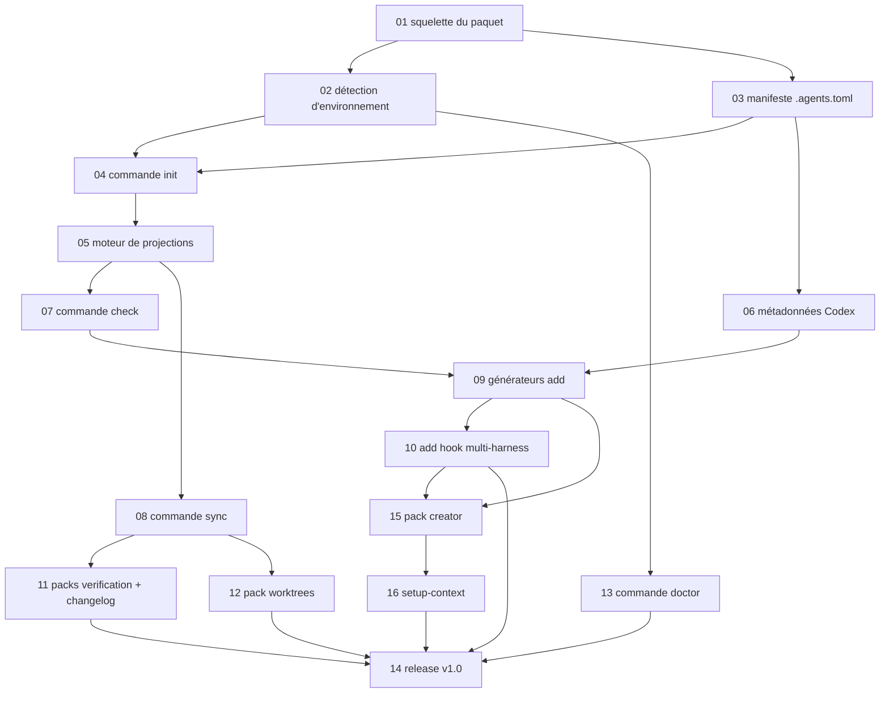

# Plan d'exécution v1

Ordre de réalisation des tâches de `.agents/tasks/`, avec leurs dépendances. Une tâche = un fichier auto-suffisant ; supprimer le fichier à la livraison.

## Lots

| Lot | Tâches | Jalon |
| --- | --- | --- |
| Fondation | 01, 02, 03 | v0.1 |
| Installation | 04, 05, 13 | v0.1 |
| Zéro dérive | 07, 08 | v0.2 |
| Générateurs | 06, 09 | v0.3 |
| Hooks | 10 | v0.4 |
| Packs | 11, 12 | v0.5 |
| Création assistée | 15, 16 | v0.6 |
| Publication | 14 | v1.0 |

## Règles d'exécution

- Chaque tâche se termine par sa section Vérification exécutée, sortie collée à l'appui, avant d'être marquée livrée.
- Aucune tâche ne rouvre une décision actée (voir [AGENTS.md](../../AGENTS.md)) sans demande explicite de l'utilisateur.
- L'autophagie est le fil rouge : dès que `init` existe (tâche 04), ce repo devient son premier terrain d'essai et le reste à chaque tâche suivante.
