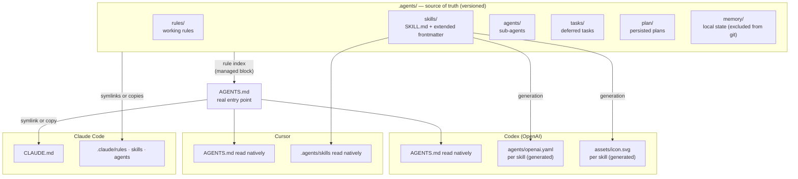
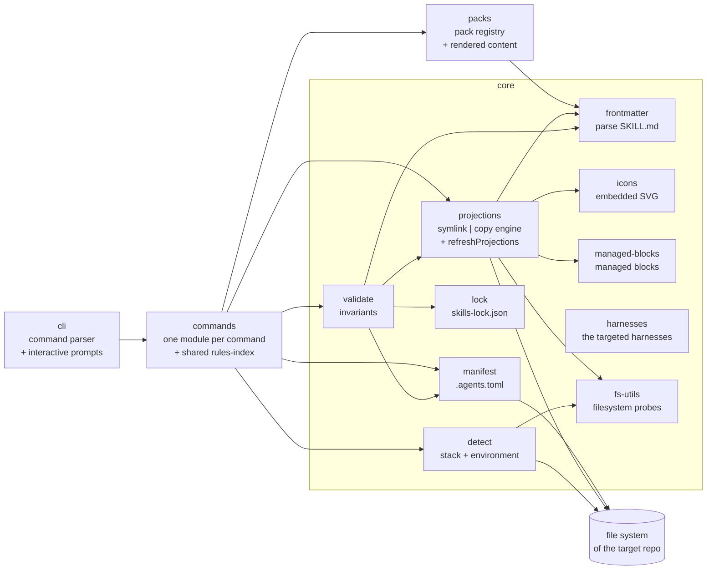
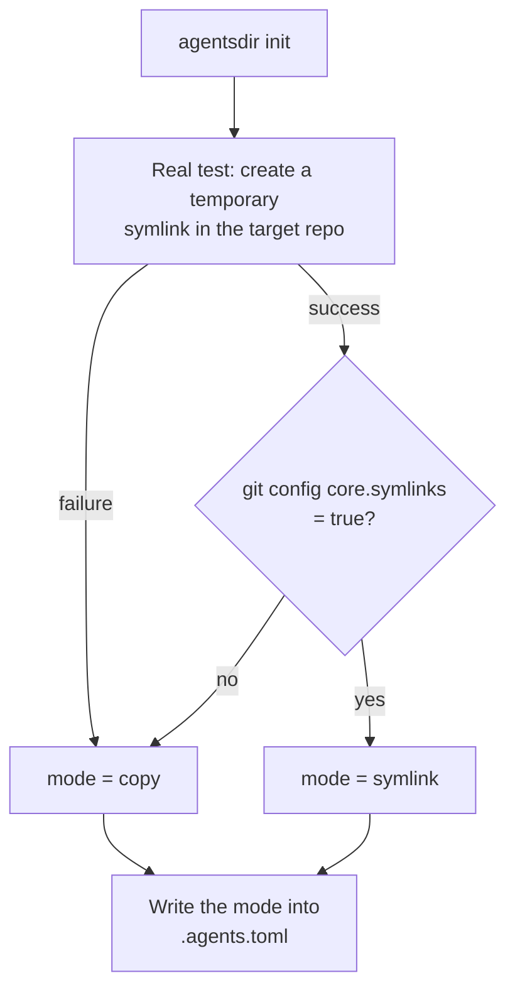

# Technical architecture

This document describes the internal architecture of the `agentsdir` CLI. It assumes you have read the [project vision](SPEC.md). The neighboring documents cover the [command specification](commandes.md), the [contracts and invariants](conventions.md), the [harness matrix](harness.md) and the [roadmap](roadmap.md). The analysis of the source model is recorded in [recherche/analyse-nowstack.md](recherche/analyse-nowstack.md).

## 1. Overview: one source of truth, many projections

The founding principle, inherited from the NowStack model and confirmed by the convergence of the standards (AGENTS.md, Agent Skills): **all agent-facing content lives exactly once in `.agents/`**, and each harness receives a *projection* — a symlink when the harness can follow a link, a generated artifact when it expects its own format. No projection is ever edited by hand; all of them are regenerable by `sync` and verifiable by `check`.



Two structural consequences:

- **Drift becomes a detectable state**, not an inevitability: any divergence between the source and a projection is a `check` failure (exit code 1), wired into CI from `init` onwards.
- **Adding a harness = adding a projector**, never duplicating content.

## 2. Internal CLI modules



| Module | Responsibility | Design notes |
| --- | --- | --- |
| `cli` | Parsing of commands and flags, interactive prompts, terminal output. | Each command is a thin module that orchestrates `core`; no business logic in the CLI layer. |
| `core/manifest` | Reading, validation and writing of the `.agents.toml` manifest. | The only module allowed to write the manifest; it carries the schema version and the manifest migrations. |
| `core/projections` | The symlink \| copy engine: creates, regenerates and compares every declared projection. `refreshProjections` is the single orchestration of "remove what must not survive, then project", shared by `sync` and the generators. The whole plan — including the classification of the arrival mode's targets — is computed **before** the first removal, and a foreign target aborts there: a switch either happens whole or leaves the repository untouched. The removal is subtracted from the disk being classified (`pendingRemovals`), never assumed away. | A projection = a declarative entry (source, target, type). The mode comes from the manifest, never from an on-the-fly detection performed along the way. |
| `core/validate` | The invariants (see [conventions.md](conventions.md)): name identity, invocation parity, length bounds, existence of referenced files, sub-agent frontmatter, symlink health, lock integrity. | Read-only. Used by `check` (failure = exit code 1) and replayed by mutating commands before writing. |
| `core/hook-protocol` | Invariant 15: one bounded dry invocation of each attributable script of `.agents/hooks/`, held to the protocol of the generated template. | The only place the CLI runs repository code — invoked by `check` and, like every other invariant, replayed by the mutating commands before they write, so `sync` runs the hooks too. Wall clock, capped output, stdin closed after the sample payload, environment untouched. |
| `core/frontmatter` | Parses and validates the YAML frontmatter of `SKILL.md` files. **The extended frontmatter IS the catalog**: the Codex fields (`display-name`, `color`, `icon`, `prompt`) live there, ignored by Claude Code. | Fixes the flaw of the source model (TypeScript catalog hard-coded in a script): adding a skill = creating a folder, not editing code. |
| `core/icons` | Renders a skill's SVG icon from an embedded icon set: lucide paths vendored as static JSON in the package. | No react/lucide dependency at runtime; byte-for-byte deterministic rendering (comparable by fingerprint). |
| `core/managed-blocks` | Inserts and updates the managed blocks `<!-- agentsdir:begin X -->` / `<!-- agentsdir:end X -->` in files owned by the user (AGENTS.md, .gitignore, CI workflow). | Everything outside the markers belongs to the user and is never touched — a mechanism proven by `convex ai-files`. |
| `core/lock` | `skills-lock.json`: provenance and sha256 fingerprint of vendored skills (sorted relative paths, content included, `.git` and `node_modules` excluded), plus the `files` table tracking the generic rules and shared scripts the packs install outside any skill folder. | Detects local drift in an imported skill or an installed rule; it does not download anything itself. Only what an install wrote is tracked — a file kept as the repository had it is never pinned to a render it did not receive. |
| `core/detect` | Detection of the target repo (`package.json`, `pyproject.toml`, `go.mod`, `Cargo.toml`…) to pre-fill the dev/test/lint commands, and of the environment (symlink support, `core.symlinks`, platform). | Detection parameterizes the templates; it never imposes a runtime on the target repo. |

| `core/harnesses` | The single list of targeted harnesses and their configuration directories. | `init`, the hook registries and the diagnostics read the same list, so they can never disagree on what "every harness" means. |
| `core/skill-hash` | The sha256 fingerprint of a skill folder, from disk or from rendered contents. | Outside the validator on purpose: `pack add` and `sync` fingerprint folders to fill the lock, which is a calculation, not a check. |
| `core/errors` | `CliError` plus `asUserFacingError`, which turns a filesystem failure into the promised message and exit code. | A `TypeError` is a bug in this CLI, not something the user can act on: it keeps its stack trace. |
| `commands/init-interview` | The questions `init` asks, the flags that replace them, and the probes filling the defaults. | Separate from the writing side so the plan can be tested without a terminal. |
| `command-tree` | The command names, and the check that rejects a typo before citty prints the help. | A mistyped command is a usage error (exit 2), never drift (exit 1) — a CI script must be able to tell them apart. |
| `core/fs-utils` | The filesystem probes shared by every layer: `pathExists`, `entryExists` (a broken symlink still counts), `isDirectory`. | Absence is a normal answer in this CLI, never an exception re-caught at each call site. |
| `commands/rules-index` | Composes the `rules-index` block of AGENTS.md: the rules on disk, plus the ones the command is about to write, minus the ones it removes. | Shared by `init`, `sync`, `add rule` and `pack add|remove`, which all need the same entries. It sits in `commands/` because it needs both `core` and `templates`. |

### Direction of dependencies

The layers depend in one direction only:

```
cli -> commands -> { core, templates, packs } -> core
```

`core/` is the engine and stays usable on its own: it never imports from
`commands/` or `packs/`. `templates/` renders content and may use `core/`, never
the reverse. A shared behaviour that needs both `core` and `templates` -- the
rules index composition, for instance -- belongs to `commands/`, the only layer
allowed to depend on both.

This is not a convention left to good will: `src/__tests__/layering.test.ts`
fails the build on the first import that reverses an arrow, and on any cycle
between two modules.

## 3. The `.agents.toml` manifest

The manifest is the local contract of the installation: it records what was installed, in which mode, and the fingerprints needed for drift detection. It is versioned in the target repo.

```toml
# .agents.toml — agentsdir manifest. Managed by the CLI; do not edit by hand.

# Manifest schema version. The transformations from one version to the next are
# declared as a table in `src/core/migrations.ts` and walked by `agentsdir
# update`, the only command that ever advances this number: `sync` preserves it.
schema = 2

# Version of the CLI that produced the last write.
cli-version = "1.0.0"

[project]
name = "my-product"           # derived from the folder or entered at init; parameterizes the templates
stack = ["node"]              # detected then confirmed: node | python | go | rust | other

[harness]
enabled = ["claude", "codex", "cursor"]

[packs]
installed = ["core", "creator", "verification", "changelog", "worktrees"]

# Optional section, seeded empty by the worktrees pack: the stack commands
# (dependency installation, environment cloning) that the worktree-setup and
# worktree-cleanup scripts run in order. The pack stays language-agnostic:
# nothing is hard-coded in the scripts.
[worktrees]
setup = ["npm ci"]
cleanup = []

[projections]
# Global mode, decided at init after a real test of the environment.
# "symlink": relative links, git mode 120000.
# "copy"   : generated copies, synchronized by `sync`, compared by `check`.
mode = "copy"

# In "copy" mode only: sha256 fingerprint of the generated content of each
# projection, as written by the last `sync`. `check` compares the file on disk
# to this fingerprint: a mismatch means the projection was edited by hand
# (the fix goes into .agents/, then `sync`).
[projections.hashes]
"CLAUDE.md" = "sha256:…"
".claude/rules" = "sha256:…"
".claude/skills" = "sha256:…"
".claude/agents" = "sha256:…"
```

Ownership rules:

- The manifest belongs to the CLI (explicit header); `check` fails if it is missing or has an unknown schema.
- `.agents/` belongs to the user — the CLI only writes there on `init`, `add` and `vendor`, with one exception: the generated artifacts of each skill (`agents/openai.yaml`, `assets/icon.svg`), derived from the frontmatter and regenerated by `sync`. Authored content (`SKILL.md`, rules, free-form sections of `AGENTS.md`) is never touched by `sync`: an invalid source makes `sync` fail with the `check` diagnostic, it is not "fixed".
- Projections belong to the CLI; files with managed blocks are shared (the user owns everything outside the markers).

## 4. Symlink / fallback strategy

The mode is decided once, at `init`, by a real test — not by a platform heuristic — then frozen in the manifest. `doctor` replays the test and offers to switch if the environment has changed.



Behavior by mode:

- **Symlink mode.** `CLAUDE.md → AGENTS.md` and `.claude/{rules,skills,agents} → ../.agents/*` as **relative** links, recorded in the git index with mode `120000`. `check` verifies both sides: `git ls-files -s` must show `120000`, and the on-disk state must be a real link — a symlink silently replaced by a copy (the drift the source model does not detect) fails CI.
- **Copy mode (fallback).** Each projection is a generated file carrying the header "GENERATED by agentsdir — edit the source in .agents/ and run `agentsdir sync`". Its fingerprint is recorded in the manifest's `[projections.hashes]` on every `sync`. `check` then detects: (a) a copy edited by hand (disk fingerprint ≠ manifest); (b) a copy lagging behind its source (expected fingerprint recomputed from `.agents/` ≠ manifest). An optional `pre-commit` hook runs `sync` automatically.
- **`CLAUDE.md` in copy mode: a bridge, not a copy** (decision recorded in task 05). The generated file contains the `@AGENTS.md` import followed by the generated header: a single source is read by Claude Code whatever the mechanism (symlink or import). Empirical validation: this repo's bridge `CLAUDE.md` has worked this way since the first commit. The alternative "full copy of the content with a header" was ruled out: duplicated content, guaranteed drift between two `sync` runs. In directory copies (`.claude/{rules,skills,agents}`), the header is only placed on Markdown files; other files are copied byte for byte.

Fact verified on the project's development machine: in a freshly created repo, `ln -s` under Git Bash produces a copy (or fails), not a symbolic link — **copy mode (fallback) is not a theoretical case, it is in use from day one**, including for developing agentsdir itself.

## 5. Technical decisions

| Decision | Choice | Rationale |
| --- | --- | --- |
| Language | TypeScript strict, Node >= 22 | Harness ecosystem; typing of the contracts (frontmatter, manifest). Floor raised from 20 to 22 in August 2026 (Node 20 EOL). |
| Distribution | `npx agentsdir` — single bundle | Zero installation; Node is only required on the developer's machine, never by the target repo. Compiled binaries are conceivable later. |
| CLI dependencies | Minimal: `citty` (parser, choice recorded in task 01), `@clack/prompts` (interactive), `smol-toml` (manifest), `yaml` (reading the frontmatter of `SKILL.md` files — YAML is the format of the Agent Skills standard, reimplementing it would be a bug nest; **parsing only**: all YAML rendering is hand-written for byte-for-byte determinism — addition recorded in task 06) — each one added at the moment the code uses it | A light bundle starts quickly via npx and limits the breakage surface. |
| Target repo dependencies | **None** | The generated artifacts are pure Markdown, YAML, JSON and SVG. A Python repo stays 100% Python. |
| Exit codes | `0` = ok · `1` = drift or violated invariant · `2` = environment or usage error | Stable CI contract; documented per command in [commandes.md](commandes.md). |
| `--dry-run` | Mandatory on every mutating command | Prints the full write plan without touching the disk. |
| Idempotence | Mandatory | Replaying `init`, `sync` or `add` on an already conformant state produces no write (and says so). |
| Deterministic rendering | Mandatory | Every generation (YAML, SVG, managed blocks) is reproducible byte for byte — a prerequisite for fingerprint comparisons. |

## 6. Built-in corrections relative to the source model

The analysis of the NowStack repo ([recherche/analyse-nowstack.md](recherche/analyse-nowstack.md)) established the model **and** its flaws. The CLI ships the fixes by default:

| Flaw observed in NowStack | agentsdir fix |
| --- | --- |
| The skill verification announced as "CI" is not wired into any workflow. | `init` emits `.github/workflows/agents-check.yml` running `npx agentsdir check`. |
| No `.gitattributes`: line endings and sha256 fingerprints depend on the machine. | `init` appends a `line-endings` managed block pinning every projected and hashed path to `eol=lf`, on an existing `.gitattributes` as well as on a new one. |
| `.agents/memory/` versioned with a substitutable personal datum (email address). | `memory/` excluded from git; template versioned separately. |
| Skill catalog hard-coded in a TypeScript script in the repo. | The extended frontmatter of each `SKILL.md` is the catalog; the CLI reads it, nothing to edit elsewhere. |
| Unix-only scripts (bash, perl, `lsof`, `trash`). | All emitted scripts are portable Node. |
| `.claude/settings.json` allowlist inconsistent with the repo's scripts (cascading permission prompts). | `init`, `sync` and `pack add`/`pack remove` maintain an allowlist covering the scripts the installed packs tell an agent to run. Ownership is structural — JSON has no comment markers, so a rule is agentsdir's iff it reads `Bash(node <path under .agents/> *)`; everything else in the file is preserved. |
| Silent replacement of a symlink by a copy: undetectable. | `check` verifies git mode `120000` + on-disk state (symlink mode) or fingerprints (copy mode). |
