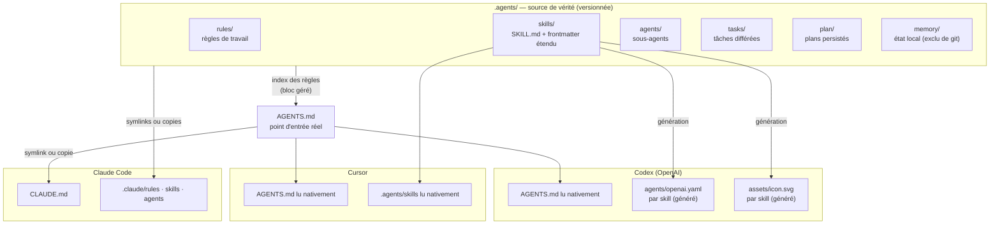
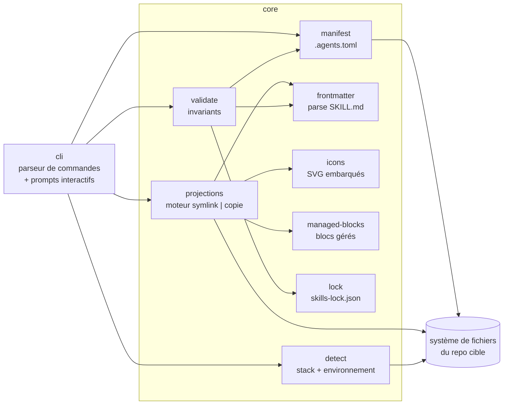
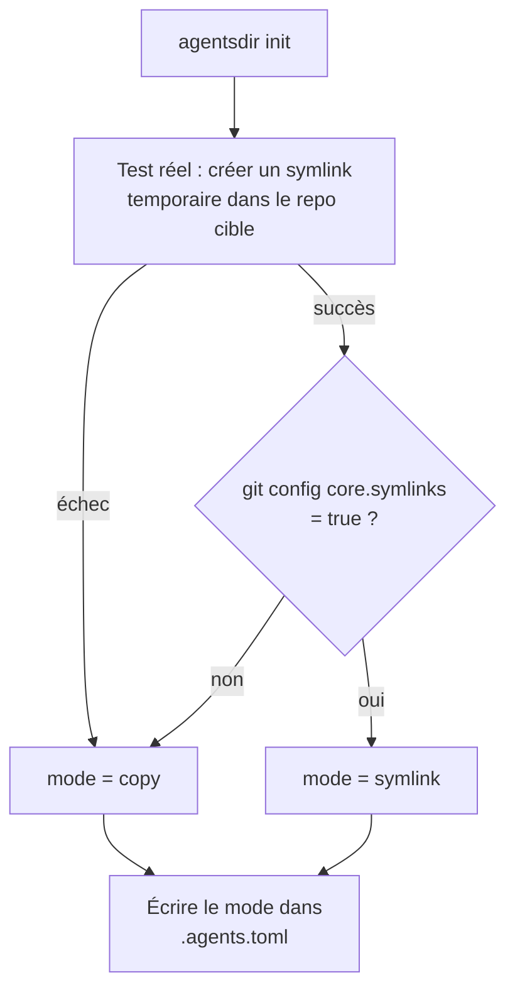

# Architecture technique

Ce document décrit l'architecture interne de la CLI `agentsdir`. Il suppose la lecture de la [vision du projet](SPEC.md). Les documents voisins précisent la [spécification des commandes](commandes.md), les [contrats et invariants](conventions.md), la [matrice des harness](harness.md) et la [feuille de route](roadmap.md). L'analyse du modèle source est consignée dans [recherche/analyse-nowstack.md](recherche/analyse-nowstack.md).

## 1. Vue d'ensemble : une source de vérité, des projections

Le principe fondateur, hérité du modèle NowStack et validé par la convergence des standards (AGENTS.md, Agent Skills) : **tout le contenu destiné aux agents vit une seule fois dans `.agents/`**, et chaque harness reçoit une *projection* — un symlink quand le harness sait suivre un lien, un artefact généré quand il attend son propre format. Aucune projection n'est éditée à la main ; toutes sont régénérables par `sync` et vérifiables par `check`.



Deux conséquences structurantes :

- **La dérive devient un état détectable**, pas une fatalité : toute divergence entre la source et une projection est un échec de `check` (code de sortie 1), branché en CI dès `init`.
- **Ajouter un harness = ajouter un projecteur**, jamais dupliquer du contenu.

## 2. Modules internes de la CLI



| Module | Responsabilité | Notes de conception |
| --- | --- | --- |
| `cli` | Analyse des commandes et des drapeaux, prompts interactifs, sortie terminal. | Chaque commande est un module fin qui orchestre `core` ; aucune logique métier dans la couche CLI. |
| `core/manifest` | Lecture, validation et écriture du manifeste `.agents.toml`. | Seul module autorisé à écrire le manifeste ; porte la version du schéma et les migrations de manifeste. |
| `core/projections` | Le moteur symlink \| copie : crée, régénère et compare chaque projection déclarée. | Une projection = une entrée déclarative (source, cible, type). Le mode vient du manifeste, jamais d'une détection à la volée en cours de route. |
| `core/validate` | Les invariants (voir [conventions.md](conventions.md)) : identité du nom, parité d'invocation, bornes de longueur, existence des fichiers référencés, intégrité du verrou. | Lecture seule. Utilisé par `check` (échec = code 1) et rejoué par les commandes mutantes avant écriture. |
| `core/frontmatter` | Parse et valide le frontmatter YAML des `SKILL.md`. **Le frontmatter étendu EST le catalogue** : les champs Codex (`display-name`, `color`, `icon`, `prompt`) y vivent, ignorés par Claude Code. | Corrige le défaut du modèle source (catalogue TypeScript codé en dur dans un script) : ajouter un skill = créer un dossier, pas éditer du code. |
| `core/icons` | Rend l'icône SVG d'un skill à partir d'un jeu d'icônes embarqué : tracés lucide vendorés en JSON statique dans le paquet. | Aucune dépendance react/lucide à l'exécution ; rendu déterministe octet à octet (comparable par empreinte). |
| `core/managed-blocks` | Insère et met à jour les blocs gérés `<!-- agentsdir:begin X -->` / `<!-- agentsdir:end X -->` dans des fichiers possédés par l'utilisateur (AGENTS.md, .gitignore, workflow CI). | Tout ce qui est hors des marqueurs appartient à l'utilisateur et n'est jamais touché — mécanisme éprouvé par `convex ai-files`. |
| `core/lock` | `skills-lock.json` : provenance et empreinte sha256 des skills vendorés (chemins relatifs triés, contenu inclus, `.git` et `node_modules` exclus). | Détecte la dérive locale d'un skill importé ; ne télécharge rien lui-même. |
| `core/detect` | Détection du repo cible (`package.json`, `pyproject.toml`, `go.mod`, `Cargo.toml`…) pour pré-remplir les commandes dev/test/lint, et de l'environnement (support des symlinks, `core.symlinks`, plateforme). | La détection paramètre les gabarits ; elle n'impose jamais un runtime au repo cible. |

## 3. Le manifeste `.agents.toml`

Le manifeste est le contrat local de l'installation : il enregistre ce qui a été installé, dans quel mode, et les empreintes nécessaires à la détection de dérive. Il est versionné dans le repo cible.

```toml
# .agents.toml — agentsdir manifest. Managed by the CLI; do not edit by hand.

# Version du schéma du manifeste (migrations gérées par `agentsdir update`).
schema = 1

# Version de la CLI qui a produit la dernière écriture.
cli-version = "0.1.0"

[project]
name = "mon-produit"          # dérivé du dossier ou saisi à l'init ; paramètre les gabarits
stack = ["node"]              # détectée puis confirmée : node | python | go | rust | autre

[harness]
enabled = ["claude", "codex", "cursor"]

[packs]
installed = ["core", "creator", "verification", "changelog", "worktrees"]

[projections]
# Mode global, décidé à l'init après test réel de l'environnement.
# "symlink" : liens relatifs, mode git 120000.
# "copy"    : copies générées, synchronisées par `sync`, comparées par `check`.
mode = "copy"

# En mode "copy" uniquement : empreinte sha256 du contenu généré de chaque
# projection, telle qu'écrite par le dernier `sync`. `check` compare le fichier
# sur disque à cette empreinte : un écart signifie une édition manuelle de la
# projection (la correction va dans .agents/, puis `sync`).
[projections.hashes]
"CLAUDE.md" = "sha256:…"
".claude/rules" = "sha256:…"
".claude/skills" = "sha256:…"
".claude/agents" = "sha256:…"
```

Règles de possession :

- Le manifeste appartient à la CLI (en-tête explicite) ; `check` échoue s'il est absent ou d'un schéma inconnu.
- `.agents/` appartient à l'utilisateur — la CLI n'y écrit que sur `init`, `add` et `vendor`, jamais sur `sync`.
- Les projections appartiennent à la CLI ; les fichiers à blocs gérés sont partagés (l'utilisateur possède tout ce qui est hors marqueurs).

## 4. Stratégie symlink / repli

Le mode est décidé une fois, à l'`init`, par un test réel — pas par une heuristique de plateforme — puis figé dans le manifeste. `doctor` rejoue le test et propose la bascule si l'environnement a changé.



Comportement par mode :

- **Mode symlink.** `CLAUDE.md → AGENTS.md` et `.claude/{rules,skills,agents} → ../.agents/*` en liens **relatifs**, entrés dans l'index git en mode `120000`. `check` vérifie les deux faces : `git ls-files -s` doit afficher `120000`, et l'état disque doit être un lien réel — un symlink silencieusement remplacé par une copie (la dérive que le modèle source ne détecte pas) fait échouer la CI.
- **Mode copie (repli).** Chaque projection est un fichier généré portant l'en-tête « GENERATED by agentsdir — edit the source in .agents/ and run `agentsdir sync` ». Son empreinte est enregistrée dans `[projections.hashes]` du manifeste à chaque `sync`. `check` détecte alors : (a) une copie modifiée à la main (empreinte disque ≠ manifeste) ; (b) une copie en retard sur sa source (empreinte attendue recalculée depuis `.agents/` ≠ manifeste). Un hook `pre-commit` optionnel lance `sync` automatiquement.

Fait vérifié sur la machine de développement du projet : dans un repo fraîchement créé, `ln -s` sous Git Bash produit une copie (ou échoue), pas un lien symbolique — **le mode copie (repli) n'est pas un cas théorique, il sert dès le premier jour**, y compris pour développer agentsdir lui-même.

## 5. Décisions techniques

| Décision | Choix | Justification |
| --- | --- | --- |
| Langage | TypeScript strict, Node >= 20 | Écosystème des harness ; typage des contrats (frontmatter, manifeste). |
| Distribution | `npx agentsdir` — bundle unique | Zéro installation ; Node n'est requis que sur la machine du développeur, jamais par le repo cible. Binaires compilés envisageables plus tard. |
| Dépendances de la CLI | Minimales : `citty` (parseur, choix acté à la tâche 01), `@clack/prompts` (interactif), `smol-toml` (manifeste) — chacune ajoutée au moment où le code l'utilise | Un bundle léger se lance vite via npx et limite la surface de rupture. |
| Dépendances du repo cible | **Aucune** | Les artefacts générés sont du Markdown, YAML, JSON et SVG purs. Un repo Python reste 100 % Python. |
| Codes de sortie | `0` = ok · `1` = dérive ou invariant violé · `2` = erreur d'environnement ou d'utilisation | Contrat CI stable ; documenté par commande dans [commandes.md](commandes.md). |
| `--dry-run` | Obligatoire sur toute commande mutante | Affiche le plan d'écriture complet sans toucher au disque. |
| Idempotence | Obligatoire | Rejouer `init`, `sync` ou `add` sur un état déjà conforme ne produit aucune écriture (et le dit). |
| Rendu déterministe | Obligatoire | Toute génération (YAML, SVG, blocs gérés) est reproductible octet à octet — condition des comparaisons par empreinte. |

## 6. Corrections d'office par rapport au modèle source

L'analyse du repo NowStack ([recherche/analyse-nowstack.md](recherche/analyse-nowstack.md)) a établi le modèle **et** ses défauts. La CLI intègre les correctifs d'office :

| Défaut constaté chez NowStack | Correctif agentsdir |
| --- | --- |
| La vérification des skills annoncée « CI » n'est branchée dans aucun workflow. | `init` émet `.github/workflows/agents-check.yml` exécutant `npx agentsdir check`. |
| Aucun `.gitattributes` : fins de ligne et empreintes sha256 dépendantes de la machine. | `init` écrit `eol=lf` sur les scripts et tout fichier hashé. |
| `.agents/memory/` versionné avec une donnée personnelle substituable (adresse e-mail). | `memory/` exclu de git ; modèle versionné à part. |
| Catalogue des skills codé en dur dans un script TypeScript du repo. | Le frontmatter étendu de chaque `SKILL.md` est le catalogue ; la CLI le lit, rien à éditer ailleurs. |
| Scripts uniquement Unix (bash, perl, `lsof`, `trash`). | Tous les scripts émis sont en Node portable. |
| Liste blanche `.claude/settings.json` incohérente avec les scripts du repo (demandes d'autorisation en cascade). | La liste blanche générée couvre exactement les commandes que la CLI émet. |
| Remplacement silencieux d'un symlink par une copie : indétectable. | `check` vérifie mode git `120000` + état disque (mode symlink) ou empreintes (mode copie). |
