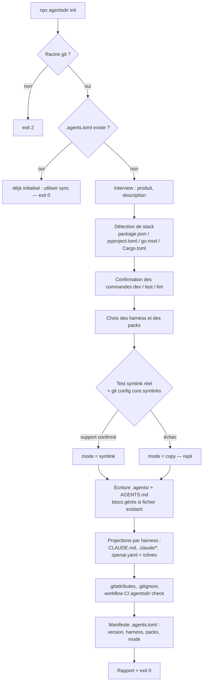
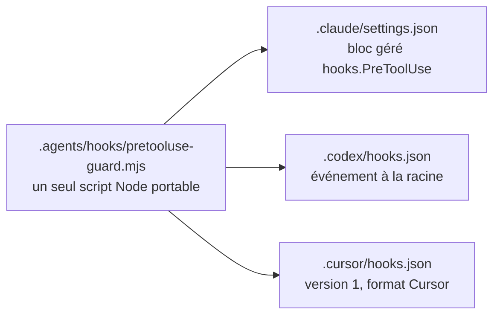
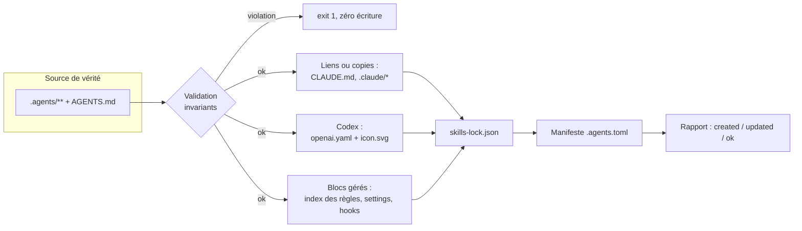
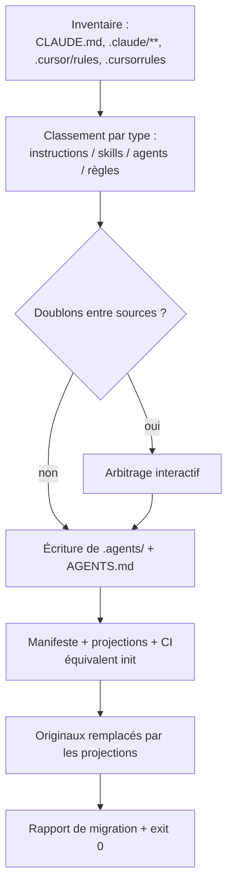

# Spécification des commandes

Ce document spécifie la surface de commandes de la CLI `agentsdir`. Les concepts
(source de vérité, projections, blocs gérés, manifeste) sont définis dans
[architecture.md](architecture.md) ; les contrats de contenu (skill, règle,
agent, hook) dans [conventions.md](conventions.md) ; le détail par harness dans
[harness.md](harness.md) ; le découpage par version dans [roadmap.md](roadmap.md).

## Tableau récapitulatif

| Commande | Version | Écrit | Rôle |
| --- | --- | --- | --- |
| `init` | v1 | oui | Installe l'architecture `.agents/` + projections dans un repo existant |
| `add skill <name>` | v1 | oui | Crée un skill conforme + ses projections Codex |
| `add rule <name>` | v1 | oui | Crée une règle + son entrée dans l'index des règles |
| `add agent <name>` | v1 | oui | Crée un sous-agent |
| `add hook <event>` | v1 | oui | Crée un script de hook portable et l'enregistre sur chaque harness |
| `sync` | v1 | oui | Régénère toutes les projections depuis la source de vérité |
| `check` | v1 | non | Vérifie invariants, dérive et santé des symlinks (mode CI) |
| `doctor` | v1 | non | Diagnostique l'environnement local |
| `pack add <name>` | v1 | oui | Installe un pack : fichiers, blocs gérés, manifeste |
| `pack remove <name>` | v1 | oui | Désinstalle un pack proprement (refus si modifié localement, sauf `--force`) |
| `vendor <owner/repo>` | v1.x | oui | Importe un skill externe et le verrouille |
| `update` | v1.x | oui | Met à niveau la structure vers un nouveau schéma de manifeste |
| `migrate` | v2 | oui | Bascule une configuration `.claude/` ou `.cursor/` existante vers `.agents/` |

## Conventions transverses

Ces règles s'appliquent à toutes les commandes.

**Codes de sortie.**

| Code | Signification |
| --- | --- |
| `0` | Succès — aucun écart constaté ou toutes les écritures effectuées |
| `1` | Dérive ou invariant violé — le contenu du repo contredit la source de vérité ou les contrats |
| `2` | Erreur d'environnement ou d'utilisation — hors racine du repo, git absent, manifeste illisible, permissions insuffisantes, nom déjà pris dans un générateur |

**Racine du repo.** Toute commande se résout depuis la racine du dépôt git
(remontée jusqu'à `.git/`). Lancée hors d'un dépôt git : code `2` avec un
message actionnable.

**`--dry-run`.** Toutes les commandes qui écrivent acceptent `--dry-run` : le
plan complet des créations/modifications est affiché, rien n'est écrit, code de
sortie identique à celui qu'aurait produit l'exécution réelle.

**Idempotence.** Relancer une commande sans changement intermédiaire ne produit
aucune écriture (comparaison octet à octet avant réécriture) et sort en `0`.
Exception assumée : les générateurs (`add …`) refusent en `2` la relance sur un
nom déjà pris — créer deux fois n'est pas « sans changement », c'est une erreur
d'utilisation.

**Blocs gérés.** La CLI n'écrit jamais dans le contenu libre d'un fichier
partagé avec l'utilisateur (`AGENTS.md`, `.claude/settings.json`,
`.gitignore`). Elle ne touche que ses blocs délimités :

```markdown
<!-- agentsdir:begin rules-index -->
… contenu régénérable …
<!-- agentsdir:end rules-index -->
```

Un bloc absent est ajouté en fin de fichier ; un bloc présent est remplacé ;
tout le reste du fichier est préservé à l'octet près.

**Sortie machine.** Chaque commande accepte `--json` et écrit alors sur stdout
un objet unique `{command, mode, changes[], errors[], exitCode}` destiné aux
scripts et à la CI.

---

## `init` — v1

### Synopsis

```
npx agentsdir init [options]
```

### Options

| Option | Effet |
| --- | --- |
| `--yes` | Accepte tous les défauts, aucune question (utilisable en script) |
| `--dry-run` | Affiche le plan sans écrire |
| `--harness claude,codex,cursor` | Restreint les harness ciblés (défaut : les trois) |
| `--packs core,creator,verification,changelog,worktrees` | Restreint les packs installés (défaut : `core,creator`) |
| `--mode symlink\|copy` | Force le mode de projection au lieu de la détection |
| `--json` | Sortie machine |

### Comportement

1. **Garde-fous.** Vérifie la racine git (`2` sinon). Si un manifeste
   `.agents.toml` existe déjà, `init` ne réécrit rien et sort en `0` avec le
   message « déjà initialisé — utiliser `sync` pour régénérer ».
2. **Interview** (sautée avec `--yes`) : nom du produit, description d'une
   phrase, puis **détection de stack** — présence de `package.json`,
   `pyproject.toml`, `go.mod`, `Cargo.toml` — pour pré-remplir les commandes
   `dev`, `test`, `lint` que l'utilisateur confirme ou corrige. La détection ne
   sert qu'à paramétrer les gabarits : aucune dépendance n'est ajoutée au
   projet, quel que soit son langage.
3. **Choix des harness** (Claude Code, Codex, Cursor) et **des packs**
   (`core` obligatoire ; `creator` coché par défaut — la création assistée,
   voir [creation-assistee.md](creation-assistee.md) ; `verification`,
   `changelog`, `worktrees` optionnels).
   Les deux questions sont à **sélection multiple** (cases à cocher
   `@clack/prompts`, les trois harness précochés) : on peut n'en garder qu'un,
   deux, ou les trois. Pour activer un harness après coup, ajouter son nom à
   `[harness] enabled` dans `.agents.toml` puis lancer `sync`, qui crée les
   projections manquantes ; le retrait suit le même chemin (les projections
   orphelines sont signalées par `check` et retirées par `sync`).
4. **Détection du mode de projection.** La CLI crée un symlink d'essai dans un
   répertoire temporaire du repo, lit `git config core.symlinks`, puis conclut
   `mode = "symlink"` ou `mode = "copy"` (repli), inscrit dans le manifeste.
   `--mode` court-circuite la détection.
5. **Écriture de la source de vérité** : arborescence
   `.agents/{rules,skills,agents,hooks,tasks,plan,memory}`, règles génériques
   du pack `core` paramétrées par les réponses, `AGENTS.md` (sections produit
   pré-remplies + blocs gérés), fichiers d'amorçage (`tasks/README.md`,
   modèle `.agents/memory.template/` versionné, `memory/` exclu de git et
   créé localement).
6. **Projections** selon les harness choisis : `CLAUDE.md` et
   `.claude/{rules,skills,agents}` (symlinks ou copies), `.claude/settings.json`
   (bloc géré de permissions couvrant les scripts émis), projections Codex par
   skill (`agents/openai.yaml`, `assets/icon.svg`), fichiers du pack
   `worktrees` le cas échéant (`.cursor/worktrees.json`).
7. **Hygiène du repo** : entrées `.gitignore` (blocs gérés), `.gitattributes`
   avec `eol=lf` sur les scripts et fichiers hachés, workflow
   `.github/workflows/agents-check.yml` exécutant `npx agentsdir check`.
8. **Cas du repo déjà rempli** : comportement strictement additif. Un
   `AGENTS.md` existant est conservé — la CLI y insère uniquement ses blocs
   gérés ; un `CLAUDE.md` existant n'est jamais écrasé : `init` s'arrête sur ce
   point précis avec un message renvoyant vers `migrate` (v2), code `1`.
9. **Rapport final** : liste des fichiers créés, mode retenu, commandes
   suivantes (`add skill`, `check`).



### Idempotence

Un second `init` ne réécrit rien et sort en `0` avec le message « déjà
initialisé — utiliser `sync` pour régénérer ». La régénération est le rôle de
`sync`.

### Sorties

Rapport humain (ou `--json`) : fichiers créés, mode de projection, packs
installés, prochaines commandes.

### Codes de sortie

`0` succès ou repo déjà initialisé · `1` conflit de contenu (ex. `CLAUDE.md`
étranger) · `2` environnement (hors git, permissions).

---

## `add skill <name>` — v1

### Synopsis

```
npx agentsdir add skill <name> [--implicit] [--read-only] [--dry-run] [--json]
```

### Comportement

1. Valide `<name>` (kebab-case, unique dans `.agents/skills/`).
2. Crée `.agents/skills/<name>/SKILL.md` avec le **frontmatter étendu qui sert
   de catalogue** (voir [conventions.md](conventions.md)). Les champs sont
   demandés interactivement — description « Use when… », nom affiché, courte
   description (25 à 64 caractères), couleur, icône choisie dans le jeu embarqué
   (l'invite liste les noms valides), prompt par défaut ; sans TTY, des valeurs
   par défaut valides sont utilisées :

   ```yaml
   ---
   name: <name>                # invariant : identique au nom du dossier
   description: >-             # déclencheurs — « Use when… »
     …
   display-name: "…"
   short-description: "…"      # 25 à 64 caractères
   color: "#RRGGBB"
   icon: <icone-du-jeu-embarque>
   default-prompt: "Use $<name> to …"   # doit contenir $<name>
   disable-model-invocation: true       # défaut : invocation explicite
   implicit: false                      # facultatif ; true réservé aux skills en lecture seule
   ---
   ```

   Le corps est un gabarit guidé (objectif, procédure, vérification) qui
   satisfait l'invariant des 12 lignes significatives minimum.
3. Génère immédiatement les projections Codex : `agents/openai.yaml`
   (`interface` + `policy`) et `assets/icon.svg` (icône du jeu embarqué sur
   fond `color`), dérivées du frontmatter — jamais éditées à la main.
4. `--implicit` retire `disable-model-invocation` et pose
   `allow_implicit_invocation: true` côté Codex — **refusé** (code `2`, erreur
   d'utilisation) sans la déclaration explicite `--read-only` : seul un skill
   en lecture seule peut être invocable implicitement, sur les deux harness à
   la fois. La déclaration est matérialisée dans le frontmatter par un
   `allowed-tools` limité aux outils de lecture (`Read`, `Grep`, `Glob`).
5. Exécute la passe de validation de `check` sur le skill créé avant de
   conclure.

### Idempotence

Si le dossier existe déjà : refus en `2` (aucune fusion silencieuse) ;
la régénération des projections d'un skill existant passe par `sync`.

### Codes de sortie

`0` créé · `2` `--implicit` sur un skill écrivant, nom déjà pris ou
environnement (erreurs d'utilisation).

---

## `add rule <name>` — v1

### Synopsis

```
npx agentsdir add rule <name> [--paths "<glob>[,<glob>]"] [--dry-run] [--json]
```

### Comportement

1. Crée `.agents/rules/<name>.md` au gabarit maison : H1 = nom de la règle,
   ton impératif (**CRITICAL**, NEVER/ALWAYS), paires d'exemples `GOOD/BAD`
   en blocs de code, tableaux de référence.
2. `--paths` ajoute un frontmatter `paths:` avec les globs fournis — règle
   scopée aux fichiers concernés ; sans `--paths`, la règle est globale et
   n'est découvrable que par l'index.
3. Met à jour la ligne correspondante dans le bloc géré
   `agentsdir:rules-index` d'`AGENTS.md` : `\`.agents/rules/<name>.md\` — <quand
   la lire>` (l'invite demande la condition de lecture en une phrase).

### Idempotence

Fichier existant : refus en `2`. L'index est régénéré intégralement à chaque
`sync` — l'entrée n'est donc jamais dupliquée.

### Codes de sortie

`0` créé · `2` nom déjà pris ou environnement.

---

## `add agent <name>` — v1

### Synopsis

```
npx agentsdir add agent <name> [--model <model>] [--dry-run] [--json]
```

### Comportement

Crée `.agents/agents/<name>.md` : frontmatter `name` (kebab-case, identique au
nom du fichier — voir l'invariant 14 de [conventions.md](conventions.md)),
`description` (quand déléguer à cet agent), `color`, `model` (défaut
`inherit`), suivi du prompt système. Le fichier est exposé à Claude Code par la
projection `.claude/agents` ; les autres harness le découvrent via `AGENTS.md`.

### Idempotence et codes de sortie

Identiques à `add rule` : refus en `2` si le fichier existe, `0` sinon.

---

## `add hook <event>` — v1

Le différenciateur de la CLI : les trois harness ont convergé sur les mêmes
noms d'événements (`PreToolUse`, `PostToolUse`, `UserPromptSubmit`, `Stop`,
`SessionStart`…) mais chacun a son propre fichier d'enregistrement. Le script
est portable ; son enregistrement ne l'est pas. `add hook` écrit le script une
fois et l'enregistre partout.

### Synopsis

```
npx agentsdir add hook <event> [--name <slug>] [--matcher "<pattern>"] [--dry-run] [--json]
```

### Comportement

1. Valide `<event>` contre la table des événements communs (voir
   [harness.md](harness.md) pour la matrice complète et les événements propres
   à un seul harness, acceptés avec avertissement).
2. Crée **un seul script portable Node sans dépendances** :
   `.agents/hooks/<event>-<slug>.mjs`, qui lit le payload JSON sur stdin et
   répond selon le protocole commun (gabarit commenté).
3. L'enregistre sur chaque harness actif du manifeste :
   - Claude Code — bloc géré dans `.claude/settings.json`
     (`hooks.<event>[]`, forme `{matcher, hooks: [{type: "command", command}]}`) ;
   - Codex — `.codex/hooks.json` (événements à la racine, sans enveloppe
     `hooks`) ;
   - Cursor — `.cursor/hooks.json` (`"version": 1`, forme propre à Cursor).
4. La commande invoquée est identique partout : `node .agents/hooks/<fichier>`.



### Idempotence

Script existant : refus en `2`. Les trois enregistrements sont des blocs ou
fichiers gérés, régénérés par `sync` — pas de doublon possible.

### Codes de sortie

`0` créé et enregistré · `2` événement inconnu de tous les harness, script
déjà présent ou environnement inutilisable (erreur d'utilisation).

---

## `sync` — v1

### Synopsis

```
npx agentsdir sync [--mode symlink|copy] [--dry-run] [--json]
```

`--mode symlink|copy` bascule explicitement le mode de projection : le
manifeste est mis à jour, puis toutes les projections sont régénérées dans le
nouveau mode. C'est la commande que `doctor` recommande quand l'environnement
a changé.

### Comportement

Régénère l'intégralité des projections depuis la source de vérité, dans cet
ordre :

1. **Validation** — mêmes contrôles que `check` ; toute violation d'invariant
   interrompt avant la moindre écriture (code `1`).
2. **Projections de liens** — selon le `mode` du manifeste : (re)création des
   symlinks `CLAUDE.md → AGENTS.md` et `.claude/{rules,skills,agents} →
   ../.agents/*`, ou réécriture des copies marquées « GENERATED by agentsdir —
   edit the source in .agents/ and run `agentsdir sync` ».
3. **Projections Codex** — `agents/openai.yaml` et `assets/icon.svg` de chaque
   skill, dérivés du frontmatter, comparés octet à octet (réécrits seulement
   si différents).
4. **Blocs gérés** — index des règles d'`AGENTS.md`, permissions de
   `.claude/settings.json`, enregistrements de hooks, entrées `.gitignore`.
5. **Verrou** — recalcul des empreintes sha256 de `skills-lock.json` pour les
   skills vendorés (`sourceType: "github"`) ; les entrées `"agentsdir"` restent
   épinglées à la version installée (protection d'`update`), jamais recalculées.
6. **Projections orphelines** — les projections d'un harness retiré de
   `[harness] enabled` sont supprimées (listées dans le rapport) ; `sync` ne
   touche jamais un fichier qui ne porte pas l'en-tête généré ou qui n'est pas
   un lien connu du manifeste.
7. **Manifeste** — horodatage et version du schéma.



### Idempotence

Totale : deux `sync` consécutifs → le second ne réécrit rien et sort en `0`.

### Codes de sortie

`0` projections à jour · `1` invariant violé (rien n'est écrit) · `2`
environnement.

---

## `check` — v1

### Synopsis

```
npx agentsdir check [--json]
```

Strictement en lecture seule. C'est la commande exécutée par le workflow
GitHub Actions généré par `init` — la version CI de la discipline que le repo
source de l'analyse n'avait jamais branchée.

### Comportement

1. **Invariants de contenu** (voir [conventions.md](conventions.md)) :
   bijection entre dossiers de skills et frontmatters valides ; `name` =
   dossier ; `short-description` entre 25 et 64 caractères ; `default-prompt`
   contenant `$<name>` ; `color` en `#RRGGBB` ; corps ≥ 12 lignes
   significatives ; existence de chaque fichier `references/`, `scripts/`,
   `steps/` cité ; parité `disable-model-invocation` ⟺
   `allow_implicit_invocation` ; implicite réservé à la lecture seule.
2. **Dérive des projections** : chaque fichier généré (openai.yaml, icônes,
   copies du mode copie, blocs gérés) est recalculé en mémoire et comparé à
   l'état du disque.
3. **Santé des liens** (mode symlink) : `git ls-files -s` doit rapporter le
   mode `120000` pour `CLAUDE.md` et `.claude/{rules,skills,agents}`, et
   l'état du disque doit être un lien réel — détecte le remplacement
   silencieux d'un symlink par une copie.
4. **Verrou** : empreinte sha256 recalculée de chaque skill vendoré comparée à
   `skills-lock.json`.
5. Rapport listant chaque écart avec la commande de correction (`sync`,
   `vendor`, édition manuelle).

### Codes de sortie

`0` conforme · `1` au moins un écart (chaque écart listé) · `2` environnement.

---

## `doctor` — v1

### Synopsis

```
npx agentsdir doctor [--json]
```

Lecture seule. Diagnostique la machine et le clone, pas le contenu :

- support réel des symlinks (création d'essai) et `git config core.symlinks` ;
- sous Windows : mode développeur actif ou droits d'administrateur ;
- état des liens existants (réels ou matérialisés en fichiers texte par un
  checkout sans support — le piège classique) ;
- harness détectés sur la machine et dans le repo ;
- version du schéma du manifeste vs version de la CLI (oriente vers `update`) ;
- cohérence `.gitattributes` (`eol=lf` sur les fichiers hachés).

Chaque constat est assorti de la correction exacte (commande ou réglage).
Diagnostic, pas vérification : l'échec CI appartient à `check`.

### Codes de sortie

`0` diagnostic rendu, même quand des anomalies sont détectées · `2`
environnement inutilisable, diagnostic impossible.

---

## `pack add <name>` / `pack remove <name>` — v1

### Synopsis

```
npx agentsdir pack add <name> [--dry-run] [--json]
npx agentsdir pack remove <name> [--force] [--dry-run] [--json]
```

### Comportement

`pack add` installe un pack (`creator`, `verification`, `changelog`, `worktrees`) :
fichiers du pack, entrées d'index en blocs gérés, mise à jour de
`[packs] installed` du manifeste. `pack remove` retire ces mêmes éléments ;
il **refuse** si des fichiers du pack ont été modifiés localement, sauf
`--force`.

### Codes de sortie

`0` installé ou retiré · `1` fichiers du pack modifiés localement (sans
`--force`) · `2` pack inconnu, déjà installé/absent ou environnement.

---

## `vendor <owner/repo>` — v1.x (spécification abrégée)

```
npx agentsdir vendor <owner/repo> [--path <sous-chemin>] [--dry-run]
```

Importe un skill publié dans un dépôt GitHub externe vers
`.agents/skills/<name>/`, puis l'enregistre dans `skills-lock.json` :
`{source, sourceType: "github", skillPath, computedHash}` — empreinte sha256
du dossier complet (chemins relatifs triés + contenus). `check` échoue ensuite
à la moindre modification locale non verrouillée, ce qui protège les
adaptations locales d'un écrasement par une réimportation irréfléchie.
Codes : `0` importé · `1` empreinte existante divergente (dérive détectée) ·
`2` collision de nom, réseau ou environnement (erreur d'utilisation).

---

## `update` — v1.x (spécification abrégée)

```
npx agentsdir update [--dry-run]
```

Migre la structure quand le schéma du manifeste évolue (nouvelle version
majeure de la CLI) : transformations déclarées d'une version de schéma à la
suivante, appliquées uniquement aux **blocs gérés et aux projections** — le
contenu rédigé par l'utilisateur (`SKILL.md`, règles, corps d'`AGENTS.md`)
n'est jamais réécrit. Met aussi à niveau les **contenus installés par la CLI**
(méta-skills du pack `creator`, règles génériques, gabarits), suivis par
empreinte dans `skills-lock.json` (`sourceType: "agentsdir"`) : un contenu
intact est remplacé par la nouvelle version ; un contenu modifié localement
est préservé, signalé avec le diff upstream, fusion proposée — jamais
d'écrasement silencieux (voir
[creation-assistee.md](creation-assistee.md)). Termine par un `sync` complet.
Codes : `0` à niveau · `1` transformation impossible sans décision humaine ·
`2` environnement.

---

## `migrate` — v2 (spécification abrégée)

```
npx agentsdir migrate [--from claude|cursor|auto] [--dry-run]
```

Le canal d'acquisition : bascule une configuration existante vers la
convention `.agents/`.

1. **Inventaire** : `CLAUDE.md`, `.claude/{skills,agents,commands,settings}`,
   `.cursor/rules`, `.cursorrules`, `AGENTS.md` existant.
2. **Classement** : chaque élément est mappé vers sa destination
   (`instructions → AGENTS.md`, `skills → .agents/skills/`,
   `agents → .agents/agents/`, `règles → .agents/rules/`), les doublons entre
   sources sont détectés et arbitrés interactivement.
3. **Bascule** : écriture de la source de vérité, puis `init` interne
   (manifeste, projections, CI) et remplacement des originaux par les
   projections correspondantes.
4. **Rapport de migration** : provenance → destination pour chaque fichier,
   éléments non migrables laissés en place et listés.



Codes : `0` migré · `1` conflit non arbitré (`--yes` interdit sur les
conflits) · `2` environnement.
