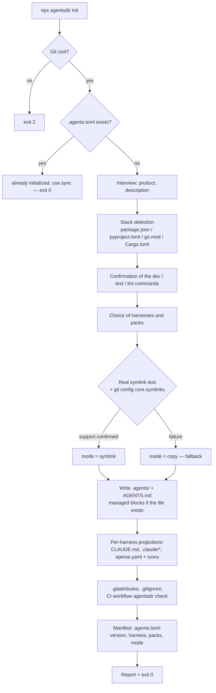
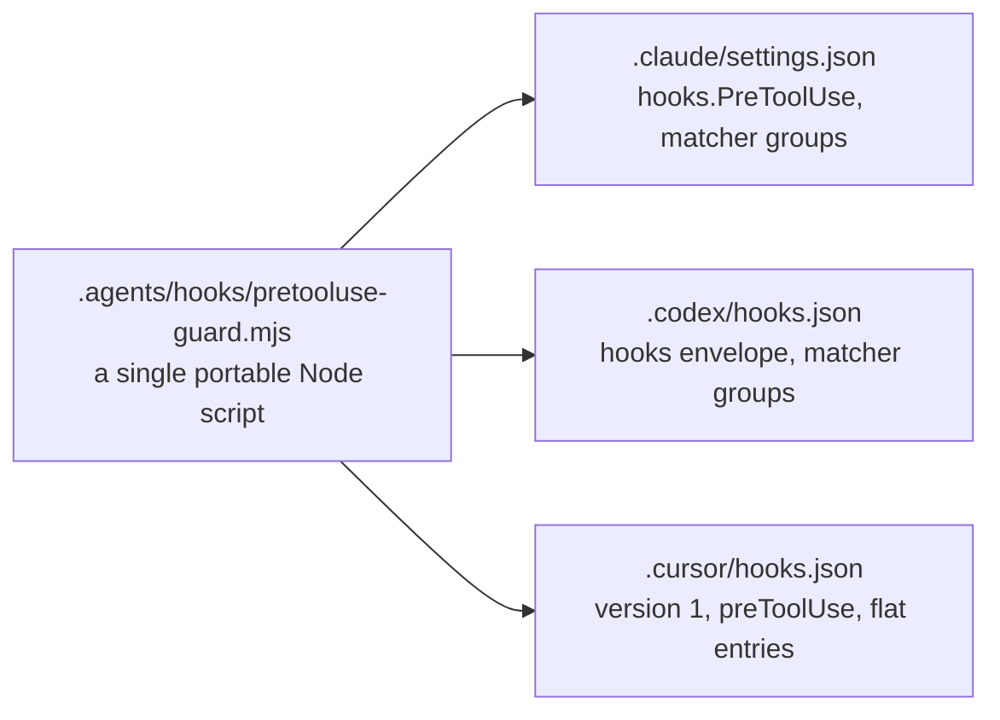
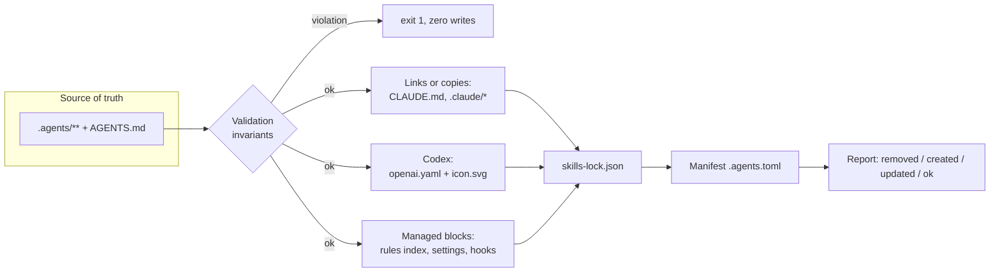
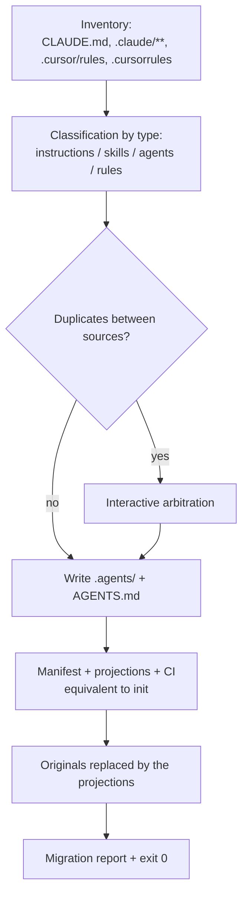

# Command specification

This document specifies the command surface of the `agentsdir` CLI. The concepts
(source of truth, projections, managed blocks, manifest) are defined in
[architecture.md](architecture.md); the content contracts (skill, rule,
agent, hook) in [conventions.md](conventions.md); the per-harness details in
[harness.md](harness.md); the version-by-version split in [roadmap.md](roadmap.md).

## Summary table

| Command | Version | Writes | Role |
| --- | --- | --- | --- |
| `init` | v1 | yes | Installs the `.agents/` architecture + projections in an existing repo |
| `add skill <name>` | v1 | yes | Creates a conformant skill + its Codex projections |
| `add rule <name>` | v1 | yes | Creates a rule + its entry in the rules index |
| `add agent <name>` | v1 | yes | Creates a sub-agent |
| `add hook <event>` | v1 | yes | Creates a portable hook script and registers it on every harness |
| `sync` | v1 | yes | Regenerates every projection from the source of truth |
| `check` | v1 | no | Checks invariants, drift and symlink health (CI mode) |
| `doctor` | v1 | no | Diagnoses the local environment |
| `pack add <name>` | v1 | yes | Installs a pack: files, managed blocks, manifest |
| `pack remove <name>` | v1 | yes | Uninstalls a pack cleanly (refuses if modified locally, unless `--force`) |
| `update` | v1 | yes | Migrates the manifest schema and upgrades the content agentsdir installed |
| `vendor <owner/repo>` | v1.x | yes | Imports an external skill and locks it |
| `migrate` | v2 | yes | Switches an existing `.claude/` or `.cursor/` configuration over to `.agents/` |

## Cross-cutting conventions

These rules apply to every command.

**Exit codes.**

| Code | Meaning |
| --- | --- |
| `0` | Success — no discrepancy found, or every write performed |
| `1` | Drift or violated invariant — the repo content contradicts the source of truth or the contracts |
| `2` | Environment or usage error — outside the repo root, git missing, unreadable manifest, insufficient permissions, name already taken in a generator |

**Unknown command.** A command or subcommand the CLI does not know is a usage
error: exit code `2`, with a message naming what was not understood and listing
the alternatives. It is never reported as `1`, which belongs to drift and
violated invariants — a CI script must be able to tell a typo from a repository
that moved.

**Missing argument.** A command run without a required positional is a usage
error too: exit code `2`, with a message naming the argument and the usage
line. Left to the argument parser it would print the help and exit `1`, which
a CI script reads as drift.

**Answering without a terminal.** Every interview question has a flag. A caller
that already knows the repository — a coding agent asked to install agentsdir,
a provisioning script — supplies the answers directly and never sees a prompt.
Without a TTY the CLI falls back to the defaults, so a flag is the only way to
give a real answer rather than a guessed one.

**Repo root.** Every command resolves from the git repository root (walking up
to `.git/`). Run outside a git repository: exit code `2` with an actionable
message.

**`--dry-run`.** Every command that writes accepts `--dry-run`: the full plan of
creations/modifications is printed, nothing is written, and the exit code is
identical to the one a real run would have produced.

**Idempotence.** Re-running a command with no intervening change produces no
write (byte-for-byte comparison before rewriting) and exits `0`. Deliberate
exception: the generators (`add …`) refuse with `2` when re-run on a name that
is already taken — creating twice is not "no change", it is a usage error.

**Managed blocks.** The CLI never writes into the free-form content of a file
shared with the user (`AGENTS.md`, `.claude/settings.json`, `.gitignore`). It
only touches its delimited blocks:

```markdown
<!-- agentsdir:begin rules-index -->
… regenerable content …
<!-- agentsdir:end rules-index -->
```

A missing block is appended at the end of the file; an existing block is
replaced; everything else in the file is preserved byte for byte.

**Machine output.** Every command accepts `--json` and then writes a single
object `{command, mode, changes[], errors[], exitCode}` to stdout, intended for
scripts and CI.

---

## `init` — v1

### Synopsis

```
npx agentsdir init [options]
```

### Options

| Option | Effect |
| --- | --- |
| `--yes` | Accepts every default, no questions asked (scriptable) |
| `--name <name>` | Product name (default: the directory name) |
| `--description <text>` | One-sentence description of the product |
| `--dev`, `--test`, `--lint` | The real commands of the repo |
| `--dry-run` | Prints the plan without writing |
| `--harness claude,codex,cursor` | Restricts the targeted harnesses (default: all three) |
| `--packs core,creator,verification,changelog,worktrees` | Restricts the installed packs (default: `core,creator`) |
| `--mode symlink\|copy` | Forces the projection mode instead of detecting it |
| `--json` | Machine output |

### Behavior

1. **Guard rails.** Checks the git root (`2` otherwise). If an `.agents.toml`
   manifest already exists, `init` rewrites nothing and exits `0` with the
   message "already initialized — use `sync` to regenerate".
2. **Interview** (skipped with `--yes`): product name, one-sentence
   description, then **stack detection** — presence of `package.json`,
   `pyproject.toml`, `go.mod`, `Cargo.toml` — to pre-fill the `dev`, `test`
   and `lint` commands that the user confirms or corrects. Detection only
   serves to parameterize the templates: no dependency is added to the
   project, whatever its language.
3. **Choice of harnesses** (Claude Code, Codex, Cursor) and **of packs**
   (`core` mandatory; `creator` checked by default — assisted creation,
   see [creation-assistee.md](creation-assistee.md); `verification`,
   `changelog`, `worktrees` optional).
   Both questions are **multiple choice** (`@clack/prompts` checkboxes, all
   three harnesses pre-checked): you can keep only one, two, or all three. To
   enable a harness afterwards, add its name to `[harness] enabled` in
   `.agents.toml` then run `sync`, which creates the missing projections;
   removal follows the same path (orphan projections are reported by `check`
   and removed by `sync`).
4. **Projection mode detection.** The CLI creates a trial symlink in a
   temporary directory inside the repo, reads `git config core.symlinks`, then
   concludes `mode = "symlink"` or `mode = "copy"` (fallback), recorded in the
   manifest. `--mode` short-circuits detection.
5. **Writing the source of truth**: the
   `.agents/{rules,skills,agents,hooks,tasks,plan,memory}` tree, the generic
   rules of the `core` pack parameterized by the answers, `AGENTS.md`
   (pre-filled product sections + managed blocks), bootstrap files
   (`tasks/README.md`, versioned `.agents/memory.template/` model, `memory/`
   excluded from git and created locally).
6. **Projections** according to the chosen harnesses: `CLAUDE.md` and
   `.claude/{rules,skills,agents}` (symlinks or copies), `.claude/settings.json`
   (the permission rules covering the scripts the installed packs tell an agent
   to run — written only when there are such scripts), per-skill Codex
   projections (`agents/openai.yaml`, `assets/icon.svg`), files of the
   `worktrees` pack where applicable (`.cursor/worktrees.json`).
7. **Repo hygiene**: `.gitignore` entries (managed blocks), a `line-endings`
   managed block in `.gitattributes` pinning the projected paths to `eol=lf`
   (appended, so a repository declaring its own `* text=auto` keeps its policy
   and still gets LF where agentsdir fingerprints; last match wins), the
   `.github/workflows/agents-check.yml` workflow running `npx agentsdir check`.
8. **Case of an already-populated repo**: strictly additive behavior. An
   existing `AGENTS.md` is kept — the CLI only inserts its managed blocks
   there; an existing `CLAUDE.md` is never overwritten: `init` stops on that
   precise point with a message pointing to `migrate` (v2), exit code `1`.
9. **Final report**: list of created files, selected mode, next commands
   (`add skill`, `check`).



### Idempotence

A second `init` rewrites nothing and exits `0` with the message "already
initialized — use `sync` to regenerate". Regeneration is the job of `sync`.

### Outputs

Human-readable report: created files, projection mode, installed packs, next
commands. With `--json`, a single object `{command, mode, changes[], errors[],
exitCode}` on stdout — `--json` implies `--yes`, since the interview writes its
prompts to the same stdout a script came to parse.

### Exit codes

`0` success or repo already initialized · `1` content conflict (e.g. foreign
`CLAUDE.md`) · `2` environment (outside git, permissions).

---

## `add skill <name>` — v1

### Synopsis

```
npx agentsdir add skill <name> [--description "<text>"] [--display-name "<text>"]
                             [--short-description "<text>"] [--color "#RRGGBB"]
                             [--icon <name>] [--default-prompt "<text>"]
                             [--implicit] [--read-only] [--dry-run] [--json]
```

### Behavior

1. Validates `<name>` (kebab-case, unique within `.agents/skills/`).
2. Creates `.agents/skills/<name>/SKILL.md` with the **extended frontmatter
   that acts as a catalog** (see [conventions.md](conventions.md)). The fields
   are asked interactively — "Use when…" description, display name, short
   description (25 to 64 characters), color, icon chosen from the embedded set
   (the prompt lists the valid names), default prompt. Each question has its
   flag (`--description`, `--display-name`, `--short-description`, `--color`,
   `--icon`, `--default-prompt`), refused by the same rule as the prompt it
   replaces; a question the flag answered is not asked. Without a TTY, what no
   flag answered falls back to valid default values:

   ```yaml
   ---
   name: <name>                # invariant: identical to the folder name
   description: >-             # triggers — "Use when…"
     …
   display-name: "…"
   short-description: "…"      # 25 to 64 characters
   color: "#RRGGBB"
   icon: <icon-from-the-embedded-set>
   default-prompt: "Use $<name> to …"   # must contain $<name>
   disable-model-invocation: true       # default: explicit invocation
   implicit: false                      # optional; true reserved for read-only skills
   ---
   ```

   The body is a guided template (objective, procedure, verification) that
   satisfies the invariant of at least 12 significant lines.
3. Immediately generates the Codex projections: `agents/openai.yaml`
   (`interface` + `policy`) and `assets/icon.svg` (icon from the embedded set
   on a `color` background), derived from the frontmatter — never hand-edited.
4. `--implicit` removes `disable-model-invocation` and sets
   `allow_implicit_invocation: true` on the Codex side — **refused** (exit code
   `2`, usage error) without the explicit `--read-only` declaration: only a
   read-only skill may be implicitly invocable, on both harnesses at once. The
   declaration is materialized in the frontmatter by an `allowed-tools` limited
   to read tools (`Read`, `Grep`, `Glob`).
5. Runs the validation pass of `check` on the created skill before concluding.
6. Refreshes the Claude Code projections according to the manifest mode, so the
   skill is usable immediately — in copy mode as it already is in symlink mode —
   and `check` stays green without a manual `sync`. The same step closes
   `add rule`, `add agent`, `add hook`, `pack add` and `pack remove`.

### Idempotence

If the folder already exists: refusal with `2` (no silent merge);
regenerating the projections of an existing skill goes through `sync`.

### Exit codes

`0` created · `2` `--implicit` on a writing skill, name already taken or
environment (usage errors).

---

## `add rule <name>` — v1

### Synopsis

```
npx agentsdir add rule <name> [--paths "<glob>[,<glob>]"] [--hook "<sentence>"]
                            [--dry-run] [--json]
```

### Behavior

1. Creates `.agents/rules/<name>.md` from the house template: H1 = rule name,
   imperative tone (**CRITICAL**, NEVER/ALWAYS), `GOOD/BAD` example pairs
   in code blocks, reference tables.
2. `--paths` adds a `paths:` frontmatter with the supplied globs — a rule
   scoped to the files concerned; without `--paths`, the rule is global and
   is discoverable only through the index.
3. Updates the corresponding line in the managed block
   `agentsdir:rules-index` of `AGENTS.md`: `\`.agents/rules/<name>.md\` — <quand
   la lire>` (the prompt asks for the reading condition in one sentence, and
   `--hook` answers it without a terminal).

### Idempotence

Existing file: refusal with `2`. The index is regenerated in full on every
`sync` — the entry is therefore never duplicated.

### Exit codes

`0` created · `2` name already taken or environment.

---

## `add agent <name>` — v1

### Synopsis

```
npx agentsdir add agent <name> [--model <model>] [--description "<sentence>"]
                             [--dry-run] [--json]
```

### Behavior

Creates `.agents/agents/<name>.md`: `name` frontmatter (kebab-case, identical to
the file name — see invariant 14 in [conventions.md](conventions.md)),
`description` (when to delegate to this agent — the interview question, and
`--description` answers it without a terminal), `color`, `model` (default
`inherit`), followed by the system prompt. The file is exposed to Claude Code by
the `.claude/agents` projection; the other harnesses discover it through
`AGENTS.md`.

### Idempotence and exit codes

Identical to `add rule`: refusal with `2` if the file exists, `0` otherwise.

---

## `add hook <event>` — v1

The differentiator of the CLI: the three harnesses have converged on the same
event names (`PreToolUse`, `PostToolUse`, `UserPromptSubmit`, `Stop`,
`SessionStart`…) but each one has its own registration file. The script is
portable; its registration is not. `add hook` writes the script once and
registers it everywhere.

### Synopsis

```
npx agentsdir add hook <event> [--name <slug>] [--matcher "<pattern>"] [--dry-run] [--json]
```

### Behavior

1. Validates `<event>` against the table of common events (see
   [harness.md](harness.md) for the full matrix and the events specific to a
   single harness, accepted with a warning).
2. Creates **a single portable Node script with no dependencies**:
   `.agents/hooks/<event>-<slug>.mjs` (default slug: `hook`), which reads the
   JSON payload on stdin and responds according to the common protocol
   (commented template). The first line of the script is a metadata comment
   `// agentsdir:hook {"event": …, "matcher": …}`: that is the line `sync`
   re-reads to regenerate the registrations.
3. Registers it on every harness enabled in the manifest. Since JSON carries no
   comments, there is no managed block: the merge is **structural**, and
   ownership of an entry is recognized by its
   `node .agents/hooks/…` command — the user's entries are never
   touched. Exact formats in [harness.md](harness.md) §3:
   - Claude Code — `.claude/settings.json` (`hooks.<event>[]`, groups
     `{matcher, hooks: [{type: "command", command}]}`);
   - Codex — `.codex/hooks.json` (same `hooks` envelope and same groups as
     Claude, in a dedicated file);
   - Cursor — `.cursor/hooks.json` (`"version": 1`, lowerCamelCase keys —
     `preToolUse` —, flat entries `{command}`, with no matcher: its tool
     vocabulary differs, the script filters by itself).
4. The invoked command is identical everywhere: `node .agents/hooks/<file>`.



### Idempotence

Existing script: refusal with `2`. The three registrations are regenerated by
`sync` from the scripts in `.agents/hooks/` — no duplicate is possible, and a
deleted script loses its registrations on the next `sync`.

### Exit codes

`0` created and registered · `2` event unknown to every harness, script
already present or unusable environment (usage error).

---

## `sync` — v1

### Synopsis

```
npx agentsdir sync [--mode symlink|copy] [--dry-run] [--json]
```

`--mode symlink|copy` explicitly switches the projection mode: the projections
of the old mode are removed first (`removed` lines in the report), then every
projection is regenerated in the new mode and the manifest is updated. This is
the command `doctor` recommends when the environment has changed.

Removal only deletes what `agentsdir` owns: a correct link, or a copy whose
fingerprint is recorded in the manifest or that carries the generated header.
Any other file stays on disk and the projection of the new mode reports it as a
foreign target. This prior removal is not cosmetic: without it, writing a copy
over a symlink left in place would write *through* the link, into the source of
truth.

### Behavior

Regenerates every projection from the source of truth, in this order:

1. **Validation** — the same checks as `check`; any invariant violation
   interrupts before the slightest write (exit code `1`).
2. **Link projections** — according to the `mode` of the manifest:
   (re)creation of the symlinks `CLAUDE.md → AGENTS.md` and
   `.claude/{rules,skills,agents} → ../.agents/*`, or rewriting of the copies
   marked "GENERATED by agentsdir — edit the source in .agents/ and run
   `agentsdir sync`".
3. **Codex projections** — `agents/openai.yaml` and `assets/icon.svg` of each
   skill, derived from the frontmatter, compared byte for byte (rewritten only
   if different).
4. **Managed blocks** — rules index of `AGENTS.md`, `.gitignore` entries, and,
   in `.claude/settings.json`, both the hook registrations and the permission
   rules of the installed packs' scripts. That file has no comment markers to
   delimit a block, so ownership is structural: a rule is agentsdir's iff it
   reads `Bash(node <path under .agents/> *)`, a registration iff its command is
   exactly `node .agents/hooks/<file>`. Everything else the file holds is
   preserved, in place and in order.
5. **Lock** — recomputation of the sha256 fingerprints of `skills-lock.json`
   for vendored skills (`sourceType: "github"`); the `"agentsdir"` entries stay
   pinned to the installed version (`update` protection), never recomputed.
6. **Orphan projections** — the projections of a harness removed from
   `[harness] enabled` are deleted (listed in the report); `sync` never touches
   a file that does not carry the generated header or that is not a link known
   to the manifest.
7. **Manifest** — timestamp and schema version.



### Idempotence

Total: two consecutive `sync` runs → the second rewrites nothing and exits `0`.

### Exit codes

`0` projections up to date · `1` violated invariant (nothing is written) · `2`
environment.

---

## `check` — v1

### Synopsis

```
npx agentsdir check [--json]
```

Strictly read-only. This is the command run by the GitHub Actions workflow
generated by `init` — the CI version of the discipline that the repo the
analysis came from had never wired up.

### Behavior

1. **Content invariants** (see [conventions.md](conventions.md)):
   bijection between skill folders and valid frontmatters; `name` =
   folder; `short-description` between 25 and 64 characters; `default-prompt`
   containing `$<name>`; `color` in `#RRGGBB`; body ≥ 12 significant
   lines; existence of every `references/`, `scripts/`, `steps/` file cited;
   parity `disable-model-invocation` ⟺ `allow_implicit_invocation`;
   implicit reserved for read-only.
2. **Projection drift**: every generated file (openai.yaml, icons, copies of
   copy mode, managed blocks) is recomputed in memory and compared to the state
   on disk.
3. **Link health**: in symlink mode, `CLAUDE.md` and
   `.claude/{rules,skills,agents}` must be real links on disk — detects the
   silent replacement of a symlink by a copy. In either mode, a projection
   `git ls-files -s` reports in mode `120000` while the working tree holds an
   ordinary file is a violation of its own (`symlink-materialized`).
4. **Hook script protocol**: every script of `.agents/hooks/` an event can be
   attributed to is invoked once, dry, with the sample payload of its event on
   stdin — bounded by a 5-second wall clock — and must answer an empty stdout
   or one JSON object, with exit code `0` or `2`.
5. **Lock**: recomputed sha256 fingerprint of each vendored skill compared to
   `skills-lock.json`, and of each file of its `files` table (the generic rules
   and shared scripts installed by the packs).
6. Report listing each discrepancy with the command that fixes it (`sync`,
   `vendor`, manual editing).

### Exit codes

`0` conformant · `1` at least one discrepancy (each one listed) · `2` environment.

---

## `doctor` — v1

### Synopsis

```
npx agentsdir doctor [--json]
```

Read-only. Diagnoses the machine and the clone, not the content:

- real symlink support (trial creation) and `git config core.symlinks`;
- on Windows: developer mode enabled or administrator rights;
- state of the existing links (real, or materialized as text files by a
  checkout without support — the classic trap);
- harnesses detected on the machine and in the repo;
- manifest schema version vs CLI version (points to `update`);
- `.gitattributes` consistency (`eol=lf` on hashed files).

Each finding comes with the exact fix (command or setting).
Diagnosis, not verification: CI failure belongs to `check`.

The `--json` output carries each finding in `errors[]` with its severity
(`ok`, `info`, `warn`, `error`); `exitCode` stays `0` — a machine
consumer must not read a non-empty `errors[]` as a failure.

### Exit codes

`0` diagnosis produced, even when anomalies are detected · `2`
unusable environment, diagnosis impossible.

---

## `pack add <name>` / `pack remove <name>` — v1

### Synopsis

```
npx agentsdir pack add <name> [--dry-run] [--json]
npx agentsdir pack remove <name> [--force] [--dry-run] [--json]
```

### Behavior

`pack add` installs a pack (`creator`, `verification`, `changelog`, `worktrees`):
pack files, index entries in managed blocks, update of
`[packs] installed` in the manifest. `pack remove` removes those same elements;
it **refuses** if pack files have been modified locally, unless
`--force`.

Mechanics common to all packs:

- The skills installed by a pack get their `sourceType: "agentsdir"` entry
  in `skills-lock.json` (fingerprint of the complete folder, Codex artifacts
  included, and installed version — see
  [conventions.md](conventions.md) §7); `pack remove` removes the entry.
- "Modified locally" is established by byte-for-byte comparison against the
  installed rendering, including files added inside the skill folder.
- **Copy mode**: `pack remove` also deletes the `.claude/` copies whose
  manifest fingerprints prove they belong to the pack, and removes those
  fingerprints in the same manifest write — without which Claude Code
  would keep discovering a deleted skill.
- A pre-existing `CHANGELOG.md` is kept as is when the `changelog` pack is
  installed (a note is emitted); on uninstall, a changelog that has lived
  differs from the seed and falls under the exit `1` refusal — `--force`
  deletes it knowingly.
- The `creator` pack installs the five assisted-creation meta-skills
  (`$create-skill`, `$create-hook`, `$create-rule`, `$create-agent`,
  `$setup-context` — see [creation-assistee.md](creation-assistee.md)),
  each locked with `sourceType: "agentsdir"` for `update`
  protection.
- The `worktrees` pack seeds an empty `[worktrees]` section in the manifest
  (`setup`, `cleanup` — the extension points of the lifecycle scripts);
  `pack remove` removes it only if it has stayed empty, the commands declared
  by the user are kept.

### Exit codes

`0` installed or removed · `1` pack files modified locally (without
`--force`) · `2` unknown pack, already installed/absent, or environment.

---

## `update` — v1

```
npx agentsdir update [--dry-run] [--json]
```

Brings an installation up to the schema and the content this CLI ships. Three
steps, in this order.

**1. Schema migration.** The transformations declared from one schema version
to the next are applied in order. Each step declares its **scope** — the
managed blocks it rebuilds, and whether the projections are rebuilt with them
— and nothing else is within reach: the content written by the user
(`SKILL.md`, rules, the body of `AGENTS.md`) is named by no step. A gap no
declared step bridges stops the run before anything is written (exit `1`).

**2. Content upgrade.** The `sourceType: "agentsdir"` entries of
`skills-lock.json` (see [conventions.md](conventions.md) §7) record what the
CLI installed and the fingerprint it had at install time. Each entry is
classified against that fingerprint and against the rendering this CLI
produces today:

| On disk | This CLI renders | Outcome |
| --- | --- | --- |
| matches the lock | the installed version | nothing to do |
| matches the lock | a new version | replaced, re-locked to this CLI version |
| modified locally | the installed version | kept, reported as information |
| modified locally | a version already refused | kept, no question asked again |
| modified locally | a new version | kept, upstream diff shown, merge offered |

The last row is never a silent overwrite. On a terminal each case is a
question — keep mine, or take the agentsdir version. Answering "keep mine"
records the **refused version** beside the entry (`declinedHash`), never the
local bytes: `computedHash` stays the version agentsdir installed, so a
declined merge can never be mistaken for a pristine install and upgraded away
on the next run. The question comes back only when upstream moves further.

Without a terminal — a script, `--json`, `--dry-run` — the conflicted entry is
the only thing left undecided: it is not written, its diff is printed, and the
run exits `1`. The schema migration and every other upgrade still apply, so a
repository is never held hostage to one pending merge; exit `1` says a
decision is owed, not that nothing happened.

Only what the lock names is ever written. A file the install kept as the
repository already had it is absent from the lock on purpose, and stays out of
reach; content vendored from elsewhere (`sourceType: "github"`) is left alone.

**3. Closing `sync`.** The run ends with a full [`sync`](#sync--v1): every
managed block and every projection regenerated from the source of truth, the
manifest fingerprints written last. Determinism is preserved — a second
`update` writes nothing.

`sync` never advances the schema. The schema lives in the manifest and only
`update` moves it, exactly as the projection mode is never recomputed silently:
a command that stamped a new schema without running its transformations would
leave `update` with nothing left to migrate.

### Exit codes

`0` up to date, or migrated · `1` a transformation needs a human decision (a
merge to settle, or a schema gap no declared step bridges) · `2` environment
or usage.

Specification completed and delivered on 6 September 2026.

---

## `vendor <owner/repo>` — v1.x (abridged specification)

```
npx agentsdir vendor <owner/repo> [--path <subpath>] [--dry-run]
```

Imports a skill published in an external GitHub repository into
`.agents/skills/<name>/`, then registers it in `skills-lock.json`:
`{source, sourceType: "github", skillPath, computedHash}` — sha256 fingerprint
of the complete folder (sorted relative paths + contents). `check` then fails
on the slightest unlocked local modification, which protects local adaptations
from being overwritten by a careless re-import.
Exit codes: `0` imported · `1` existing fingerprint diverges (drift detected) ·
`2` name collision, network or environment (usage error).

---

## `migrate` — v2 (abridged specification)

```
npx agentsdir migrate [--from claude|cursor|auto] [--dry-run]
```

The acquisition channel: switches an existing configuration over to the
`.agents/` convention.

1. **Inventory**: `CLAUDE.md`, `.claude/{skills,agents,commands,settings}`,
   `.cursor/rules`, `.cursorrules`, an existing `AGENTS.md`.
2. **Classification**: each element is mapped to its destination
   (`instructions → AGENTS.md`, `skills → .agents/skills/`,
   `agents → .agents/agents/`, `rules → .agents/rules/`), duplicates between
   sources are detected and arbitrated interactively.
3. **Switch-over**: writing of the source of truth, then an internal `init`
   (manifest, projections, CI) and replacement of the originals by the
   corresponding projections.
4. **Migration report**: origin → destination for each file, elements that
   cannot be migrated are left in place and listed.



Exit codes: `0` migrated · `1` unarbitrated conflict (`--yes` forbidden on
conflicts) · `2` environment.
