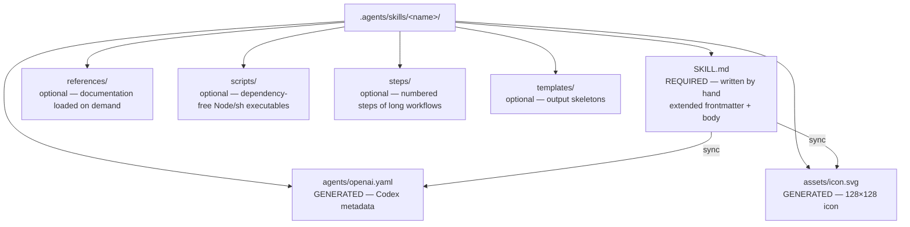

# Conventions

This document defines the contracts that `agentsdir` installs in a repository and that the `check` command validates. They derive from the NowStack architecture analyzed beforehand (see [recherche/analyse-nowstack.md](recherche/analyse-nowstack.md)), corrected for its known flaws, and aligned with the open AGENTS.md and Agent Skills standards (see [harness.md](harness.md)).

Terminology: the **source of truth** is the single versioned content under `.agents/`; a **projection** is a file derived for a given harness (symlink or copy, never edited by hand); the **`.agents.toml` manifest** records the mode (`symlink` or `copy`), the harnesses and the installed packs.

## 1. Anatomy of a skill

A skill is a `.agents/skills/<name>/` folder. Only one file is written by hand: `SKILL.md`. The Codex artifacts are generated by the CLI. The content subfolders are optional.



Content rules:

- Scripts bundled in `scripts/` are written in Node or POSIX shell **with no external dependencies**, so they run identically from Claude Code, Codex or a bare terminal.
- The documentation subfolder is always named `references/` (plural).
- Cross-invocations between skills use only the exact `$<folder-name>` token, never an alias.

## 2. The extended SKILL.md frontmatter: the single catalog

The YAML frontmatter of `SKILL.md` is the **only** source of a skill's metadata. It combines the fields of the Agent Skills standard (read by Claude Code and the other harnesses) with fields specific to `agentsdir` (consumed by the CLI to generate the Codex projections). Harnesses ignore the fields they do not know: the extension carries no risk.

```yaml
---
# Standard Agent Skills fields
name: my-skill
description: Does X end to end. Use when the user asks to X, Y or Z.
argument-hint: "[--target local|prod] <subject>"
disable-model-invocation: true

# agentsdir fields (Codex projections)
display-name: "My Skill"
short-description: "Does X end to end, autonomously"
color: "#1F4E8C"
icon: badge-check
default-prompt: "Use $my-skill to do X end to end."
implicit: false
---
```

| Field | Type | Required | Consumed by |
| --- | --- | --- | --- |
| `name` | string, equal to the folder name | yes | Claude Code, Codex, CLI |
| `description` | trigger-oriented string ("Use when…") | yes | Claude Code, Codex, CLI |
| `argument-hint` | string | no | Claude Code |
| `disable-model-invocation` | boolean | yes if the skill can write | Claude Code, CLI |
| `allowed-tools` | list of pre-authorized tool patterns | no | Claude Code |
| `display-name` | string | yes | CLI → `openai.yaml` |
| `short-description` | string of 25 to 64 characters | yes | CLI → `openai.yaml` (Codex) |
| `color` | hex `#RRGGBB` | yes | CLI → `openai.yaml` + icon |
| `icon` | icon name from the set bundled in the CLI | yes | CLI → `assets/icon.svg` |
| `default-prompt` | string containing `$<name>` | yes | CLI → `openai.yaml` |
| `implicit` | boolean (default `false`) | no | CLI → `openai.yaml` (parity) |

This is a deliberate correction relative to NowStack, whose catalog was hardcoded in a TypeScript script: here, adding a skill means creating a folder, without editing any script.

## 3. The generated `agents/openai.yaml` artifact

Exact format, derived from the frontmatter, regenerated byte for byte by `sync`, never edited by hand:

```yaml
interface:
  display_name: "My Skill"
  short_description: "Does X end to end, autonomously"
  icon_small: "./assets/icon.svg"
  icon_large: "./assets/icon.svg"
  brand_color: "#1F4E8C"
  default_prompt: "Use $my-skill to do X end to end."

policy:
  allow_implicit_invocation: false
```

- `short_description` takes the explicit `short-description` field from the frontmatter, validated between 25 and 64 characters (no derivation).
- `allow_implicit_invocation` reflects `implicit` from the frontmatter, under the parity constraint (invariant 2 below).
- `assets/icon.svg` is rendered from the icon set bundled in the CLI: a 24×24 path stroked in white on a rounded rectangle filled with `color`, exported at 128×128, with `<title>` and `aria-label` derived from `display-name`.

## 4. The invariants validated by `check`

`check` runs read-only and exits with code 1 on the first violation.

**Scope**: the catalog invariants (2 to 9) apply only to the skills **managed by agentsdir** — those whose frontmatter carries at least one catalog field (`display-name`, `short-description`, `color`, `icon`, `default-prompt`) or whose generated artifacts exist on disk. A skill installed by another tool (for example `npx skills`) or written by hand against the open Agent Skills spec alone (`name` + `description`) is validated only against that spec (invariant 1): `check` reports it as information (`skill-external`), never as an error, and `sync` touches neither its content nor its folder.

Exhaustive list:

1. **Name identity**: folder name = frontmatter `name` = `$<name>` token present in `default-prompt` = displayed name. No alias. The name follows the Agent Skills spec: 1 to 64 characters, `a-z 0-9 -`, no leading or trailing dash.
2. **Invocation parity across harnesses**: `implicit: true` in the frontmatter ⟺ `allow_implicit_invocation: true` in `openai.yaml` ⟺ absence of `disable-model-invocation`. The three express the same decision; otherwise a skill blocked on one platform stays discoverable on the other.
3. **Implicit reserved for read-only**: an implicit skill must declare `implicit: true` in its frontmatter **and** be read-only. It must therefore list its `allowed-tools` explicitly, none of them write-capable: an absent list means *no restriction*, which is the opposite of read-only. Any skill able to write is explicit.
4. **Frontmatter ⟷ projections bijection**: every folder containing a `SKILL.md` has its generated artifacts, and no orphan artifact remains for a deleted skill.
5. **`short_description` bounds**: between 25 and 64 characters (Unicode code points).
6. **Valid color**: `color` follows `#RRGGBB` (six-digit hexadecimal).
7. **Body depth**: between 12 significant (non-empty) lines and 500 lines after the frontmatter — beyond that, the content moves into `references/` (progressive disclosure).
8. **Existence of the referenced files**: every `references/…`, `scripts/…` or `steps/…` path mentioned in a `SKILL.md` exists on disk (resolved relative to the skill or to the repository root).
9. **Byte-for-byte synchronization**: `agents/openai.yaml` and `assets/icon.svg` on disk are identical to the deterministic rendering of the frontmatter; any deviation signals a manual edit.
10. **Lock integrity** (`sourceType: "github"` entries): the recomputed sha256 fingerprint of the folder equals `computedHash` — a deviation is an **error** (overwrite by a third-party tool, or an unacknowledged edit). For `sourceType: "agentsdir"` entries, a deviation is **information** ("locally modified"): reported, never blocking — it is the input to the `update` protection.
11. **Symlink health**: `CLAUDE.md` and `.claude/{rules,skills,agents}` never sit half-way between the two modes. In `symlink` mode they exist on disk as real links, not as text files holding their target (`projection-replaced-by-copy`). In **either** mode, a projection git records with mode `120000` while the working tree holds an ordinary file is a violation (`symlink-materialized`): the next clone on a machine with symlink support would turn that file into a link pointing at its own content. `check` fails on it and names the repair; `doctor` explains the same state without failing.
12. **Copy headers and freshness** (`copy` mode): every copied projection carries its "GENERATED by agentsdir — edit the source in .agents/ and run `agentsdir sync`" header and its content matches, byte for byte, the rendering recomputed from the source of truth — not the fingerprint recorded at the last sync. A source edited without a `sync` therefore fails (`projection-stale`), a projection edited by hand fails (`projection-modified`), and a projection whose source was deleted is reported as an orphan (`projection-orphan`), which `sync` removes. Orphans are found by enumerating the projected directories, not only the recorded fingerprints: a file dropped in with no source of its own is loaded by the harness all the same.
13. **Rules index in sync**: the `rules-index` managed block of `AGENTS.md` lists exactly the rules of `.agents/rules/`, **and** matches the text `sync` renders from the first line of each rule — a rule whose purpose changed is a drift, not just a missing path.
14. **Sub-agent frontmatter**: every `.agents/agents/*.md` carries a non-empty `name` (lowercase and dashes) and `description` — a file without them is silently ignored by Claude Code, which makes it the most insidious flaw.
15. **Hook script protocol**: every script of `.agents/hooks/` an event can be attributed to — through its `agentsdir:hook` metadata comment or its `<event>-<slug>.mjs` name, exactly the scripts `sync` registers — is invoked once, dry, with the sample JSON payload of its event on stdin, and must follow the protocol: stdout empty or starting with `{` (`hook-protocol-stdout`), and an exit code among the documented ones, `0` (continue) or `2` (block) (`hook-protocol-exit`). A script no event can be attributed to is user-managed: no harness runs it, and neither does `check`. The invocation is bounded — 5 seconds of wall clock, stdin closed right after the payload, output capped, not one environment variable added — and a script that overruns is a named violation (`hook-protocol-timeout`), never a hung check. `check` runs the repository's own code here: that is the price of proving a hook works before a harness discovers it does not. Like every other invariant, this one is replayed by the mutating commands before they write — `sync` invokes the hooks too, and refuses to register a script that fails the protocol.
16. **Hook registry shape**: every registry of an enabled harness (`.claude/settings.json`, `.codex/hooks.json`, `.cursor/hooks.json`) that exists on disk is valid JSON with an object at the top level. `check` and `sync` hold it to the same contract, so CI never passes on a repository `sync` would refuse.
17. **Hook registrations in step**: those registries hold exactly what the scripts of `.agents/hooks/` imply. A script added without a `sync` is registered nowhere and no harness would ever run it; a deleted script leaves registrations the harnesses would still try to execute. Both are drift (`hook-registration-drift`), and `sync` repairs them.
18. **Nothing loaded that agentsdir cannot see**: a skill folder of `.agents/skills/` or a file of `.agents/agents/` that is a symlink is refused. The harness follows it and loads what it points at, which this CLI can neither validate nor project.
19. **Hook metadata that cannot be read**: a script carrying an `agentsdir:hook` comment whose JSON is malformed, whose `event` key is missing, or which names an unknown event is reported (`hook-metadata-invalid`) instead of silently falling back to the file-name convention. The author declared an event; when the declaration cannot be read the script ends up registered under whatever its file name implies, or nowhere at all, and nothing said why. An **absent** comment is not a problem — the `<event>-<slug>.mjs` name is a documented way to declare the event.
20. **MCP servers in step**: `.agents/mcp.toml` parses, carries the name of an environment variable everywhere a secret could be written (`mcp-secret-value`), and the file each enabled harness reads holds exactly the servers it declares (`mcp-projection-drift`). A harness dropped from `[harness] enabled` that still declares them is the same drift: it would keep starting the servers. In `.codex/config.toml` the managed block must stay last, because TOML attaches any key written below it to the server table above (`mcp-block-not-last`). Detailed in §12.

## 5. Rule format

A rule is a short Markdown file in `.agents/rules/`, named in kebab-case, whose H1 is the rule name. The first line under the H1 states **when to read the rule** ("Read before…"): it is from this line that `sync` derives the "path — when to read it" entry of the `rules-index` block when regenerating it — the reading condition lives in the rule file, never in the index alone. The tone is imperative and direct: **CRITICAL**, NEVER, ALWAYS markers; `GOOD` / `BAD` example pairs in code blocks; Markdown tables for references (commands, mappings, sizes).

Two discovery mechanisms coexist:

- **Scoped rules**: a `paths:` frontmatter with globs limits the rule to the files concerned.

  ```yaml
  ---
  paths:
    - "src/api/**"
  ---
  ```

- **Rules index**: every rule, scoped or not, has a line in the `rules-index` managed block of `AGENTS.md` — "path — when to read it". Without this line, a rule with no frontmatter is invisible to agents.

**CRITICAL**: never cite a code file of the repository as a normative reference ("Modelled on `src/…`") without guaranteeing that it exists. A dead anchor produces a lying rule; `check` verifies the existence of the paths cited by the generated rules.

## 6. Structure of AGENTS.md and managed blocks

`AGENTS.md` is the real entry point, structured into three families of sections:

- **Generic** — transposable as is: entry-point preamble (the file's role, projections, ban on replacing a symlink with a copy), rules index, verification.
- **Stack** — instantiated from the stack declared at `init`: project commands, import conventions, runtime logs.
- **Product** — to be filled in by the user: product description, foundations, important files.

The CLI writes only inside **managed blocks**, delimited by markers:

```markdown
<!-- agentsdir:begin rules-index -->
… content regenerated by `sync` …
<!-- agentsdir:end rules-index -->
```

Absolute rule: in an existing file, the CLI **never writes outside its blocks**. An `AGENTS.md` that is already present is preserved in full; `init` only inserts the necessary blocks into it. This is what makes the installation additive and idempotent.

## 7. The `skills-lock.json` lock

Tracks the provenance of skills copied from an external repository ("vendored") and detects any local drift:

```json
{
  "version": 1,
  "skills": {
    "mon-skill-importe": {
      "source": "org/repo",
      "sourceType": "github",
      "skillPath": ".agents/skills/mon-skill-importe/SKILL.md",
      "computedHash": "<sha256>"
    },
    "create-skill": {
      "source": "agentsdir",
      "sourceType": "agentsdir",
      "installedVersion": "1.0.0",
      "skillPath": ".agents/skills/create-skill/SKILL.md",
      "computedHash": "<sha256 of the installed version, never recomputed by sync>"
    }
  },
  "files": {
    ".agents/rules/verification.md": {
      "source": "agentsdir",
      "sourceType": "agentsdir",
      "installedVersion": "1.0.0",
      "computedHash": "<sha256 of the file content, never recomputed by sync>",
      "declinedHash": "<sha256 of an upstream version the user refused; optional>"
    }
  }
}
```

Fingerprint algorithm: sorted list of the relative paths of the skill folder (excluding `.git` and `node_modules`), then a sha256 fed, for each file, with its relative path and its content. The fingerprint is recomputed locally: the lock detects **local drift** (a third-party tool overwriting the skill, an unacknowledged edit), it does not verify conformance with upstream. Updating the lock is a conscious act (`sync` in write mode).

The optional **`files` table** covers the content the CLI installs outside any skill folder: the generic rules of `.agents/rules/` and the shared scripts of `.agents/scripts/` written by the packs. Its keys are repo-relative POSIX paths inside `.agents/` — a key escaping the repository is refused (`lock-invalid`) — and its fingerprint is the plain sha256 of the file's bytes, not the folder algorithm above. Only what an install actually **wrote** is recorded: a file the repository already had and the install kept is left untracked rather than pinned to a render it never received. An absent `files` table is valid and means nothing is tracked outside the skills.

Two `sourceType` values: `"github"` for a skill vendored from an external repository (`vendor` command), and `"agentsdir"` for content installed by the CLI itself — the meta-skills of the `creator` pack under `skills`, the generic rules and shared scripts of the packs under `files`. The `"agentsdir"` entries carry the installed version and serve the `update` protection: intact content → upgraded; locally modified content → preserved, reported (`lock-local-change`, information, never a failure), merge offered (see [creation-assistee.md](creation-assistee.md)). A locked file that has disappeared is an error (`lock-file-missing`): restore it, or drop its entry.

These fingerprints are the only ones `sync` never recomputes: recomputing them would erase the very difference `update` reads. [`update`](commandes.md#update--v1) is what rewrites them, and only when it upgrades an entry — `computedHash` then becomes the fingerprint of the new rendering.

A declined merge is recorded separately, in an optional **`declinedHash`**: the fingerprint of the upstream version the user refused. `computedHash` is left alone, because it means the version agentsdir installed and nothing else — writing the local bytes there would make a refusal indistinguishable from a pristine install, and the next `update` would upgrade the entry as intact, overwriting exactly what the user asked to keep. With the two fields side by side, a locally modified entry whose upstream equals `declinedHash` is left alone in silence, and the merge is offered again as soon as upstream moves further. An upgrade rewrites the entry whole and drops the field.

## 8. State directories

| Directory | Role | Versioned |
| --- | --- | --- |
| `.agents/tasks/` | Deferred tasks, one per file | yes |
| `.agents/plan/` | Persisted implementation plans | yes |
| `.agents/scripts/` | Shared scripts installed by the packs (e.g. worktree lifecycle), dependency-free Node | yes |
| `.agents/memory/` | Per-machine local state (accounts, preferences) | **no** — a `.agents/memory.template/` model is versioned separately |
| `.agents/output/` | Artifacts produced by agent workflows | no |

Task conventions (`tasks/`): name `NN-kebab-title.md` (two-digit number); sections in the order **Problem → Acceptance criteria → Verification → Out of scope**, as emitted by the template `init` installs in `tasks/README.md`; every `file:line` reference must be valid at commit time; the file is **deleted when the task is delivered** — a solved task left in place reads as open work.

Excluding `.agents/memory/` corrects a flaw observed in NowStack, where the memory file was versioned with a placeholder value meant to be replaced by personal data — which the next commit published into the history.

## 9. The usage journal

The `usage` pack observes what the configuration is actually used for. This section is its **contract**: the collection stage writes exactly what follows, and the analysis stage reads exactly that and nothing more.

### Location and rotation

`.agents/output/usage/usage-YYYY-MM-DD.jsonl` — one JSON object per line, one file per day. Files older than 30 days are deleted when a session starts or ends; nothing is pruned on the tool path, which stays a single append.

The directory sits under `.agents/output/`, which the managed `.gitignore` block excludes (§8). `check` **fails** with `usage-journal-tracked` if git tracks it anyway: an ignore rule is a convention, and the journal names the paths a session touched.

### Line format

| Field | Type | Content |
| --- | --- | --- |
| `ts` | string | ISO 8601 timestamp, UTC |
| `event` | string | `PreToolUse`, `SessionStart`, `SessionEnd`, `SubagentStart`, `SubagentStop` |
| `tool` | string \| null | Tool name as the harness spells it (Cursor uses its own vocabulary) |
| `path` | string \| null | Repo-relative POSIX path, or null |
| `skill` | string \| null | Skill invoked, or null |
| `agent` | string \| null | Sub-agent invoked, or null |
| `session` | string \| null | Opaque session key: first 12 hex of sha256 of the harness session id |

Every field is always present; an unknown value is `null`, never an omitted key.

`ts` is UTC, and so is the day in the file name: a session running at 01:00 in Paris writes into the previous day's file. The two agree, so a reader never has to reconcile them.

**Not yet confirmed against a live harness**: the payload keys the `SubagentStart` and `SubagentStop` events carry. The collector accepts `subagent_type`, `agent_type`, `agent_name` and `agentName`, at the root of the payload or inside `tool_input` — the shapes observed on 2026-09-12. A real session is what settles it, which is what the manual tier exists for (`e2e/validation-agent/`).

```json
{"ts":"2026-09-12T10:11:12.000Z","event":"PreToolUse","tool":"Read","path":"src/api/handler.ts","skill":null,"agent":null,"session":"9f2c1ab40d77"}
```

### What never reaches the journal

Prompts, file contents, command lines, diffs, absolute paths, and the raw session identifier. The collector reads an **allow-list** of keys out of `tool_input` (`file_path`, `path`, `notebook_path`, `filePath`, `skill`, `skill_name`, `skillName`, `subagent_type`, `agent_type`, `agent_name`, `agentName`) and never the object as a whole — reading it whole is what would leak `command`, `content` and `old_string`.

A path that resolves outside the repository, or matches a glob of `[usage].exclude`, is recorded as `null`: the event still counts, the path does not.

### Configuration

`[usage]` in `.agents.toml`, read by the collectors themselves with a minimal reader (a hook parses no TOML, so both values stay on one line each):

```toml
[usage]
enabled = true
exclude = ["src/clients/**", "private/**"]
```

`enabled = false` suspends the collection without uninstalling anything. An absent section means collection is on — installing the pack is what asked for it. `exclude` takes the globs of `agentsdir add rule --paths`.

### Cost

Measured on 2026-09-12, Windows 11, Node 22, median of 40 invocations: **41.8 ms** per tool call for the collector against **34.1 ms** for an empty Node process — a **net overhead of 7.6 ms**. The dominant cost is the process start, which the harness pays for any hook; the collector itself is one manifest read and one line appended.

### What the collection does *not* do

It produces no report and passes no judgement — that is the review stage below. And **rules are not observable**: a rule is injected into the context, and no hook can say whether an agent read it. What the journal supports is *relevance*, not reading: a rule declares its scope (`--paths "src/api/**"`), the journal records that the session touched `src/api/x.ts`, and the analysis draws the conclusion.

## 10. The context budget

Everything installed here is paid, at every session, in the context window. `doctor` reports what each element weighs and **when** it is paid; nothing about it can fail a build. It is the counterpart of the usage journal (§9): usage says *whether* an element serves, the budget says *what it costs*, and the two together answer the only question a team asks — is this skill worth what it costs?

### The nature of the figures

| Figure | Nature | How it is obtained |
| --- | --- | --- |
| `bytes` | **exact** | UTF-8 byte length of the measured text |
| `lines` | **exact** | line count; a trailing newline does not open one more |
| `tokens` | **estimate**, always printed with a `~` | Unicode code points divided by **4**, rounded up |

The decision is explicit: the report **estimates** tokens rather than counting them, and says so everywhere it shows one. An exact count needs the tokenizer of the target model, therefore a heavy dependency — and this CLI limits itself to four runtime dependencies, each justified in writing. An assumed approximation is more useful than a byte count the reader has to convert, provided it never passes for a measurement.

**Calibration**, done once, on 2026-09-12: the o200k_base BPE (`gpt-tokenizer` 4.0.0, installed outside the repository for the occasion, left in no manifest) over 33 real Markdown files of this repository — `AGENTS.md`, `README.md`, `.agents/rules/`, `.agents/skills/`, `docs/`, `e2e/`. Result: **183 285 characters for 45 435 tokens, i.e. 4.03 characters per token**, with a per-file spread of 3.69 to 4.52. The divisor is kept at a round **4**, which over-estimates the whole corpus by 0.9% — the safe direction for a budget, and within 8% over to 13% under on a single file.

Claude's tokenizer is not public, and o200k is a proxy, not the target: **no figure derived from this divisor is exact**, which is why the report carries the divisor and the calibration next to the numbers, in the terminal and in `--json` alike.

**What the estimate is good for, checked on 2026-09-12.** Comparing every pair of items of a report against the real o200k count: on this repository's own content, 208 pairs, **0 inversions** — the ranking is the real one. On a generated repository padded with repetitive filler, which is the worst case for a characters-per-token ratio because such text compresses far better than prose, 309 pairs gave 3 inversions (1.0%), each between two items within 6.1% of one another. The ranking is therefore trustworthy for what the report is read for — which element weighs most — and only ever uncertain between near-ties. Absolute figures on such filler drifted up to 53% above the real count; on real prose the corpus error stays under 1%.

### The three moments of payment

A total that adds everything up is impressive and false. Each element is billed to exactly one moment:

| Moment | What is paid | Elements |
| --- | --- | --- |
| **always** | every session, before anything happens | `AGENTS.md` whole, the `name` + `description` of each skill, the `name` + `description` of each sub-agent, every rule **without** a `paths:` scope |
| **on invocation** | when the element is activated | a skill body (frontmatter excluded), the files of its `references/`, a sub-agent body |
| **when relevant** | when the session touches a file the scope covers | a rule **with** a `paths:` scope |

Three consequences worth stating, because each one is a way to get the count wrong:

- The rules index is inside `AGENTS.md` and is not a line of its own — counting the block again would bill it twice.
- Only the **source of truth** is measured. The `.claude/**` projections are the same bytes under another name; counting both would double every figure.
- A rule with no `paths:` has no scope to miss, so it is paid at **every** session. Reading every rule as "when relevant" under-reports the always-paid total exactly as badly as adding everything up over-reports it.

`scripts/`, `steps/`, `templates/` and `assets/` are not counted: they are executed, rendered or shipped, never read into the window.

### The Agent Skills bounds

The spec states bounds that nothing used to verify. `doctor` checks two of them and **informs**:

| Bound | Source | Reported as |
| --- | --- | --- |
| `description` up to 1024 characters | spec, hard limit | `skill-description-length` |
| body under ~5000 tokens | spec, recommendation | `skill-body-tokens` |

The third — `SKILL.md` under 500 lines — is already invariant 7 of `check` (§4), and is not repeated here. The token bound is the one that discriminates: a 400-line body made of long lines blows ~5000 tokens without the line invariant seeing anything.

An overrun is **information, never a failure**: `check` stays the guardian of drift, `doctor` diagnoses sobriety. `doctor` exits 0 whatever the budget says.

### Reading the report

`agentsdir doctor` prints one block per moment of payment, heaviest first, capped at 12 lines per block so the diagnosis stays readable on a repository with sixty skills; the every-session total and the general total are two separate lines. `agentsdir doctor --json` carries the whole thing under the `context` key — every item without exception, the totals, the bounds, and the nature of each figure — which is what makes a budget followable over time.

### Cost of the measure

Measured on 2026-09-12, Windows 11, Node 22, on a generated repository of **60 skills, 6 rules and 60 reference files** (187 measured items), median of 20 runs: **16.3 ms** for the whole measure (14.2 ms min, 29.2 ms max). It is one pass over `.agents/` and `AGENTS.md`, with no fingerprint and no process started — the measure is negligible against the `doctor` probes that surround it.

## 11. The usage review

Stage 2 of the same pack, and the consumer of the format above. It answers three questions, and the third is the one nobody else asks: what serves, what was never seen, and **what the measure cannot say**.

The work is split the way the two stages are: a dependency-free script (`.agents/skills/review-usage/scripts/summarize.mjs`) counts, and the `$review-usage` meta-skill judges. The script exists rather than instructions to read the journal because a month of sessions is thousands of JSONL lines, and pouring them into the context window to count them is the waste §10 exists to expose. It reads, prints Markdown (or JSON under `--json`), and writes nothing.

### Presence and absence are not symmetric

**A presence is proved by one line; an absence needs volume.** The review therefore states the volume it rests on and refuses to conclude on an absence below **20 distinct sessions AND 14 distinct days**. Both conditions: twenty sessions crammed into one afternoon say nothing about a skill that serves only at release time, and fourteen days holding three sessions say nothing at all.

Below the threshold the "never seen" table is replaced by the refusal, naming what is missing. The "what was used" table is printed regardless — it needs no threshold.

### Rules: relevance, never usage

A rule is not invocable, and no hook can say whether an agent read one. The review speaks only of **relevance**, in three buckets — never two:

| Bucket | Meaning |
| --- | --- |
| `relevant` | the rule declares a `paths:` scope, and that scope met a path a session touched |
| `never-relevant` | the rule declares a scope, and it never met one over the window |
| `cannot-say` | the rule declares **no** scope: there is nothing to meet, so nothing can be concluded either way |

The third bucket is the one that is easy to get wrong. An unscoped rule filed as "never relevant" would propose deleting a rule that applies everywhere — and it is precisely the kind that is paid at every session (§10). It belongs in the limits section, with its cost.

The glob semantics are those of `add rule --paths`, and the matcher is the collector's, character for character: a scope and a journalled path have to be compared under one set of rules.

### Crossing usage with cost

Given `agentsdir doctor --json` through `--doctor <file>`, the review crosses what an element is used for with what it costs. The two costs stay apart, as in §10: what is paid **at every session** and what is paid **per invocation**. A skill that is never invoked pays its metadata always and its body never, so adding the two would reproduce the impressive, false total. Without the file the review says the cost was **not measured** — never that it is zero.

### What the review never does

It deletes nothing and runs no `pack remove`. Every removal is a proposal carrying the data that motivates it — sessions observed, last occurrence, cost per session — and the decision is the team's. The review is written to `.agents/output/usage/`, which git ignores: it summarizes the journal and carries the same sensitivity.

## 12. MCP servers

`.agents/mcp.toml` declares the MCP servers of the repository once; `sync` projects them into the file each enabled harness reads, and `check` reports any drift. The three formats and the reasons behind them are in [harness.md §4](harness.md); what follows is the contract of the source.

```toml
[servers.context7]
type = "stdio"                            # stdio | http | sse
command = "npx"
args = ["-y", "@upstash/context7-mcp"]
env = ["CONTEXT7_API_KEY"]                # variable NAMES, never values

[servers.figma]
type = "http"
url = "https://mcp.figma.com/mcp"
headers = { "X-Figma-Token" = "FIGMA_OAUTH_TOKEN" }   # header -> variable NAME
```

- `type` is required and decides which other keys are: `command` for `stdio`, `url` for `http` and `sse`. `args` and `env` apply to `stdio`, `headers` to the two remote transports.
- A server name follows the skill grammar — 1 to 64 characters of `a-z`, `0-9` and `-`, no leading or trailing dash. It becomes a JSON key and a TOML table segment.
- The file is optional. A repository that declares no server gets no projection: no empty `.mcp.json` appears in anyone's diff.

### Names, never values

`.agents/` is committed and pushed, and an MCP server is usually configured with a token. So `env` is a **list of variable names** and `headers` maps a header to a **variable name** — a shape in which a secret cannot be expressed by accident. Each harness resolves a name into a value its own way at run time, and `check` fails with `mcp-secret-value` on anything that does not match `^[A-Z_][A-Z0-9_]*$`. The diagnostic truncates what it found: a report a user may paste into an issue must not carry the secret it is warning about.

### Ownership, and clean removal

A server declared in the source is ours and is rewritten at each `sync`; every other entry of `.mcp.json` or `.cursor/mcp.json` belongs to the user and is never touched — including one carrying a literal token they typed themselves.

Ownership is by **name**, not by content. Matching on content — the rule the hook registries use, where a registration never changes — would make a server untouchable the moment its `args` were edited, leaving the stale version configured for good. Removal then needs a memory: `[mcp] servers` in `.agents.toml` records the names projected by the last run, so a name dropped from the source is still recognised as ours for exactly one `sync`, which removes it from the three files. A harness dropped from `[harness] enabled` is deprojected the same way, never merely skipped: a skipped harness would keep starting the servers.

### The invariants

| Rule | What it catches |
| --- | --- |
| `mcp-source-invalid` | `.agents/mcp.toml` does not parse, or a key has the wrong shape |
| `mcp-secret-value` | a value written where a variable name belongs |
| `mcp-projection-drift` | a harness file differs from the declaration, or still holds servers of a disabled harness |
| `mcp-block-not-last` | a key was written after the managed block of `.codex/config.toml`, where TOML attaches it to the server table above |

See also: [architecture.md](architecture.md) (engine and projections), [commandes.md](commandes.md) (command specification), [roadmap.md](roadmap.md) (milestones).
