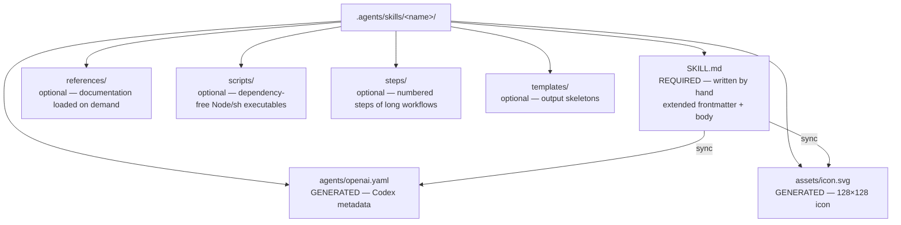

# Conventions

This document defines the contracts that `agentsdir` installs in a repository and that the `check` command validates. They derive from the NowStack architecture analyzed beforehand (see [recherche/analyse-nowstack.md](recherche/analyse-nowstack.md)), corrected for its known flaws, and aligned with the open AGENTS.md and Agent Skills standards (see [harness.md](harness.md)).

Terminology: the **source of truth** is the single versioned content under `.agents/`; a **projection** is a file derived for a given harness (symlink or copy, never edited by hand); the **`.agents.toml` manifest** records the mode (`symlink` or `copy`), the harnesses and the installed packs.

## 1. Anatomy of a skill

A skill is a `.agents/skills/<name>/` folder. Only one file is written by hand: `SKILL.md`. The Codex artifacts are generated by the CLI. The content subfolders are optional.



Content rules:

- Scripts bundled in `scripts/` are written in Node or POSIX shell **with no external dependencies**, so they run identically from Claude Code, Codex or a bare terminal.
- The documentation subfolder is always named `references/` (plural).
- Cross-invocations between skills use only the exact `$<folder-name>` token, never an alias.

## 2. The extended SKILL.md frontmatter: the single catalog

The YAML frontmatter of `SKILL.md` is the **only** source of a skill's metadata. It combines the fields of the Agent Skills standard (read by Claude Code and the other harnesses) with fields specific to `agentsdir` (consumed by the CLI to generate the Codex projections). Harnesses ignore the fields they do not know: the extension carries no risk.

```yaml
---
# Standard Agent Skills fields
name: mon-skill
description: Fait X de bout en bout. Use when the user asks to X, Y or Z.
argument-hint: "[--target local|prod] <sujet>"
disable-model-invocation: true

# agentsdir fields (Codex projections)
display-name: "Mon Skill"
short-description: "Fait X de bout en bout, en autonomie"
color: "#1F4E8C"
icon: badge-check
default-prompt: "Use $mon-skill to do X end to end."
implicit: false
---
```

| Field | Type | Required | Consumed by |
| --- | --- | --- | --- |
| `name` | string, equal to the folder name | yes | Claude Code, Codex, CLI |
| `description` | trigger-oriented string ("Use when…") | yes | Claude Code, Codex, CLI |
| `argument-hint` | string | no | Claude Code |
| `disable-model-invocation` | boolean | yes if the skill can write | Claude Code, CLI |
| `allowed-tools` | list of pre-authorized tool patterns | no | Claude Code |
| `display-name` | string | yes | CLI → `openai.yaml` |
| `short-description` | string of 25 to 64 characters | yes | CLI → `openai.yaml` (Codex) |
| `color` | hex `#RRGGBB` | yes | CLI → `openai.yaml` + icon |
| `icon` | icon name from the set bundled in the CLI | yes | CLI → `assets/icon.svg` |
| `default-prompt` | string containing `$<name>` | yes | CLI → `openai.yaml` |
| `implicit` | boolean (default `false`) | no | CLI → `openai.yaml` (parity) |

This is a deliberate correction relative to NowStack, whose catalog was hardcoded in a TypeScript script: here, adding a skill means creating a folder, without editing any script.

## 3. The generated `agents/openai.yaml` artifact

Exact format, derived from the frontmatter, regenerated byte for byte by `sync`, never edited by hand:

```yaml
interface:
  display_name: "Mon Skill"
  short_description: "Fait X de bout en bout, en autonomie"
  icon_small: "./assets/icon.svg"
  icon_large: "./assets/icon.svg"
  brand_color: "#1F4E8C"
  default_prompt: "Use $mon-skill to do X end to end."

policy:
  allow_implicit_invocation: false
```

- `short_description` takes the explicit `short-description` field from the frontmatter, validated between 25 and 64 characters (no derivation).
- `allow_implicit_invocation` reflects `implicit` from the frontmatter, under the parity constraint (invariant 2 below).
- `assets/icon.svg` is rendered from the icon set bundled in the CLI: a 24×24 path stroked in white on a rounded rectangle filled with `color`, exported at 128×128, with `<title>` and `aria-label` derived from `display-name`.

## 4. The invariants validated by `check`

`check` runs read-only and exits with code 1 on the first violation.

**Scope**: the catalog invariants (2 to 9) apply only to the skills **managed by agentsdir** — those whose frontmatter carries at least one catalog field (`display-name`, `short-description`, `color`, `icon`, `default-prompt`) or whose generated artifacts exist on disk. A skill installed by another tool (for example `npx skills`) or written by hand against the open Agent Skills spec alone (`name` + `description`) is validated only against that spec (invariant 1): `check` reports it as information (`skill-external`), never as an error, and `sync` touches neither its content nor its folder.

Exhaustive list:

1. **Name identity**: folder name = frontmatter `name` = `$<name>` token present in `default-prompt` = displayed name. No alias. The name follows the Agent Skills spec: 1 to 64 characters, `a-z 0-9 -`, no leading or trailing dash.
2. **Invocation parity across harnesses**: `implicit: true` in the frontmatter ⟺ `allow_implicit_invocation: true` in `openai.yaml` ⟺ absence of `disable-model-invocation`. The three express the same decision; otherwise a skill blocked on one platform stays discoverable on the other.
3. **Implicit reserved for read-only**: an implicit skill must declare `implicit: true` in its frontmatter **and** be read-only; any skill able to write is explicit.
4. **Frontmatter ⟷ projections bijection**: every folder containing a `SKILL.md` has its generated artifacts, and no orphan artifact remains for a deleted skill.
5. **`short_description` bounds**: between 25 and 64 characters (Unicode code points).
6. **Valid color**: `color` follows `#RRGGBB` (six-digit hexadecimal).
7. **Body depth**: between 12 significant (non-empty) lines and 500 lines after the frontmatter — beyond that, the content moves into `references/` (progressive disclosure).
8. **Existence of the referenced files**: every `references/…`, `scripts/…` or `steps/…` path mentioned in a `SKILL.md` exists on disk (resolved relative to the skill or to the repository root).
9. **Byte-for-byte synchronization**: `agents/openai.yaml` and `assets/icon.svg` on disk are identical to the deterministic rendering of the frontmatter; any deviation signals a manual edit.
10. **Lock integrity** (`sourceType: "github"` entries): the recomputed sha256 fingerprint of the folder equals `computedHash` — a deviation is an **error** (overwrite by a third-party tool, or an unacknowledged edit). For `sourceType: "agentsdir"` entries, a deviation is **information** ("locally modified"): reported, never blocking — it is the input to the `update` protection.
11. **Symlink health** (`symlink` mode): `CLAUDE.md` and `.claude/{rules,skills,agents}` are recorded in git mode `120000` **and** exist on disk as links — never materialized as text files containing their target.
12. **Copy headers and freshness** (`copy` mode): every copied projection carries its "GENERATED by agentsdir — edit the source in .agents/ and run `agentsdir sync`" header and its content matches, byte for byte, the rendering recomputed from the source of truth — not the fingerprint recorded at the last sync. A source edited without a `sync` therefore fails (`projection-stale`), a projection edited by hand fails (`projection-modified`), and a projection whose source was deleted is reported as an orphan (`projection-orphan`), which `sync` removes.
13. **Rules index in sync**: the rules index of `AGENTS.md` is in sync with `.agents/rules/` (managed block `rules-index`).
14. **Sub-agent frontmatter**: every `.agents/agents/*.md` carries a non-empty `name` (lowercase and dashes) and `description` — a file without them is silently ignored by Claude Code, which makes it the most insidious flaw.
15. **Hook script protocol**: every script in `.agents/hooks/` can be invoked dry (sample JSON on stdin) and follows the protocol — stdout empty or starting with `{`, documented exit code.

## 5. Rule format

A rule is a short Markdown file in `.agents/rules/`, named in kebab-case, whose H1 is the rule name. The first line under the H1 states **when to read the rule** ("Read before…"): it is from this line that `sync` derives the "path — when to read it" entry of the `rules-index` block when regenerating it — the reading condition lives in the rule file, never in the index alone. The tone is imperative and direct: **CRITICAL**, NEVER, ALWAYS markers; `GOOD` / `BAD` example pairs in code blocks; Markdown tables for references (commands, mappings, sizes).

Two discovery mechanisms coexist:

- **Scoped rules**: a `paths:` frontmatter with globs limits the rule to the files concerned.

  ```yaml
  ---
  paths:
    - "src/api/**"
  ---
  ```

- **Rules index**: every rule, scoped or not, has a line in the `rules-index` managed block of `AGENTS.md` — "path — when to read it". Without this line, a rule with no frontmatter is invisible to agents.

**CRITICAL**: never cite a code file of the repository as a normative reference ("Modelled on `src/…`") without guaranteeing that it exists. A dead anchor produces a lying rule; `check` verifies the existence of the paths cited by the generated rules.

## 6. Structure of AGENTS.md and managed blocks

`AGENTS.md` is the real entry point, structured into three families of sections:

- **Generic** — transposable as is: entry-point preamble (the file's role, projections, ban on replacing a symlink with a copy), rules index, verification.
- **Stack** — instantiated from the stack declared at `init`: project commands, import conventions, runtime logs.
- **Product** — to be filled in by the user: product description, foundations, important files.

The CLI writes only inside **managed blocks**, delimited by markers:

```markdown
<!-- agentsdir:begin rules-index -->
… content regenerated by `sync` …
<!-- agentsdir:end rules-index -->
```

Absolute rule: in an existing file, the CLI **never writes outside its blocks**. An `AGENTS.md` that is already present is preserved in full; `init` only inserts the necessary blocks into it. This is what makes the installation additive and idempotent.

## 7. The `skills-lock.json` lock

Tracks the provenance of skills copied from an external repository ("vendored") and detects any local drift:

```json
{
  "version": 1,
  "skills": {
    "mon-skill-importe": {
      "source": "org/repo",
      "sourceType": "github",
      "skillPath": ".agents/skills/mon-skill-importe/SKILL.md",
      "computedHash": "<sha256>"
    },
    "create-skill": {
      "source": "agentsdir",
      "sourceType": "agentsdir",
      "installedVersion": "1.0.0",
      "skillPath": ".agents/skills/create-skill/SKILL.md",
      "computedHash": "<sha256 de la version installée, jamais recalculée par sync>"
    }
  }
}
```

Fingerprint algorithm: sorted list of the relative paths of the skill folder (excluding `.git` and `node_modules`), then a sha256 fed, for each file, with its relative path and its content. The fingerprint is recomputed locally: the lock detects **local drift** (a third-party tool overwriting the skill, an unacknowledged edit), it does not verify conformance with upstream. Updating the lock is a conscious act (`sync` in write mode).

Two `sourceType` values: `"github"` for a skill vendored from an external repository (`vendor` command), and `"agentsdir"` for content installed by the CLI itself (meta-skills of the `creator` pack, generic rules, templates). The `"agentsdir"` entries carry the installed version and serve the `update` protection: intact content → upgraded; locally modified content → preserved, reported, merge offered (see [creation-assistee.md](creation-assistee.md)).

## 8. State directories

| Directory | Role | Versioned |
| --- | --- | --- |
| `.agents/tasks/` | Deferred tasks, one per file | yes |
| `.agents/plan/` | Persisted implementation plans | yes |
| `.agents/scripts/` | Shared scripts installed by the packs (e.g. worktree lifecycle), dependency-free Node | yes |
| `.agents/memory/` | Per-machine local state (accounts, preferences) | **no** — a `.agents/memory.template/` model is versioned separately |
| `.agents/output/` | Artifacts produced by agent workflows | no |

Task conventions (`tasks/`): name `NN-kebab-title.md` (two-digit number); sections in the order **Problem → Files → Acceptance criteria → Implementation notes → Verification → Out of scope**; every `file:line` reference must be valid at commit time; the file is **deleted when the task is delivered** — a solved task left in place reads as open work.

Excluding `.agents/memory/` corrects a flaw observed in NowStack, where the memory file was versioned with a placeholder value meant to be replaced by personal data — which the next commit published into the history.

See also: [architecture.md](architecture.md) (engine and projections), [commandes.md](commandes.md) (command specification), [roadmap.md](roadmap.md) (milestones).
