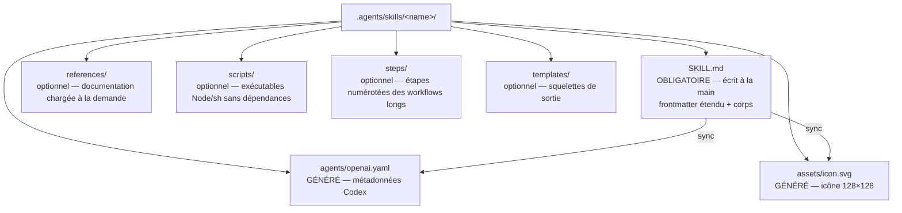

# Conventions

Ce document définit les contrats que `agentsdir` installe dans un dépôt et que la commande `check` valide. Ils sont dérivés de l'architecture NowStack analysée en amont (voir [recherche/analyse-nowstack.md](recherche/analyse-nowstack.md)), corrigés de ses défauts connus, et alignés sur les standards ouverts AGENTS.md et Agent Skills (voir [harness.md](harness.md)).

Terminologie : la **source de vérité** est le contenu unique versionné sous `.agents/` ; une **projection** est un fichier dérivé pour un harness donné (symlink ou copie, jamais éditée à la main) ; le **manifeste `.agents.toml`** enregistre le mode (`symlink` ou `copy`), les harness et les packs installés.

## 1. Anatomie d'un skill

Un skill est un dossier `.agents/skills/<name>/`. Un seul fichier est écrit à la main : `SKILL.md`. Les artefacts Codex sont générés par la CLI. Les sous-dossiers de contenu sont optionnels.



Règles de contenu :

- Les scripts embarqués dans `scripts/` sont écrits en Node ou en shell POSIX **sans dépendances externes**, pour s'exécuter identiquement depuis Claude Code, Codex ou un terminal nu.
- Le sous-dossier de documentation s'appelle toujours `references/` (au pluriel).
- Les invocations croisées entre skills utilisent uniquement le jeton exact `$<nom-de-dossier>`, jamais un alias.

## 2. Le frontmatter étendu de SKILL.md : le catalogue unique

Le frontmatter YAML de `SKILL.md` est la **seule** source des métadonnées d'un skill. Il combine les champs du standard Agent Skills (lus par Claude Code et les autres harness) et des champs propres à `agentsdir` (consommés par la CLI pour générer les projections Codex). Les harness ignorent les champs qu'ils ne connaissent pas : l'extension est sans risque.

```yaml
---
# Champs standard Agent Skills
name: mon-skill
description: Fait X de bout en bout. Use when the user asks to X, Y or Z.
argument-hint: "[--target local|prod] <sujet>"
disable-model-invocation: true

# Champs agentsdir (projections Codex)
display-name: "Mon Skill"
short-description: "Fait X de bout en bout"
color: "#1F4E8C"
icon: badge-check
default-prompt: "Use $mon-skill to do X end to end."
implicit: false
---
```

| Champ | Type | Obligatoire | Consommé par |
| --- | --- | --- | --- |
| `name` | chaîne, égale au nom du dossier | oui | Claude Code, Codex, CLI |
| `description` | chaîne orientée déclencheurs (« Use when… ») | oui | Claude Code, Codex, CLI |
| `argument-hint` | chaîne | non | Claude Code |
| `disable-model-invocation` | booléen | oui si le skill peut écrire | Claude Code, CLI |
| `allowed-tools` | liste de motifs d'outils pré-autorisés | non | Claude Code |
| `display-name` | chaîne | oui | CLI → `openai.yaml` |
| `short-description` | chaîne de 25 à 64 caractères | oui | CLI → `openai.yaml` (Codex) |
| `color` | hex `#RRGGBB` | oui | CLI → `openai.yaml` + icône |
| `icon` | nom d'icône du jeu embarqué dans la CLI | oui | CLI → `assets/icon.svg` |
| `default-prompt` | chaîne contenant `$<name>` | oui | CLI → `openai.yaml` |
| `implicit` | booléen (défaut `false`) | non | CLI → `openai.yaml` (parité) |

C'est une correction délibérée par rapport à NowStack, dont le catalogue vivait en dur dans un script TypeScript : ajouter un skill se fait ici en créant un dossier, sans éditer aucun script.

## 3. L'artefact généré `agents/openai.yaml`

Format exact, dérivé du frontmatter, régénéré octet à octet par `sync`, jamais édité à la main :

```yaml
interface:
  display_name: "Mon Skill"
  short_description: "Fait X de bout en bout"
  icon_small: "./assets/icon.svg"
  icon_large: "./assets/icon.svg"
  brand_color: "#1F4E8C"
  default_prompt: "Use $mon-skill to do X end to end."

policy:
  allow_implicit_invocation: false
```

- `short_description` reprend le champ explicite `short-description` du frontmatter, validé entre 25 et 64 caractères (pas de dérivation).
- `allow_implicit_invocation` reflète `implicit` du frontmatter, sous contrainte de parité (invariant 2 ci-dessous).
- `assets/icon.svg` est rendu depuis le jeu d'icônes embarqué dans la CLI : tracé 24×24 en trait blanc sur un rectangle arrondi rempli de `color`, exporté en 128×128, avec `<title>` et `aria-label` dérivés de `display-name`.

## 4. Les invariants validés par `check`

`check` s'exécute en lecture seule et sort avec le code 1 à la première violation. Liste exhaustive :

1. **Identité du nom** : nom du dossier = frontmatter `name` = jeton `$<name>` présent dans `default-prompt` = nom affiché. Aucun alias. Le nom respecte la spec Agent Skills : 1 à 64 caractères, `a-z 0-9 -`, pas de tiret en début/fin.
2. **Parité d'invocation entre harness** : `implicit: true` dans le frontmatter ⟺ `allow_implicit_invocation: true` dans `openai.yaml` ⟺ absence de `disable-model-invocation`. Les trois expriment la même décision, sinon un skill bloqué sur une plateforme reste découvrable sur l'autre.
3. **Implicite réservé à la lecture seule** : un skill implicite doit déclarer `implicit: true` dans son frontmatter **et** être en lecture seule ; tout skill capable d'écrire est explicite.
4. **Bijection frontmatter ⟷ projections** : chaque dossier contenant un `SKILL.md` possède ses artefacts générés, et aucun artefact orphelin ne subsiste pour un skill supprimé.
5. **Bornes de `short_description`** : entre 25 et 64 caractères (points de code Unicode).
6. **Couleur valide** : `color` respecte `#RRGGBB` (hexadécimal sur 6 chiffres).
7. **Profondeur du corps** : entre 12 lignes significatives (non vides) et 500 lignes après le frontmatter — au-delà, le contenu part dans `references/` (divulgation progressive).
8. **Existence des fichiers référencés** : tout chemin `references/…`, `scripts/…` ou `steps/…` mentionné dans un `SKILL.md` existe sur disque (résolution relative au skill ou à la racine du dépôt).
9. **Synchronisation octet à octet** : `agents/openai.yaml` et `assets/icon.svg` sur disque sont identiques au rendu déterministe du frontmatter ; tout écart signale une édition manuelle.
10. **Intégrité du verrou** (entrées `sourceType: "github"`) : l'empreinte sha256 recalculée du dossier égale `computedHash` — un écart est une **erreur** (écrasement par un outil tiers ou édition non assumée). Pour les entrées `sourceType: "agentsdir"`, un écart est une **information** (« modifié localement ») : signalé, jamais bloquant — c'est la donnée d'entrée de la protection d'`update`.
11. **Santé des symlinks** (mode `symlink`) : `CLAUDE.md` et `.claude/{rules,skills,agents}` sont enregistrés en mode git `120000` **et** existent sur disque comme liens — jamais matérialisés en fichiers texte contenant leur cible.
12. **En-têtes des copies** (mode `copy`) : chaque projection copiée porte son en-tête « GENERATED by agentsdir — edit the source in .agents/ and run `agentsdir sync` » et son contenu correspond, par empreinte, à la source de vérité.
13. **Index des règles synchronisé** : l'index des règles d'`AGENTS.md` est synchronisé avec `.agents/rules/` (bloc géré `rules-index`).
14. **Frontmatter des sous-agents** : chaque `.agents/agents/*.md` porte `name` (minuscules et tirets) et `description` non vides — un fichier sans eux est ignoré silencieusement par Claude Code, ce qui en fait le défaut le plus sournois.
15. **Protocole des scripts de hook** : chaque script de `.agents/hooks/` est invocable à blanc (JSON d'exemple sur stdin) et répond au protocole — stdout vide ou commençant par `{`, code de sortie documenté.

## 5. Format des règles

Une règle est un fichier Markdown court dans `.agents/rules/`, nommé en kebab-case, dont le H1 est le nom de la règle. Le ton est impératif et direct : marqueurs **CRITICAL**, NEVER, ALWAYS ; paires d'exemples `GOOD` / `BAD` en blocs de code ; tableaux Markdown pour les références (commandes, correspondances, tailles).

Deux mécanismes de découverte coexistent :

- **Règles scopées** : un frontmatter `paths:` avec des globs limite la règle aux fichiers concernés.

  ```yaml
  ---
  paths:
    - "src/api/**"
  ---
  ```

- **Index des règles** : toutes les règles, scopées ou non, ont une ligne dans le bloc géré `rules-index` d'`AGENTS.md` — « chemin — quand la lire ». Sans cette ligne, une règle sans frontmatter est invisible pour les agents.

**CRITICAL** : ne jamais citer un fichier de code du dépôt comme référence normative (« Modelled on `src/…` ») sans garantir son existence. Une ancre morte produit une règle mensongère ; `check` vérifie l'existence des chemins cités par les règles générées.

## 6. Structure d'AGENTS.md et blocs gérés

`AGENTS.md` est le point d'entrée réel, structuré en trois familles de sections :

- **Génériques** — transposables telles quelles : préambule du point d'entrée (rôle du fichier, projections, interdiction de remplacer un symlink par une copie), index des règles, vérification.
- **Stack** — instanciées d'après la stack déclarée à l'`init` : commandes du projet, conventions d'imports, journaux d'exécution.
- **Produit** — à remplir par l'utilisateur : description du produit, fondations, fichiers importants.

La CLI n'écrit que dans des **blocs gérés**, délimités par des marqueurs :

```markdown
<!-- agentsdir:begin rules-index -->
… contenu régénéré par `sync` …
<!-- agentsdir:end rules-index -->
```

Règle absolue : dans un fichier existant, la CLI **n'écrit jamais hors de ses blocs**. Un `AGENTS.md` déjà présent est préservé intégralement ; `init` y insère seulement les blocs nécessaires. C'est ce qui rend l'installation additive et idempotente.

## 7. Le verrou `skills-lock.json`

Trace la provenance des skills copiés depuis un dépôt externe (« vendorés ») et détecte toute dérive locale :

```json
{
  "version": 1,
  "skills": {
    "mon-skill-importe": {
      "source": "org/repo",
      "sourceType": "github",
      "skillPath": ".agents/skills/mon-skill-importe/SKILL.md",
      "computedHash": "<sha256>"
    },
    "create-skill": {
      "source": "agentsdir",
      "sourceType": "agentsdir",
      "installedVersion": "1.0.0",
      "skillPath": ".agents/skills/create-skill/SKILL.md",
      "computedHash": "<sha256 de la version installée, jamais recalculée par sync>"
    }
  }
}
```

Algorithme d'empreinte : liste triée des chemins relatifs du dossier du skill (en excluant `.git` et `node_modules`), puis sha256 alimenté, pour chaque fichier, par son chemin relatif et son contenu. L'empreinte est recalculée localement : le verrou détecte la **dérive locale** (un outil tiers qui écrase le skill, une édition non assumée), il ne vérifie pas la conformité à l'upstream. La mise à jour du verrou est un acte conscient (`sync` en mode écriture).

Deux valeurs de `sourceType` : `"github"` pour un skill vendoré depuis un dépôt externe (commande `vendor`), et `"agentsdir"` pour un contenu installé par la CLI elle-même (méta-skills du pack `creator`, règles génériques, gabarits). Les entrées `"agentsdir"` portent la version installée et servent à la protection d'`update` : contenu intact → mis à niveau ; contenu modifié localement → préservé, signalé, fusion proposée (voir [creation-assistee.md](creation-assistee.md)).

## 8. Répertoires d'état

| Répertoire | Rôle | Versionné |
| --- | --- | --- |
| `.agents/tasks/` | Tâches différées, une par fichier | oui |
| `.agents/plan/` | Plans d'implémentation persistés | oui |
| `.agents/memory/` | État local par machine (comptes, préférences) | **non** — un modèle `.agents/memory.template/` est versionné à part |
| `.agents/output/` | Artefacts produits par les workflows d'agents | non |

Conventions des tâches (`tasks/`) : nom `NN-titre-kebab.md` (numéro sur deux chiffres) ; sections dans l'ordre **Problème → Fichiers → Critères d'acceptation → Notes d'implémentation → Vérification → Hors périmètre** ; chaque référence `fichier:ligne` doit être valide au moment du commit ; le fichier est **supprimé quand la tâche est livrée** — une tâche résolue qui reste se lit comme du travail ouvert.

L'exclusion de `.agents/memory/` corrige un défaut observé chez NowStack, où le fichier de mémoire était versionné avec une valeur de substitution destinée à être remplacée par une donnée personnelle — que le commit suivant publiait dans l'historique.

Voir aussi : [architecture.md](architecture.md) (moteur et projections), [commandes.md](commandes.md) (spécification des commandes), [roadmap.md](roadmap.md) (jalons).
