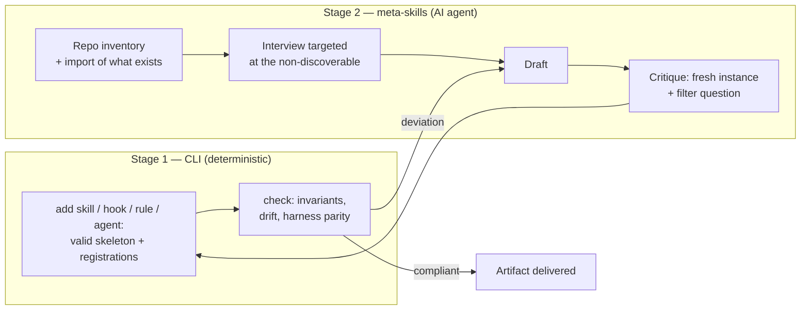

# Assisted creation

This document specifies the assisted artifact creation system — the heart of the product: creating **perfectly**, through an interview, every artifact of the architecture (skills, hooks, rules, sub-agents, and AGENTS.md itself). It complements [commandes.md](commandes.md) (the deterministic generators) and [conventions.md](conventions.md) (the invariants). Decisions taken: hybrid approach, repo analysis by meta-skill, assisted creation in v1; the `update` protection is laid down as early as v0.6 (recorded fingerprints), and the `update` command that reads it ships with v1.0.

## The principle: two stages, one loop

- **Stage 1 (the CLI)** guarantees the structure: valid names, complete frontmatter, generated projections, multi-harness registrations. It works on its own, without an AI agent.
- **Stage 2 (the meta-skills, `creator` pack)** guides the harness agent to produce the *content*. It relies on stage 1 to write, never the other way round.
- **The loop** is the differentiator: the AI writes, the CLI validates (`check`), and nothing is delivered without passing the mechanical validation. No tool on the market closes this loop.

## The creation protocol (common to all artifacts)

Derived from the best practices observed (the new `/init` flow, Anthropic's `skill-creator`, the "Claude A author / Claude B tester" loop):

1. **Inventory before creation.** Explore the repo and absorb what exists (CLAUDE.md, AGENTS.md, `.cursor/rules`, `copilot-instructions.md`, hooks, CI) — never write over what exists; import it or complete it.
   **Check the current guidance at the same time**, for the artifacts whose shape a vendor defines — skills, hooks, sub-agents, and the whole-repo proposal that spans them. What each is good for, and the fields it supports, move with the harnesses and the models that run them, and a pack shipped by npm cannot move at that rate. The rules of that check:
   - **Primary sources only, whatever the medium**: what the people who build that harness or that model publish themselves — their documentation, their talks and recorded sessions, their papers and slide decks. Never a third party's paraphrase of one.
   - **Dated**: note what was consulted and when, and say which choice it changed. This is the convention [task 29](../.agents/tasks/29-suivre-l-evolution-des-pratiques.md) settled for the same reason — the specification publishes no version number, so a norm is dated by its consultation.
   - **Offline is an answer**: with no network access, say so and proceed on what the repo proves. A silent guess dressed as current practice is worse than not looking.
   - **The CLI never does this.** `check` and `doctor` open no connection, by design and by test; the check belongs to the agent, at creation time, in a session the user is watching.
2. **Interview targeted at the non-discoverable.** Ask only the questions whose answer cannot be read in the code (see the interview banks below). Canonical instruction: dig into the unanticipated hard points, not the obvious ones.
3. **Routing.** Before creating, qualify the need: advisory → rule or AGENTS.md section; on demand → skill; guaranteed every time → hook; bulky and isolable → sub-agent. A misrouted need produces an artifact that does not work.
4. **Draft, then critique.** A critique pass with the official filter question: *"if this line is removed, will the agent make a mistake?"* — any line whose removal would cause no error is dropped. For skills: a trigger test (phrases that must / must not trigger).
5. **Mechanical validation.** `agentsdir check` on the created artifact; a deviation = back to the draft.
6. **Reviewable proposal.** The user sees the result before the final write (stage 1's `--dry-run` mode).

## The whole-repo proposal

The protocol above creates **one** artifact, on demand. What `init` leaves behind is a different problem: the structure is installed and empty — `.agents/rules/` holds only the generic rules, `.agents/hooks/` and `.agents/agents/` hold nothing, and nothing tells the user what would make sense for *their* repo. `$propose-setup` is that missing step, between "the architecture is installed" and "the user knows what to put in it".

It runs the same six steps, applied to a **set** instead of a single artifact:

1. **Inventory.** The facts the repo carries — stack marker files and the commands they prove, `package.json` scripts, CI workflows, linter and formatter configs, test layout, AGENTS.md, recent commit subjects — and the artifacts already configured (`.agents/rules/`, `.agents/hooks/`, `.agents/agents/`, `.agents/skills/`, harness permissions). Every fact is marked **read** (naming the file) or **assumed** (an inference from the stack conventions). The same distinction `detect.ts` already draws between a command a repository *proves* and one it merely suggests: an element resting on assumed facts alone is never proposed, it becomes a question.
2. **Interview.** Two or three questions, asked before the table exists — an interview run afterwards only decorates a decision already taken.
3. **Routing.** No kind outranks another: a hook, a rule and a sub-agent each cover what the other two cannot, so the right mix is the one *this* repo and the user's request call for — the three together, one of them, or none at all. The proposal is ranked by the strength of the evidence, never by the kind of artifact. Skills stay out of scope (`$create-skill` on demand). Anything a linter, a formatter, a type checker, a CI step, an existing hook or a harness deny rule already enforces is **excluded**, not proposed.
4. **Draft, then critique.** One table, one line per element: kind, name, why it earns its place in *this* repo, the evidence with each fact marked read or assumed, and what it does not cover. The filter question cuts, then the list is cut again — five founded elements beat fifteen generic ones, because a list too long to read is accepted wholesale and then ignored. Each line gets its own verdict: accept, refuse or amend. Nothing is written before every line has one.
5. **Generate.** The accepted lines only, each through its own meta-skill (`$create-hook`, `$create-rule`, `$create-agent`), which runs its own inventory, interview and critique and calls the matching generator. The protocol is delegated, never replayed.
6. **Mechanical validation.** `agentsdir check`, then a closing report of what was *not* created: the refused lines with their reason, and what a repo tool already covers — so the omissions read as deliberate.

On a repo that already carries rules or hooks the job is to **complete** that set: a duplicate is never proposed, it is named as already covered. The end of `init` points at the skill, and only when the `creator` pack was installed.

## Quality rubrics per artifact

Each meta-skill bundles its rubric in `references/`; the criteria marked ▣ are checked mechanically by `check`, the others by the critique pass.

### AGENTS.md / CLAUDE.md

- No README ⟷ AGENTS.md duplication; pointers, never copies.
- **Exact** commands (build, targeted test, lint) + explicit prohibitions (watch, deploy) — the non-guessable first.
- Document only what **diverges** from the ecosystem's default settings; the model already knows the standards.
- What is enforced mechanically (linter, CI, hooks) has no place in the file ("never send an LLM to do a linter's job").
- Short: every line must pass the filter question. Wrong information is worse than no file at all.

### Skills (SKILL.md)

- ▣ `name`: 1–64 characters, `a-z 0-9 -`, equal to the folder name.
- `description`: third person, what + when + the user's trigger keywords (never "Helps with…").
- ▣ Body < 500 lines; the bulky material goes into `references/` (progressive disclosure, a single level of indirection).
- Explicit degrees of freedom: fragile sequence → executable script (`scripts/`), not prose; several valid approaches → instructions.
- One default + one escape hatch, never a menu of options; constant terminology; no perishable information.
- Trigger test: ≥ 3 phrases that must trigger, ≥ 2 near-miss phrases that must not.

### Hooks

- Event consistent with the intent: **prevent** → blocking event (PreToolUse, UserPromptSubmit, Stop) + exit 2 (hook protocol, distinct from the CLI exit codes); **react** → PostToolUse and similar (they cannot cancel anything).
- ▣ Portable Node script, absolute paths or project root, executable, JSON stdout starting with `{`.
- Fail-open or fail-closed: an explicit choice asked during the interview and documented in the script.
- A hook is **not** a security boundary — a hard prohibition goes into the harness permissions, not into a hook.
- Stop hook guard rail (`stop_hook_active`); timeout suited to the real work; manual test provided (`echo '<json>' | node hook.mjs`).

### Sub-agents (.agents/agents/*.md)

- ▣ Frontmatter `name` (lowercase-dashes) + `description` required — a file without a description is **silently** ignored by Claude Code.
- A single responsibility; output format required in the body (the parent receives only the final report).
- Minimal tools (a reviewer has no Write/Edit); justified model (mechanical → haiku, reasoning → opus, otherwise inherit).
- The prompt never assumes access to the parent conversation: the agent starts blank.
- Short cumulative descriptions (shared budget); "Use proactively" only if spontaneous delegation is wanted.

### Rules (.agents/rules/*.md)

- Every rule is anchored in an **observed failure** or a real divergence of the project, not a hypothetical fear.
- House template: H1, imperative tone, GOOD/BAD, tables; `paths:` if scoped; ▣ index line in AGENTS.md.
- ▣ Never a normative reference to a file that does not exist.

### Whole-repo proposal ($propose-setup)

- Every element states why it is needed in **this** repo, not in repos of this kind.
- Every element cites its evidence, each fact marked read (with the file) or assumed; none rests on assumed facts alone.
- Nothing a linter, a formatter, a type checker, a CI step, an existing hook or a harness deny rule already enforces.
- Nothing that duplicates an existing rule, hook or sub-agent: the proposal completes what is installed.
- No kind ranked above another: the mix follows the repo and the request, and each element says what the other two kinds would not have covered; few and founded rather than exhaustive.
- One verdict per line — accept, refuse or amend — and nothing written before every line has one.
- ▣ Every created element passes `check`, each through the rubric of its own creator.

## The interview question banks

Each meta-skill bundles its bank in `references/interview.md`. The five most discriminating questions per artifact (each derived from a sourced anti-pattern):

| Artifact | The questions that change the generated content |
| --- | --- |
| AGENTS.md | Exact commands + never-run? · What did the agent get wrong recently? · Which conventions diverge from the default settings? · What is already enforced mechanically? · Monorepo / existing configs? |
| Skill | 3 phrases that trigger + 2 that do not? · Objective or subjective output? · Which fragile sequence should be frozen into a script? · What have you repeated to the agent the last 3 times? · Which knowledge is bulky but rarely needed (→ references/)? |
| Hook | Prevent or react? · Script failure: pass or block? · Hard security (→ permissions, not a hook)? · Which tools/commands exactly? · Worst-case duration, blocking or async? |
| Sub-agent | Which single task, finished when? · Modify or only read? · Spontaneous delegation or on demand? · Which context, given that it starts blank? · Deep reasoning or bulky mechanical work? |
| Rule | Which observed failure justifies it? · Scoped to which files? · Mechanically verifiable (→ hook/CI instead)? · When must an agent read it? · Which real GOOD/BAD example? |
| Whole-repo proposal | What did the agents get wrong here recently? · What is already enforced mechanically? · Which command must never run? · Which step do you repeat by hand? · Which paths are off limits, generated or vendored? |
| Usage review | Was collection suspended during the window? · Which harnesses does the team actually use? · Did the window hold a release, a freeze or a holiday? · Do the `exclude` globs overlap a rule's scope? · Is any skill invoked by a script rather than a session? |

## The `creator` pack

Installed by `init` (checked by default), it contains:

- `$create-skill`, `$create-hook`, `$create-rule`, `$create-agent` — one meta-skill per artifact, applying the protocol above and calling the stage 1 generators.
- `$setup-context` — the assisted creation of AGENTS.md: repo inventory by the agent (real commands, conventions, key files, competing configs to import), pre-drafting of the stack/product sections, validation interview, line-by-line critique, writing through the managed blocks. This is `/init`, multi-harness and with mechanical validation.
- `$propose-setup` — the whole-repo proposal that fills the structure `init` installs: repo analysis, then a table of the hooks, rules and sub-agents that earn their place *here*, each accepted, refused or amended on its own line. See [The whole-repo proposal](#the-whole-repo-proposal) below.

Constraints: these meta-skills themselves follow all the conventions ([conventions.md](conventions.md)) — `disable-model-invocation: true` (they write), body < 500 lines, rubrics and question banks in `references/`.

## The `usage` pack meta-skill

The `usage` pack (optional, never installed by default) ships one meta-skill of its own, with the same shape and the same constraints:

- `$review-usage` — turns the usage journal into a review of what the configuration is actually used for. It follows the protocol above with one addition of its own: **the arithmetic is done by a script, not by the agent**. `.agents/skills/review-usage/scripts/summarize.mjs` reads the journal and prints the counts; the meta-skill interviews, judges and writes. A month of sessions is thousands of JSONL lines, and reading them into the window to count them would be exactly the waste the context budget exists to expose.

Its rubric enforces what makes such a review honest rather than authoritative: the observation volume is stated, an absence is not concluded below the threshold, rules are spoken of as *relevant* and never as *used*, every removal is a proposal carrying its data, and the limits section is never the one cut for length. The contract is [conventions.md](conventions.md) §11.

## Update (`update`) and protection of the installed content

The content installed by the CLI evolves with it. Tracked by the existing lock mechanism: each piece of CLI content gets an entry in `skills-lock.json` with `sourceType: "agentsdir"` and the fingerprint of the installed version — the meta-skills under `skills`, the generic rules and shared scripts of the packs under `files` (see [conventions.md](conventions.md) §7).

- `update` replaces **intact** content (fingerprint = installed version) with the new version. `sync` **never** recomputes the fingerprint of an `"agentsdir"` entry: it stays pinned to the installed version, otherwise the local modification would be "blessed" and the protection lost.
- **Locally modified** content is preserved: `update` reports it, shows the diff of the upstream changes, and offers the merge — never a silent overwrite (the lesson of the source model's vendored skills, overwritten twice by their upstream tool).
- `check` distinguishes "locally modified" (accepted, reported as information) from "projection drift" (an error).
- Answering "keep mine" to the merge offer records the refused version beside the lock entry, leaving its install fingerprint untouched: the decision is remembered, and the same merge is not offered again until upstream moves once more. Without a terminal to ask, the conflicted file is left alone and `update` exits `1`, having applied everything else.
