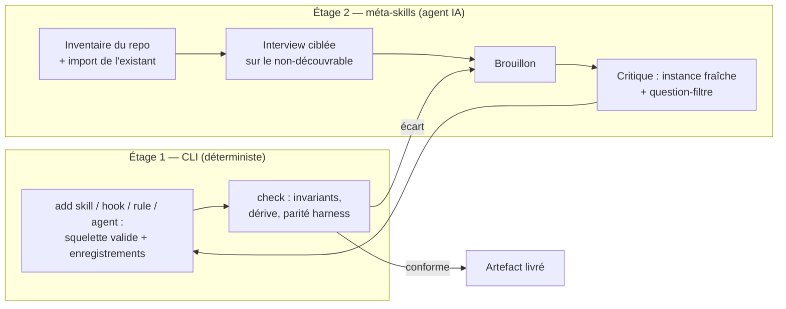

# Création assistée

Ce document spécifie le système de création assistée d'artefacts — le cœur du produit : créer **parfaitement**, par interview, chaque artefact de l'architecture (skills, hooks, règles, sous-agents, et AGENTS.md lui-même). Il complète [commandes.md](commandes.md) (les générateurs déterministes) et [conventions.md](conventions.md) (les invariants). Décisions actées : approche hybride, analyse du repo par méta-skill, création assistée en v1 ; la protection d'`update` est posée dès la v0.6 (empreintes enregistrées), la commande `update` elle-même reste en v1.x.

## Le principe : deux étages, une boucle

- **L'étage 1 (la CLI)** garantit la structure : noms valides, frontmatter complet, projections générées, enregistrements multi-harness. Il fonctionne seul, sans agent IA.
- **L'étage 2 (les méta-skills, pack `creator`)** guide l'agent du harness pour produire le *contenu*. Il s'appuie sur l'étage 1 pour écrire, jamais l'inverse.
- **La boucle** est le différenciateur : l'IA rédige, la CLI valide (`check`), et rien n'est livré sans passer la validation mécanique. Aucun outil du marché ne ferme cette boucle.

## Le protocole de création (commun à tous les artefacts)

Issu des meilleures pratiques observées (`/init` nouveau flux, `skill-creator` d'Anthropic, boucle « Claude A auteur / Claude B testeur ») :

1. **Inventaire avant création.** Explorer le repo et absorber l'existant (CLAUDE.md, AGENTS.md, `.cursor/rules`, `copilot-instructions.md`, hooks, CI) — on n'écrit jamais par-dessus l'existant, on l'importe ou on le complète.
2. **Interview ciblée sur le non-découvrable.** Ne poser que les questions dont la réponse ne se lit pas dans le code (voir les banques de questions ci-dessous). Consigne canonique : creuser les points durs non anticipés, pas les évidences.
3. **Aiguillage.** Avant de créer, qualifier le besoin : consultatif → règle ou section d'AGENTS.md ; à la demande → skill ; garanti à chaque fois → hook ; volumineux et isolable → sous-agent. Un besoin mal aiguillé produit un artefact inopérant.
4. **Brouillon, puis critique.** Passe de critique avec la question-filtre officielle : *« si on supprime cette ligne, l'agent fera-t-il une erreur ? »* — toute ligne dont la suppression ne provoquerait aucune erreur est retirée. Pour les skills : test de déclenchement (phrases qui doivent/ne doivent pas déclencher).
5. **Validation mécanique.** `agentsdir check` sur l'artefact créé ; écart = retour au brouillon.
6. **Proposition révisable.** L'utilisateur voit le résultat avant écriture définitive (mode `--dry-run` de l'étage 1).

## Rubriques de qualité par artefact

Chaque méta-skill embarque sa rubrique dans `references/` ; les critères marqués ▣ sont vérifiés mécaniquement par `check`, les autres par la passe de critique.

### AGENTS.md / CLAUDE.md

- Pas de duplication README ⟷ AGENTS.md ; pointeurs, jamais de copies.
- Commandes **exactes** (build, test ciblé, lint) + interdits explicites (watch, deploy) — le non-devinable d'abord.
- Ne documenter que ce qui **diverge** des réglages par défaut de l'écosystème ; le modèle connaît déjà les standards.
- Ce qui est appliqué mécaniquement (linter, CI, hooks) n'a rien à faire dans le fichier (« never send an LLM to do a linter's job »).
- Court : chaque ligne doit passer la question-filtre. Une information fausse est pire que pas de fichier.

### Skills (SKILL.md)

- ▣ `name` : 1–64 caractères, `a-z 0-9 -`, égal au nom du dossier.
- `description` : troisième personne, quoi + quand + mots-clés déclencheurs de l'utilisateur (jamais « Helps with… »).
- ▣ Corps < 500 lignes ; le volumineux part dans `references/` (divulgation progressive, un seul niveau de renvoi).
- Degrés de liberté explicites : séquence fragile → script exécutable (`scripts/`), pas de la prose ; plusieurs approches valides → instructions.
- Un défaut + une échappatoire, jamais un menu d'options ; terminologie constante ; pas d'infos périssables.
- Test de déclenchement : ≥ 3 phrases qui doivent déclencher, ≥ 2 proches qui ne doivent pas.

### Hooks

- Événement cohérent avec l'intention : **empêcher** → événement bloquant (PreToolUse, UserPromptSubmit, Stop) + exit 2 (protocole des hooks, distinct des codes de sortie de la CLI) ; **réagir** → PostToolUse et assimilés (ne peuvent rien annuler).
- ▣ Script portable Node, chemins absolus ou racine projet, exécutable, stdout JSON commençant par `{`.
- Fail-open ou fail-closed : choix explicite demandé à l'interview et documenté dans le script.
- Un hook n'est **pas** une frontière de sécurité — une interdiction dure va dans les permissions du harness, pas dans un hook.
- Garde-fou des Stop hooks (`stop_hook_active`) ; timeout adapté au travail réel ; test manuel fourni (`echo '<json>' | node hook.mjs`).

### Sous-agents (.agents/agents/*.md)

- ▣ Frontmatter `name` (minuscules-tirets) + `description` obligatoires — un fichier sans description est ignoré **silencieusement** par Claude Code.
- Une responsabilité unique ; format de sortie exigé dans le corps (le parent ne reçoit que le rapport final).
- Outils minimaux (un relecteur n'a pas Write/Edit) ; modèle motivé (mécanique → haiku, raisonnement → opus, sinon inherit).
- Le prompt ne suppose jamais l'accès à la conversation parente : l'agent démarre vierge.
- Descriptions cumulées courtes (budget partagé) ; « Use proactively » seulement si la délégation spontanée est voulue.

### Règles (.agents/rules/*.md)

- Chaque règle est ancrée dans un **échec observé** ou une divergence réelle du projet, pas une crainte hypothétique.
- Gabarit maison : H1, ton impératif, GOOD/BAD, tableaux ; `paths:` si scopée ; ▣ ligne d'index dans AGENTS.md.
- ▣ Jamais de référence normative vers un fichier inexistant.

## Les banques de questions d'interview

Chaque méta-skill embarque sa banque dans `references/interview.md`. Les cinq questions les plus discriminantes par artefact (chacune dérivée d'un anti-pattern sourcé) :

| Artefact | Les questions qui changent le contenu généré |
| --- | --- |
| AGENTS.md | Commandes exactes + jamais-lancer ? · Qu'a raté l'agent récemment ? · Quelles conventions divergent des réglages par défaut ? · Qu'est-ce qui est déjà appliqué mécaniquement ? · Monorepo / configs existantes ? |
| Skill | 3 phrases qui déclenchent + 2 qui ne déclenchent pas ? · Sortie objective ou subjective ? · Quelle séquence fragile à figer en script ? · Qu'avez-vous répété à l'agent les 3 dernières fois ? · Quel savoir volumineux mais rare (→ references/) ? |
| Hook | Empêcher ou réagir ? · Échec du script : passer ou bloquer ? · Sécurité dure (→ permissions, pas hook) ? · Quels outils/commandes exactement ? · Durée au pire, bloquant ou async ? |
| Sous-agent | Quelle tâche unique, finie quand ? · Modifier ou seulement lire ? · Délégation spontanée ou sur demande ? · Quel contexte, sachant qu'il démarre vierge ? · Raisonnement profond ou mécanique volumineux ? |
| Règle | Quel échec observé la justifie ? · Scopée à quels fichiers ? · Vérifiable mécaniquement (→ hook/CI plutôt) ? · Quand un agent doit-il la lire ? · Quel exemple GOOD/BAD réel ? |

## Le pack `creator`

Installé par `init` (coché par défaut), il contient :

- `$create-skill`, `$create-hook`, `$create-rule`, `$create-agent` — une méta-skill par artefact, appliquant le protocole ci-dessus et appelant les générateurs de l'étage 1.
- `$setup-context` — la création assistée d'AGENTS.md : inventaire du repo par l'agent (commandes réelles, conventions, fichiers clés, configs concurrentes à importer), pré-rédaction des sections stack/produit, interview de validation, critique ligne à ligne, écriture via les blocs gérés. C'est `/init`, en multi-harness et avec validation mécanique.

Contraintes : ces méta-skills respectent elles-mêmes toutes les conventions ([conventions.md](conventions.md)) — `disable-model-invocation: true` (elles écrivent), corps < 500 lignes, rubriques et banques de questions dans `references/`.

## Mise à jour (`update`) et protection du contenu installé

Le contenu installé par la CLI (méta-skills, gabarits, règles génériques des packs) évolue avec elle. Suivi par le mécanisme du verrou existant : chaque contenu CLI reçoit une entrée dans `skills-lock.json` avec `sourceType: "agentsdir"` et l'empreinte de la version installée.

- `update` remplace un contenu **intact** (empreinte = version installée) par la nouvelle version. `sync` ne recalcule **jamais** l'empreinte d'une entrée `"agentsdir"` : elle reste épinglée à la version installée, sinon la modification locale serait « bénie » et la protection perdue.
- Un contenu **modifié localement** est préservé : `update` le signale, affiche le diff des changements upstream, et propose la fusion — jamais d'écrasement silencieux (la leçon des skills vendorés du modèle source, écrasés deux fois par leur outil upstream).
- `check` distingue « modifié localement » (accepté, signalé en information) de « dérive d'une projection » (erreur).
