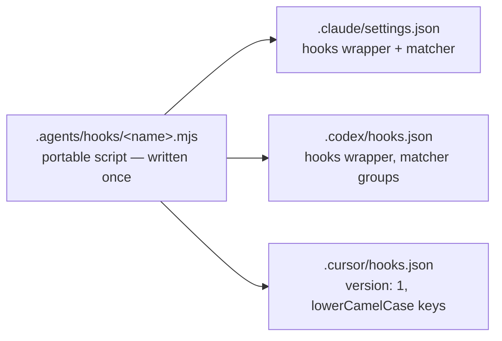

# Harness matrix

This document lists, for each harness targeted by v1, what it reads, how it discovers skills, and what `agentsdir` must project for it. Status as of August 2026 (detailed sources in [recherche/paysage-open-source.md](recherche/paysage-open-source.md)).

## 1. Who reads what

| Harness | Instructions | Skill discovery | Own files | Hooks |
| --- | --- | --- | --- | --- |
| **Claude Code** | `CLAUDE.md` only (does not read `AGENTS.md`) | `.claude/skills/` | `.claude/settings.json` (permissions, hooks), `.claude/agents/` (sub-agents) | yes — `.claude/settings.json` |
| **Codex (OpenAI)** | `AGENTS.md` (native) | `.agents/skills/` scanned natively, from the cwd up to the root | `agents/openai.yaml` + icon per skill; `.codex/config.toml` (if the repository is "trusted") | yes — `.codex/hooks.json` |
| **Cursor** | `AGENTS.md` (native) | `.cursor/skills/` or `.agents/skills/`, picked up anywhere in the repository | `.cursor/worktrees.json` (officially documented) | yes — `.cursor/hooks.json` |
| **Other AGENTS.md readers** (opencode, Gemini CLI, Copilot, Zed, Windsurf, Aider…) | `AGENTS.md` (native) | opencode reads `.opencode/skills`, `.claude/skills` then `.agents/skills`; varies by tool | none required | varies |

How to read the matrix: **the `.agents/` source of truth is already readable natively by everyone except Claude Code**. The projection work therefore focuses on Claude Code (symlinks or copies to `CLAUDE.md` and `.claude/*`) and on the Codex interface metadata (`agents/openai.yaml` + icon per skill).

## 2. Adoption facts (August 2026)

- **AGENTS.md is a standard**: launched by OpenAI in August 2025, transferred to the Agentic AI Foundation (Linux Foundation) for neutral governance. More than 60,000 public repositories, read natively by more than 30 agents.
- **Claude Code is the exception**: it only reads `CLAUDE.md`; the demand for native `AGENTS.md` support is massive but has received no official answer. This is precisely the projection that `agentsdir` installs — and the "bridge" half of the value proposition.
- **Agent Skills (SKILL.md) is an open standard**: specification published by Anthropic at the end of 2025 (agentskills.io), adopted within 48 hours by Microsoft and OpenAI; more than 30 tools read it.
- **`.agents/skills/` is the cross-client convention**: Codex scans it natively, Cursor picks it up anywhere in the repository, opencode reads it as a last resort. Installing this convention means following the standards, not imposing a proprietary format.
- **`agents/openai.yaml` is the official format** for skill metadata in Codex/ChatGPT (`display_name`, `short_description`, icons, `brand_color`, `default_prompt`, invocation policy). No surveyed tool generates it automatically: it is a clear differentiator for `agentsdir`.

## 3. Hooks: one portable script, three registrations

The three harnesses have converged on the **same event set** — `PreToolUse`, `PostToolUse`, `UserPromptSubmit`, `Stop`, `SessionStart`… — but their registration files are incompatible. Formats revalidated on 2026-08-29 against the three official documentation sites (code.claude.com/docs/en/hooks, developers.openai.com/codex/hooks, cursor.com/docs/hooks); the exact matrix as coded lives in `src/core/hook-registries.ts`:

- **Claude Code** — `.claude/settings.json`: `hooks` wrapper, `{ "matcher": "…", "hooks": [{ "type": "command", "command": "…" }] }` groups per event.
- **Codex** — `.codex/hooks.json`: the same `hooks` wrapper and the same groups as Claude, in a dedicated file. (Correction of 2026-08-29: an earlier version of this document claimed "events at the root, without a wrapper" — the official documentation published by OpenAI shows the `hooks` wrapper; third-party guides still diverge, the official documentation prevails.)
- **Cursor** — `.cursor/hooks.json`: mandatory `"version": 1`, `hooks` wrapper, event keys in lowerCamelCase with renamings (`preToolUse`, `stop`, `sessionStart`, and `beforeSubmitPrompt` for `UserPromptSubmit`), flat entries `{ "command": "…" }`. The `matcher` exists there but with Cursor's own tool vocabulary (`Shell`, not `Bash`): a matcher written for Claude matches nothing there — so `add hook` never projects it on the Cursor side.

The hook script itself is portable (dependency-free Node, JSON input on stdin). Hence the `add hook` generator: write the script once, register it three times.

**Warning**: Cursor's hook formats have already broken between two versions of the tool. Every `agentsdir` release must revalidate the three registration formats against the current documentation, and `doctor` must report an unknown format rather than writing blindly.

## 4. Non-standardized points, or points to verify

- **`.codex/environments/environment.toml`**: observed in the NowStack repository (marked "autogenerated", probably written by the Codex application itself), but corroborated by **no public documentation** — Codex cloud environments are configured in the web interface. The CLI **must not generate this file in v1**; to be reassessed if OpenAI documents it.
- **`.cursor/worktrees.json`**: officially documented by Cursor (keys `setup-worktree`, `setup-worktree-unix`, `setup-worktree-windows` pointing to scripts). It is the target of the worktrees pack.
- **`conductor.json`** (Conductor): same pattern as Cursor (`setup`/`archive` scripts), out of v1 scope but trivial to add if requested.
- **`.codex/config.toml`**: it is only loaded if the repository is "trusted" on the Codex side; no projection needed in v1.

## 5. What each harness receives after `init`

**Claude Code**
- `CLAUDE.md` → projection of `AGENTS.md` — a symlink, or a copy with a header in copy mode (fallback);
- `.claude/rules`, `.claude/skills`, `.claude/agents` → projections of `.agents/*`;
- `.claude/settings.json`: a permission allowlist covering exactly the emitted scripts, and hook registrations where applicable.

**Codex (OpenAI)**
- `AGENTS.md` read as is (a real file, no projection needed);
- `.agents/skills/` scanned natively; per skill, `agents/openai.yaml` + `assets/icon.svg` generated from the frontmatter (see [conventions.md](conventions.md));
- `.codex/hooks.json` if hooks are installed.

**Cursor**
- `AGENTS.md` read as is; `.agents/skills/` picked up natively;
- `.cursor/worktrees.json` if the worktrees pack is installed;
- `.cursor/hooks.json` if hooks are installed.

**Other AGENTS.md readers** (opencode, Gemini CLI, Copilot…)
- Nothing to generate: `AGENTS.md` and `.agents/skills/` are enough. This is the direct consequence of the "follow the standards" choice: every new conformant harness is covered for free.

See also: [architecture.md](architecture.md) (projection engine), [commandes.md](commandes.md) (`init`, `sync`, `check`, `add hook`), [roadmap.md](roadmap.md) (v1 scope).
