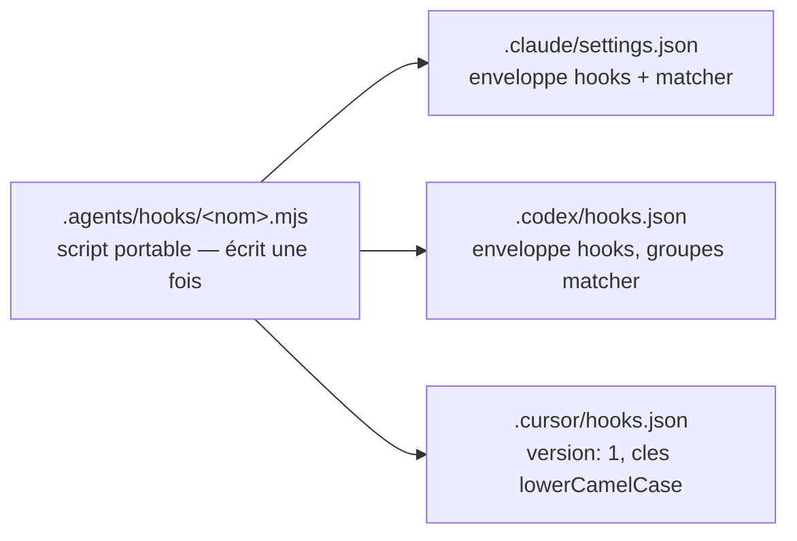

# Matrice des harness

Ce document recense, pour chaque harness cible de la v1, ce qu'il lit, comment il découvre les skills, et ce que `agentsdir` doit lui projeter. État des lieux : août 2026 (sources détaillées dans [recherche/paysage-open-source.md](recherche/paysage-open-source.md)).

## 1. Qui lit quoi

| Harness | Instructions | Découverte des skills | Fichiers propres | Hooks |
| --- | --- | --- | --- | --- |
| **Claude Code** | `CLAUDE.md` uniquement (ne lit pas `AGENTS.md`) | `.claude/skills/` | `.claude/settings.json` (permissions, hooks), `.claude/agents/` (sous-agents) | oui — `.claude/settings.json` |
| **Codex (OpenAI)** | `AGENTS.md` (natif) | `.agents/skills/` scanné nativement, du cwd à la racine | `agents/openai.yaml` + icône par skill ; `.codex/config.toml` (si dépôt « trusted ») | oui — `.codex/hooks.json` |
| **Cursor** | `AGENTS.md` (natif) | `.cursor/skills/` ou `.agents/skills/`, ramassés n'importe où dans le dépôt | `.cursor/worktrees.json` (documenté officiellement) | oui — `.cursor/hooks.json` |
| **Autres lecteurs d'AGENTS.md** (opencode, Gemini CLI, Copilot, Zed, Windsurf, Aider…) | `AGENTS.md` (natif) | opencode lit `.opencode/skills`, `.claude/skills` puis `.agents/skills` ; variable selon l'outil | aucun requis | variable |

Lecture de la matrice : **la source de vérité `.agents/` est déjà lisible nativement par tout le monde sauf Claude Code**. Le travail de projection se concentre donc sur Claude Code (symlinks ou copies vers `CLAUDE.md` et `.claude/*`) et sur les métadonnées d'interface Codex (`agents/openai.yaml` + icône par skill).

## 2. Faits d'adoption (août 2026)

- **AGENTS.md est un standard** : lancé par OpenAI en août 2025, transféré à l'Agentic AI Foundation (Linux Foundation) pour une gouvernance neutre. Plus de 60 000 dépôts publics, lu nativement par plus de 30 agents.
- **Claude Code est l'exception** : il ne lit que `CLAUDE.md` ; la demande de support natif d'`AGENTS.md` est massive mais sans réponse officielle. C'est précisément la projection que `agentsdir` installe — et la moitié « pont » de la proposition de valeur.
- **Agent Skills (SKILL.md) est un standard ouvert** : spécification publiée par Anthropic fin 2025 (agentskills.io), adoptée en 48 heures par Microsoft et OpenAI ; plus de 30 outils la lisent.
- **`.agents/skills/` est la convention inter-clients** : Codex la scanne nativement, Cursor la ramasse n'importe où dans le dépôt, opencode la lit en dernier recours. Installer cette convention, c'est suivre les standards, pas imposer un format propriétaire.
- **`agents/openai.yaml` est le format officiel** de métadonnées de skill pour Codex/ChatGPT (`display_name`, `short_description`, icônes, `brand_color`, `default_prompt`, politique d'invocation). Aucun outil recensé ne le génère automatiquement : c'est un différenciateur net d'`agentsdir`.

## 3. Hooks : un script portable, trois enregistrements

Les trois harness ont convergé sur le **même jeu d'événements** — `PreToolUse`, `PostToolUse`, `UserPromptSubmit`, `Stop`, `SessionStart`… — mais leurs fichiers d'enregistrement sont incompatibles. Formats revalidés le 2026-08-29 contre les trois documentations officielles (code.claude.com/docs/en/hooks, developers.openai.com/codex/hooks, cursor.com/docs/hooks) ; la matrice exacte codée vit dans `src/core/hook-registries.ts` :

- **Claude Code** — `.claude/settings.json` : enveloppe `hooks`, groupes `{ "matcher": "…", "hooks": [{ "type": "command", "command": "…" }] }` par événement.
- **Codex** — `.codex/hooks.json` : même enveloppe `hooks` et mêmes groupes que Claude, dans un fichier dédié. (Correction du 2026-08-29 : une version antérieure de ce document affirmait « événements à la racine, sans enveloppe » — la documentation officielle publiée par OpenAI montre l'enveloppe `hooks` ; des guides tiers divergent encore, la doc officielle prévaut.)
- **Cursor** — `.cursor/hooks.json` : `"version": 1` obligatoire, enveloppe `hooks`, clés d'événements en lowerCamelCase avec renommages (`preToolUse`, `stop`, `sessionStart`, et `beforeSubmitPrompt` pour `UserPromptSubmit`), entrées plates `{ "command": "…" }`. Le `matcher` y existe mais avec le vocabulaire d'outils propre à Cursor (`Shell`, pas `Bash`) : un matcher écrit pour Claude n'y correspond à rien — `add hook` ne le projette donc jamais côté Cursor.

Le script du hook, lui, est portable (Node sans dépendances, entrée JSON sur stdin). D'où le générateur `add hook` : écrire le script une fois, l'enregistrer trois fois.

**Avertissement** : les formats de hooks de Cursor ont déjà cassé entre deux versions de l'outil. Chaque release d'`agentsdir` doit revalider les trois formats d'enregistrement contre les documentations à jour, et `doctor` doit signaler un format inconnu plutôt que d'écrire à l'aveugle.

## 4. Points non standardisés ou à vérifier

- **`.codex/environments/environment.toml`** : observé dans le dépôt NowStack (marqué « autogenerated », probablement écrit par l'application Codex elle-même), mais corroboré par **aucune documentation publique** — les environnements Codex cloud se configurent dans l'interface web. La CLI **ne doit pas générer ce fichier en v1** ; à réévaluer si OpenAI le documente.
- **`.cursor/worktrees.json`** : documenté officiellement par Cursor (clés `setup-worktree`, `setup-worktree-unix`, `setup-worktree-windows` pointant vers des scripts). C'est la cible du pack worktrees.
- **`conductor.json`** (Conductor) : même motif que Cursor (scripts `setup`/`archive`), hors périmètre v1 mais trivial à ajouter si demandé.
- **`.codex/config.toml`** : n'est chargé que si le dépôt est « trusted » côté Codex ; aucune projection nécessaire en v1.

## 5. Ce que chaque harness reçoit après `init`

**Claude Code**
- `CLAUDE.md` → projection d'`AGENTS.md` — symlink, ou copie avec en-tête en mode copie (repli) ;
- `.claude/rules`, `.claude/skills`, `.claude/agents` → projections de `.agents/*` ;
- `.claude/settings.json` : liste blanche de permissions couvrant exactement les scripts émis, et enregistrements de hooks le cas échéant.

**Codex (OpenAI)**
- `AGENTS.md` lu tel quel (fichier réel, aucune projection nécessaire) ;
- `.agents/skills/` scanné nativement ; par skill, `agents/openai.yaml` + `assets/icon.svg` générés depuis le frontmatter (voir [conventions.md](conventions.md)) ;
- `.codex/hooks.json` si des hooks sont installés.

**Cursor**
- `AGENTS.md` lu tel quel ; `.agents/skills/` ramassé nativement ;
- `.cursor/worktrees.json` si le pack worktrees est installé ;
- `.cursor/hooks.json` si des hooks sont installés.

**Autres lecteurs d'AGENTS.md** (opencode, Gemini CLI, Copilot…)
- Rien à générer : `AGENTS.md` et `.agents/skills/` suffisent. C'est la conséquence directe du choix « suivre les standards » : chaque nouveau harness conforme est couvert gratuitement.

Voir aussi : [architecture.md](architecture.md) (moteur de projections), [commandes.md](commandes.md) (`init`, `sync`, `check`, `add hook`), [roadmap.md](roadmap.md) (périmètre v1).
