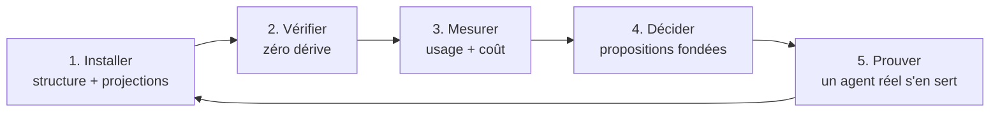

# Positionnement : gouverner, pas seulement installer

Proposition de direction produit, écrite le 30 août 2026, à partir du relevé
concurrentiel daté ([recherche/paysage-2026-08.md](recherche/paysage-2026-08.md)).
Elle ne rouvre aucune décision actée de [SPEC.md](SPEC.md) ; elle dit où porter
l'effort une fois la v1 publiée.

## Le constat

Trois outils sérieux occupent déjà le terrain de l'installation : ruler
(32 harness), rulesync (40+ outils, 9 dimensions), skills de Vercel
(30 000 étoiles, 77 agents). Ils font tous la même chose, mieux ou moins bien :
prendre une configuration et la propager vers N cibles.

Deux fonctionnalités de notre roadmap sont déjà livrées chez eux : `vendor`
(c'est `npx skills add owner/repo`, empreinte comprise) et `migrate` (c'est
`rulesync import`). Les poursuivre, c'est arriver deuxième sur un terrain occupé.

Mais les mêmes sources montrent autre chose. Les plaintes les mieux soutenues ne
portent pas sur l'installation — elles portent sur **l'après** :

- « nous sommes passés de 67 à 183 skills en moins d'un mois » : prolifération,
  redondance, pression sur la fenêtre de contexte ;
- « Your AGENTS.md file doesn't do anything », « AGENTS.md outperforms skills in
  our agent evals » (524 points) : le doute porte sur l'utilité de ce qui est
  installé ;
- une demande explicite de suivi d'invocation, fermée par un mainteneur au motif
  d'un événement de télémétrie que la documentation ne décrit pas ;
- une issue ouverte chez rulesync : sa génération « n'élague jamais les fichiers
  qu'un dossier ne possède plus ».

Personne ne répond à ces quatre-là. Ils décrivent tous le même manque : **une
fois la configuration installée, plus rien ne la gouverne.**

## La proposition

Un cycle de vie complet, dont l'installation n'est que la première étape.

**1. Installer.** Une source de vérité, des projections par harness, un repli en
copie quand les symlinks manquent. C'est fait, et le repli répond à un problème
documenté par quatre bugs distincts chez les concurrents.

**2. Vérifier.** `check` détecte la dérive et `sync` la répare — y compris
l'élagage de ce qui n'a plus de source, que rulesync ne sait pas faire. C'est
fait, et c'est déjà une différence.

**3. Mesurer.** Deux questions qu'aucun outil ne pose :

- *Est-ce que ça sert ?* Les hooks portables déjà installés observent les
  invocations de skills et de sous-agents, les outils utilisés, les chemins
  touchés — localement, en métadonnées seulement (tâche 25).
- *Combien ça coûte ?* Ce qui est payé à chaque session — `AGENTS.md`, les
  métadonnées de tous les skills, l'index des règles — est distingué de ce qui
  n'est payé qu'à l'invocation (tâche 28).

Croisées, elles donnent la seule question qui compte pour une équipe : *ce skill
vaut-il ce qu'il coûte ?* Un skill jamais invoqué qui pèse lourd au démarrage se
supprime sans débat ; le même, léger, ne mérite pas qu'on en parle.

**4. Décider.** Les mesures alimentent des propositions, jamais des suppressions
automatiques : ce qui n'a jamais servi, ce qui coûte sans rendre, ce qui manque
au vu du dépôt (tâche 24). L'outil argumente, l'équipe tranche.

**5. Prouver.** Un agent réel, dans une vraie session, vérifie ce qu'aucun test
ne peut voir : le skill est-il découvert, le hook se déclenche-t-il, les règles
sont-elles lues (tâche 26). C'est le critère de sortie v0.3 de notre roadmap,
écrit comme acquis et jamais vérifié.

## Ce que ça change pour une équipe

Aujourd'hui, une équipe de vingt personnes avec cent skills n'a aucun moyen de
répondre à : lesquels servent ? lesquels coûtent ? lesquels sont morts ? qui les
a ajoutés et pourquoi ? Elle accumule, et la fenêtre de contexte se dégrade sans
que personne ne puisse le montrer.

Le cycle ci-dessus lui donne un rapport chiffré, dans son dépôt, sans rien
envoyer à l'extérieur — ce qui est la condition pour qu'un dépôt client ou sous
NDA puisse l'utiliser. C'est le seul de nos axes qui ne soit pas déjà occupé, et
c'est aussi celui qui parle aux organisations plutôt qu'aux individus.

## Ce que nous ne faisons pas, et pourquoi

- **La course au nombre de harness.** Trois contre trente-deux, quarante et
  soixante-dix-sept : perdu, et sans valeur. Ce qui compte est ce que l'on fait
  des trois, pas leur nombre. `.agents/` est de toute façon reconnu comme
  l'emplacement commun.
- **`vendor` et `migrate`.** Livrés ailleurs, mieux dotés. À reconsidérer un
  jour comme confort, jamais comme argument.
- **Toute remontée réseau.** La mesure reste locale, sans exception. C'est ce
  qui rend l'outil acceptable là où il a le plus de valeur : les dépôts privés.
- **La suppression automatique.** L'outil mesure et propose. Décider à la place
  d'une équipe sur la foi d'une heuristique serait le meilleur moyen de perdre
  sa confiance.

## Ordre de construction proposé

1. **Mesurer avant de proposer** — tâches 25 (usage) puis 28 (coût). Sans elles,
   toute proposition n'est qu'une opinion.
2. **Prouver** — tâche 26, qui peut invalider une hypothèse de fond : si un
   skill créé n'est pas découvert par le harness, tout le reste attend.
3. **Brancher** — tâche 27 (MCP), le quatrième objet qui manque à la structure.
4. **Proposer** — tâche 24, nourrie des mesures des étapes 1 et 2 plutôt que de
   généralités.

La dette technique (tâches 17 à 23) se traite en parallèle, par petites touches,
sans jamais bloquer cette ligne.

## Une phrase

Les autres installent de la configuration d'agents. Nous la gouvernons : elle ne
dérive pas, on sait ce qu'elle sert, ce qu'elle coûte, et qu'elle fonctionne.
