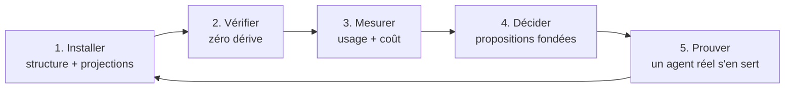

# Positionnement : gouverner, pas seulement installer

Proposition de direction produit, écrite le 30 août 2026, à partir du relevé
concurrentiel daté ([recherche/paysage-2026-08.md](recherche/paysage-2026-08.md)).
Elle ne rouvre aucune décision actée de [SPEC.md](SPEC.md) ; elle dit où porter
l'effort une fois la v1 publiée.

## Le constat

Trois outils sérieux occupent déjà le terrain de l'installation : ruler
(32 harness), rulesync (40+ outils, 9 dimensions), skills de Vercel
(30 000 étoiles, 77 agents). Ils font tous la même chose, mieux ou moins bien :
prendre une configuration et la propager vers N cibles.

Deux fonctionnalités de notre roadmap sont déjà livrées chez eux : `vendor`
(c'est `npx skills add owner/repo`, empreinte comprise) et `migrate` (c'est
`rulesync import`). Les poursuivre, c'est arriver deuxième sur un terrain occupé.

Mais les mêmes sources montrent autre chose. Les plaintes les mieux soutenues ne
portent pas sur l'installation — elles portent sur **l'après** :

- « nous sommes passés de 67 à 183 skills en moins d'un mois » : prolifération,
  redondance, pression sur la fenêtre de contexte ;
- « Your AGENTS.md file doesn't do anything », « AGENTS.md outperforms skills in
  our agent evals » (524 points) : le doute porte sur l'utilité de ce qui est
  installé ;
- une demande explicite de suivi d'invocation, fermée par un mainteneur au motif
  d'un événement de télémétrie que la documentation ne décrit pas ;
- une issue ouverte chez rulesync : sa génération « n'élague jamais les fichiers
  qu'un dossier ne possède plus ».

Personne ne répond à ces quatre-là. Ils décrivent tous le même manque : **une
fois la configuration installée, plus rien ne la gouverne.**

## La proposition

Un cycle de vie complet, dont l'installation n'est que la première étape.

**1. Installer.** Une source de vérité, des projections par harness, un repli en
copie quand les symlinks manquent. La mécanique est faite, et le repli répond à
un problème documenté par quatre bugs distincts chez les concurrents. Ce qui
manque encore est le **contenu** : la tâche 24, livrée le 12 septembre 2026, en
fait une proposition argumentée — le méta-skill `$propose-setup` analyse le dépôt
et met sur la table les hooks, les règles et les sous-agents qui y gagnent leur
place, chacun avec sa raison et ses preuves. Reste la porte de publication,
décrite plus bas.

**2. Vérifier.** `check` détecte la dérive et `sync` la répare — y compris
l'élagage de ce qui n'a plus de source, que rulesync ne sait pas faire. C'est
fait, et c'est déjà une différence.

**3. Mesurer.** Deux questions qu'aucun outil ne pose :

- *Est-ce que ça sert ?* Les hooks portables déjà installés observent les
  invocations de skills et de sous-agents, les outils utilisés, les chemins
  touchés — localement, en métadonnées seulement (collecte : tâche 25 ; analyse :
  tâche 30).
- *Combien ça coûte ?* Ce qui est payé à chaque session — `AGENTS.md`, les
  métadonnées de tous les skills, l'index des règles — est distingué de ce qui
  n'est payé qu'à l'invocation (tâche 28).

Croisées, elles donnent la seule question qui compte pour une équipe : *ce skill
vaut-il ce qu'il coûte ?* Un skill jamais invoqué qui pèse lourd au démarrage se
supprime sans débat ; le même, léger, ne mérite pas qu'on en parle.

Ce croisement n'est pas une invention de notre part, et c'est ce qui le rend
solide : Claude Code effectue déjà cet arbitrage, en silence. Quand le listing
des skills dépasse son budget de contexte, il raccourcit puis supprime les
descriptions **en commençant par les skills les moins invoqués**. Nous rendons
visible et discutable une décision que le harness prend aujourd'hui dans le dos
de l'équipe.

**4. Décider.** Les mesures alimentent des propositions, jamais des suppressions
automatiques : ce qui n'a jamais servi, ce qui coûte sans rendre, ce qui manque
au vu du dépôt (tâche 24). L'outil argumente, l'équipe tranche.

**5. Prouver.** Un agent réel, dans une vraie session, vérifie ce qu'aucun test
ne peut voir : le skill est-il découvert, le hook se déclenche-t-il, les règles
sont-elles lues (tâche 26). C'est le critère de sortie v0.3 de notre roadmap,
écrit comme acquis et jamais vérifié.

## Ce que ça change pour une équipe

Aujourd'hui, une équipe de vingt personnes avec cent skills n'a aucun moyen de
répondre à : lesquels servent ? lesquels coûtent ? lesquels sont morts ? qui les
a ajoutés et pourquoi ? Elle accumule, et la fenêtre de contexte se dégrade sans
que personne ne puisse le montrer.

Le cycle ci-dessus lui donne un rapport chiffré, dans son dépôt, sans rien
envoyer à l'extérieur — ce qui est la condition pour qu'un dépôt client ou sous
NDA puisse l'utiliser. C'est le seul de nos axes qui ne soit pas déjà occupé, et
c'est aussi celui qui parle aux organisations plutôt qu'aux individus.

## Ce que nous ne faisons pas, et pourquoi

- **La course au nombre de harness.** Trois contre trente-deux, quarante et
  soixante-dix-sept : perdu, et sans valeur. Ce qui compte est ce que l'on fait
  des trois, pas leur nombre. `.agents/` est de toute façon reconnu comme
  l'emplacement commun.
  À ne pas confondre avec l'abandon du terrain de l'installation : nous voulons
  au contraire être la référence de l'`init`. Cela ne se gagne pas au nombre de
  cibles — sinon rulesync aurait déjà gagné avec ses quarante outils, et son
  tracker quasi vide dit le contraire — mais à ce que l'`init` **produit** : une
  configuration qui a du sens pour ce dépôt-là, qui se prouve utilisée, et qui ne
  dérive pas.
- **`vendor` et `migrate`.** Livrés ailleurs, mieux dotés. À reconsidérer un
  jour comme confort, jamais comme argument.
- **Toute remontée réseau.** La mesure reste locale, sans exception. C'est ce
  qui rend l'outil acceptable là où il a le plus de valeur : les dépôts privés.
- **La suppression automatique.** L'outil mesure et propose. Décider à la place
  d'une équipe sur la foi d'une heuristique serait le meilleur moyen de perdre
  sa confiance.

## Ordre de construction

Arrêté le 30 août 2026. Deux corrections par rapport à la première rédaction de
ce document : la preuve passe devant, et la mesure d'usage se scinde.

1. **Prouver** — tâche 26. Ce document écrivait déjà qu'elle « peut invalider une
   hypothèse de fond : si un skill créé n'est pas découvert par le harness, tout
   le reste attend », puis la classait deuxième. C'était incohérent : ce qui peut
   tout invalider passe en premier. C'est en outre la moins chère du lot — un
   prompt versionné et une session réelle — et elle garde pour cette raison sa
   première passe sur Claude Code seul.
2. **Proposer** — tâche 24, **livrée le 12 septembre 2026**. Après `init`, un
   dépôt repartait avec une structure vide ; `$propose-setup` en fait une
   proposition d'ensemble, acceptable ou refusable ligne à ligne, qui exclut ce
   qu'un linter, la CI ou un hook existant applique déjà.
3. **Observer** — tâche 25, la collecte seule, **livrée le 12 septembre 2026**.
   Le pack `usage` enregistre des hooks sur les trois harness et journalise
   localement ce qui sert : skills invoqués, sous-agents délégués, outils et
   chemins touchés — jamais un prompt, jamais un contenu de fichier. Un rapport
   d'usage est vide le jour de sa livraison : il faut des semaines de sessions
   observées, et les données mûrissent maintenant pendant que le reste se
   construit.
4. **Chiffrer** — tâche 28, le coût en contexte. Purement statique, livrable en
   une passe, et visible immédiatement.
5. **Conclure** — tâche 30, l'analyse du journal, quand il y a enfin quelque
   chose à analyser, croisée avec le coût de l'étape 4.
6. **Brancher** — tâche 27 (MCP), le quatrième objet qui manque à la structure.
   Placée en dernier parce que c'est du rattrapage — ruler et rulesync le font
   déjà — et parce que le groupe de travail « Skills over MCP » peut encore
   déplacer la cible.

La dette technique (tâches 17 à 23) et les correctifs de cohérence se traitent
en parallèle, par petites touches, sans jamais bloquer cette ligne. La commande
`update` (31) et les invariants non tenus (32) sont livrés.

## La porte de publication

La v1.0 est prête et volontairement retenue. La première condition est tenue
depuis le 12 septembre 2026 : **`init` produit autre chose qu'un squelette**,
puisqu'il oriente vers `$propose-setup`, une proposition argumentée de règles,
de hooks et de sous-agents adaptés au dépôt. Publier un installateur qui laisse
l'utilisateur devant une page blanche, c'était arriver deuxième sur le terrain
déjà occupé de l'installation.

Reste le critère de sortie v1.0 de [roadmap.md](roadmap.md) — « un inconnu
installe l'architecture en moins de cinq minutes en lisant le seul README » —
qui devient la porte restante. Il était écrit comme acquis sans avoir jamais été
vérifié ; il doit l'être avant publication, par quelqu'un ou quelque chose qui
n'a pas écrit le produit.

## Une phrase

Les autres installent de la configuration d'agents. Nous l'installons pour de
bon, et nous la gouvernons : elle sert dès le premier jour, elle ne dérive pas,
on sait ce qu'elle coûte, et on a prouvé qu'elle fonctionne.
