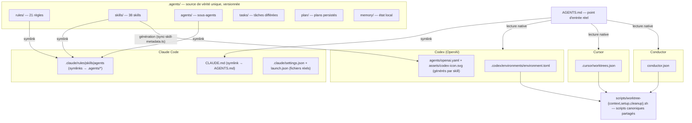

# Analyse du repo source : nowstack-saas

Ce document consolide l'analyse en profondeur du repo `nowstack-saas` (starter SaaS TanStack Start + Convex), menée le 27 août 2026 par un workflow de six agents (cinq lecteurs par couche + une passe critique). C'est le matériau de référence d'agentsdir : le repo NowStack est la preuve vivante que l'architecture fonctionne en production avec quatre harness simultanés — et la liste de ses défauts est notre cahier des charges correctif.

Voir aussi : [../architecture.md](../architecture.md) (ce qu'agentsdir en retient), [../conventions.md](../conventions.md) (les contrats formalisés), [../harness.md](../harness.md) (la matrice par harness).

## 1. Le modèle : une source de vérité, des projections

Tout le contenu destiné aux agents vit une seule fois dans `.agents/`. Chaque harness reçoit une *projection* : un symlink quand il sait suivre un lien, un artefact généré quand il attend son propre format.



Points structurants :

- Les quatre symlinks (`CLAUDE.md → AGENTS.md`, `.claude/{rules,skills,agents} → ../.agents/*`) sont versionnés en mode git `120000`, avec des cibles relatives, donc portables entre clones — à condition que `core.symlinks=true` au moment du checkout.
- `.claude/settings.json` (liste blanche de permissions, `includeCoAuthoredBy: false`) et `.claude/launch.json` (8 configurations de lancement) sont volontairement de vrais fichiers (`100644`) : ils sont propres au harness Claude Code et n'ont pas leur place dans la source de vérité partagée.
- Deux sous-dossiers d'artefacts éphémères sont exclus de git avec ancrage racine (`/.agents/output/`, `/.agents/apex/`) ; tout le reste de `.agents/` est versionné.

## 2. Le point d'entrée : AGENTS.md

`AGENTS.md` est le fichier réel, lu nativement par Codex, Cursor et Conductor. Son préambule interdit explicitement de remplacer le symlink `CLAUDE.md` par une copie (« Edit AGENTS.md; never replace the symlink with a copy, or the two will drift »). Le document suit trois familles de sections :

| Famille | Sections | Transposabilité |
| --- | --- | --- |
| Génériques | préambule du point d'entrée, index des règles (`Rule Index`), `Browser Verification`, `Worktree Environment`, `Verification` | Telles quelles |
| Stack | `Stack`, `Commands`, `Import Rules`, `Server And Data Rules`, `Frontend Rules`, `Runtime Logs`, `Billing And Files`, `Email` | Instanciées selon la stack |
| Produit | `About the project`, `Project Foundation`, `Important Files` | À remplir par l'utilisateur |

L'index des règles est vital : chaque entrée est une ligne « chemin — quand la lire », et c'est le seul mécanisme de découverte pour les règles sans frontmatter (voir ci-dessous).

## 3. La couche rules : 21 fichiers, 3 natures

### Classification

| Nature | Nombre | Fichiers | Traitement pour agentsdir |
| --- | --- | --- | --- |
| Générique | 5 | `changelog`, `read-logs`, `testing`, `ui-ux`, `mdx` | Copie quasi verbatim, seuls les chemins et commandes sont paramétrés |
| Stack | 13 | `api-routes`, `authentication`, `code-conventions`, `convex-authorization-dto`, `convex-imports`, `convex-queries`, `development-commands`, `file-naming`, `lumail-email`, `page-skeletons`, `start-commands`, `stripe-billing`, `tanstack-form` | Gabarits conditionnels par pack de stack, hors noyau v1 |
| Produit | 3 | `dialog-manager`, `user-email`, `verification` | Uniquement si la fonctionnalité correspondante existe ; sinon gabarit vide |

### Conventions de rédaction

- Un fichier Markdown court par sujet, nom en kebab-case, H1 = nom de la règle, sections H2 fonctionnelles (« Rules », « What NOT to do », liste de contrôle finale).
- Deux mécanismes de découverte : 9 règles portent un frontmatter `paths:` avec des globs qui les scopent aux fichiers concernés ; les 12 autres n'existent que via l'index des règles d'AGENTS.md.
- Ton impératif direct, marqueurs d'emphase (**CRITICAL**, MANDATORY, NEVER/ALWAYS), interdits absolus.
- Tableaux Markdown pour les références (commandes, correspondances erreur → code HTTP), paires d'exemples `// GOOD` / `// BAD` ou sections « Correct / Wrong », blocs de code complets et copiables.
- Ancrage au code réel : renvois croisés vers d'autres règles, vers des skills (`$ns-setup-email`, `$verify`) et vers des fichiers de code cités comme référence normative (« Modelled on `src/routes/api/admin/...` »). Conséquence directe pour un générateur : produire ces règles sans réécrire les ancres donne des règles mensongères, ou un validateur qui échoue.

## 4. La couche skills : anatomie et double contrat

Un skill est un dossier `.agents/skills/<name>/`. Les 38 skills suivent le même squelette :

```
.agents/skills/<name>/
├── SKILL.md                # source de vérité : frontmatter YAML + corps ≥ 12 lignes
├── agents/openai.yaml      # GÉNÉRÉ — métadonnées d'interface Codex
├── assets/codex-icon.svg   # GÉNÉRÉ — icône 128×128 sur fond de couleur de marque
├── references/             # optionnel (16 skills) — documentation chargée à la demande
├── scripts/                # optionnel (9 skills)  — exécutables Node/sh sans dépendances
├── steps/                  # optionnel (5 skills)  — étapes numérotées à chargement progressif
└── templates/              # optionnel (5 skills)  — squelettes de sortie
```

### Contrat frontmatter (côté Claude Code)

- `name` — obligatoire, strictement égal au nom du dossier.
- `description` — obligatoire en pratique ; déclencheur de découverte, formulée « Use when… » avec les mots-clés utilisateur.
- `argument-hint` — optionnel (~22 skills), indication d'arguments de la commande.
- `disable-model-invocation: true` — présent sur 33 des 38 skills ; interdit l'invocation implicite par le modèle. Les 5 skills qui l'omettent (`exa-search`, `find-docs`, `ns-setup-check`, `ns-check-launch`, `ns-plan-onboarding`) sont exactement les skills en lecture seule autorisés à se déclencher seuls.
- `allowed-tools` — optionnel (vu sur `dev-browser` uniquement), pré-autorisation d'outils.

### Le générateur : scripts/sync-skill-metadata.ts

Exécuté par `tsx` (dépend de react, react-dom et lucide-react), il porte un catalogue TypeScript codé en dur (une entrée par skill : `displayName`, `shortDescription`, `defaultPrompt`, `color`, icône lucide, `implicit`) et fait tout :

1. Valide 13 invariants, dont : bijection catalogue ⟷ dossiers ; `name` du frontmatter = dossier ; `short_description` de 25 à 64 caractères ; `default_prompt` contenant littéralement `$<name>` ; couleur hex `#RRGGBB` ; `implicit: true` réservé à une liste blanche en dur de skills en lecture seule ; parité d'invocation entre harness (`implicit: false` ⟺ `disable-model-invocation: true` dans le SKILL.md) ; corps d'au moins 12 lignes significatives ; existence sur disque de tout chemin `references/`, `scripts/` ou `steps/` mentionné.
2. Génère par skill `agents/openai.yaml` (blocs `interface:` et `policy: allow_implicit_invocation`) et `assets/codex-icon.svg` (icône lucide rendue côté serveur, trait blanc 1.8, `<rect rx="5">` rempli de la couleur de marque, `<title>` accessible), comparés octet à octet — toute édition manuelle est écrasée.
3. Recalcule les empreintes de `skills-lock.json` : pour chaque skill vendoré depuis un dépôt externe (une seule entrée : `convex`, source `get-convex/agent-skills`), sha256 déterministe du dossier complet (chemins relatifs triés, `.git` et `node_modules` exclus). Le mode `--check` échoue au moindre écart — c'est le filet qui protège les corrections locales contre un écrasement upstream (`npx convex ai-files install` a déjà annulé deux fois des corrections du repo).

Le commentaire en dur du script résume l'enjeu central : « Codex reads agents/openai.yaml, Claude reads this frontmatter. Both must express the same decision, or a skill blocked on one platform stays implicitly discoverable on the other. »

### Invariants inter-skills

- Identité du nom : dossier = frontmatter `name` = jeton `$name` = nom affiché. Zéro alias (le routeur `$ns` refuse explicitement d'interpréter des raccourcis).
- Invocations croisées uniquement par jeton exact, délégation par chemin complet (`.agents/skills/verify/SKILL.md`), couplage par artefacts de sortie (`.agents/output/projects/`).
- Scripts embarqués en Node/sh sans dépendances (« runs the same from Codex, Claude Code, or a bare shell »), variantes par harness documentées dans le SKILL.md quand le comportement diffère.

## 5. La couche worktrees et les branchements par harness

Trois scripts canoniques partagés (règle : un seul chemin de script par action, aucun script intermédiaire dupliqué par harness) :

- `scripts/worktree-context.sh` — bibliothèque de résolution. Chemin du worktree : `CODEX_WORKTREE_PATH > CONDUCTOR_WORKSPACE_PATH > CURSOR_WORKTREE_PATH > pwd`. Arbre source : `CODEX_SOURCE_TREE_PATH > CONDUCTOR_ROOT_PATH > ROOT_WORKTREE_PATH > CURSOR_ROOT_WORKSPACE_PATH > $HOME/Developer/saas/nowstack-saas` (repli codé en dur, dépendant de la machine). Nom, port, mode de déploiement Convex : chaînes analogues.
- `scripts/worktree-setup.sh` — copie des `.env`, préfixe de cookie unique par worktree, création/sélection d'un déploiement Convex `dev/<slug>`, clonage des variables d'environnement via un fichier transitoire `.env-convex` supprimé par `trap`.
- `scripts/worktree-cleanup.sh` — nettoyage, avec garde-fous.

Garde-fous notables (à conserver dans toute réécriture) : refus de s'exécuter dans la copie de travail principale (contournable par variable explicite), nettoyage des variables Convex limité aux références `dev/*`, corbeille (`trash`) plutôt que `rm -rf`.

Branchements par harness, tous pointés sur les mêmes scripts :

| Harness | Fichier | Contenu |
| --- | --- | --- |
| Codex | `.codex/environments/environment.toml` | `[setup]`/`[cleanup]` → scripts worktree ; 5 `[[actions]]` (Dev, Typecheck, Unit tests, Lint, E2E) |
| Cursor | `.cursor/worktrees.json` | `setup-worktree-unix` / `cleanup-worktree-unix` en chemins relatifs |
| Conductor | `conductor.json` | `{"scripts": {"setup", "archive"}}` |

## 6. L'état de travail : tasks, plan, memory, agents

- `.agents/tasks/` — une tâche différée par fichier, auto-suffisante (Problem → Files → Acceptance criteria → Implementation notes → Verification → Out of scope), nommage `NN-titre-kebab.md`, fichier supprimé à la livraison.
- `.agents/plan/` — plans d'implémentation persistés (mémoire de travail longue durée versionnée).
- `.agents/memory/` — état local par machine (`main-account.txt` : adresse du compte principal, livrée avec la valeur de substitution `[user-email]`).
- `.agents/agents/` — sous-agents, frontmatter `name/description/color/model` + prompt système (un seul : `snipper.md`, éditeur rapide sur Haiku).

## 7. Les défauts constatés — à ne pas reproduire

Cette liste est le cahier des charges correctif d'agentsdir. Chaque point a été vérifié dans le repo.

1. **La vérification des skills n'est branchée dans aucune CI.** `skills:metadata:check` est annoncé « (CI) » par les règles, mais `ci.yml` ne lance que prettier, tsc, eslint, tests et build. Toute la parité Codex ⟷ Claude repose sur la discipline locale.
2. **Aucun `.gitattributes`.** Pas de `eol=lf` forcé : un checkout avec `autocrlf=true` casse les scripts bash et fait diverger les empreintes sha256 du verrou selon la machine.
3. **Donnée personnelle versionnée.** `.agents/memory/main-account.txt` est versionné avec `[user-email]` ; le protocole la fait remplacer localement par l'adresse réelle — que le prochain `git add -A` publie dans l'historique.
4. **Chemins machine codés en dur.** Repli `$HOME/Developer/saas/nowstack-saas`, base du cookie `nowstack-saas`, port 3910, catalogue des 38 skills en dur dans un script TypeScript soumis au typage du projet.
5. **Scripts uniquement Unix.** bash, perl (édition des `.env`), `lsof` (balayage de ports), `trash` : rien ne fonctionne sous Windows natif, et `lsof`/`trash` manquent même sous Git Bash.
6. **`environment.toml` orphelin.** Le fichier se déclare « THIS IS AUTOGENERATED » mais aucun script du repo ne le génère — il est écrit par l'application Codex, et le changelog montre qu'il a été corrigé à la main.
7. **Incohérence de nommage.** `verify/reference/` au singulier là où les 15 autres skills utilisent `references/` — le validateur tolère l'écart parce que le chemin existe.
8. **Liste blanche de permissions incomplète.** `.claude/settings.json` autorise npm/git/pnpm/gh/cd/ls/node mais ni bash, ni tsx, ni npx : les scripts du repo lui-même déclenchent des demandes d'autorisation.
9. **Rien ne détecte le remplacement d'un symlink par une copie.** Le préambule d'AGENTS.md l'interdit, mais ni hook, ni CI, ni vérification ne le constate — un seul commit suffit à créer deux sources de vérité divergentes.

## 8. Le précédent des blocs gérés : convex ai-files

L'outillage Convex montre comment un outil tiers cohabite proprement avec un AGENTS.md possédé par l'utilisateur : il injecte en pied de fichier un bloc délimité par les marqueurs `<!-- convex-ai-start -->` / `<!-- convex-ai-end -->`, et suit l'intégrité de l'ensemble par empreintes dans `convex/_generated/ai/ai-files.state.json` (`guidelinesHash`, `agentsMdSectionHash`, `claudeMdHash`, `agentSkillsSha`). L'outil ne réécrit que son bloc, jamais le reste du document.

C'est le mécanisme retenu par agentsdir pour toutes ses écritures dans des fichiers partagés (index des règles, sections gérées d'AGENTS.md) : voir [../conventions.md](../conventions.md).
