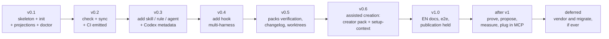

# Roadmap

Every milestone is deliverable and testable on its own. The detailed tasks live in [`.agents/tasks/`](../.agents/tasks/); the execution order and the dependencies in [`.agents/plan/v1.md`](../.agents/plan/v1.md).

## v0.1 — Installable in-house

Package skeleton (TypeScript, Node >= 22, `npx` bundle), environment detection (symlinks, stack, harnesses), `.agents.toml` manifest, working `init` (`.agents/` structure, `AGENTS.md`, Claude Code projections in symlink or copy mode), `doctor`.

**Exit criterion**: `npx agentsdir init` run on this very repo (dogfooding) and on a blank Python repo produces a correct structure, in copy mode on a Windows machine without developer mode and in symlink mode on a machine that allows it.

## v0.2 — Zero drift

`check` (invariants + drift of the projections + health of the symlinks, normalized exit codes), `sync`, GitHub Actions workflow emitted by `init`.

**Exit criterion**: hand-editing a projection, replacing a symlink with a copy, or breaking an invariant makes `check` fail with an actionable message; `sync` repairs everything.

## v0.3 — Generators

`add skill` (extended frontmatter = catalog, immediate generation of `agents/openai.yaml` + SVG icon from the built-in set), `add rule` (template + rule index in a managed block), `add agent`.

**Exit criterion**: a skill created by `add skill` is discovered by Claude Code (`/name`) and displayed by Codex with its icon and its color, without any manual editing.

> **Verified on 2026-09-12, in part.** A real Claude Code session on a freshly
> installed repo discovers the skill and loads its content through `/name` —
> in both projection modes. It did not hold at first in copy mode: the generated header
> was written ahead of the YAML frontmatter, so the harness dropped the block
> entirely — sub-agents vanished from the delegation list and skills lost their
> metadata, while `check` stayed green. Fixed in the same commit, then proved
> again by a session. **The Codex half of this criterion is out of reach of an
> agent**: icon and colour are visual, only a human looking at the interface can
> confirm them. It is not claimed as verified. Report:
> [../e2e/validation-agent/rapports/2026-09-12-claude-code.md](../e2e/validation-agent/rapports/2026-09-12-claude-code.md).

## v0.4 — Multi-harness hooks

`add hook <event>`: one portable Node script, three registrations (`.claude/settings.json`, `.codex/hooks.json`, `.cursor/hooks.json`).

**Exit criterion**: a `PreToolUse` hook created once fires in all three harnesses.

> **Verified on 2026-09-12 for Claude Code only.** The hook fires, and its
> `exit 2` blocks the tool call — proved by the hook events of a real session.
> Codex and Cursor remain unverified: the criterion is one third met, not met.

## v0.5 — Packs

`verification` pack (generic `$verify` skill with a proof matrix and a standalone HTML report), `changelog`, `worktrees` (portable Node scripts + `.cursor/worktrees.json`).

**Exit criterion**: each pack can be installed and uninstalled in isolation; the worktrees pack works on native Windows (no dependency on bash, perl, lsof or trash).

## v0.6 — Assisted creation

The heart of the product ([docs/creation-assistee.md](creation-assistee.md)): `creator` pack (meta-skills `$create-skill`, `$create-hook`, `$create-rule`, `$create-agent` applying the inventory → interview → critique → `check` protocol) and `$setup-context` (a perfect AGENTS.md through repo analysis + an interview on what cannot be discovered). CLI content tracked by fingerprint (`sourceType: "agentsdir"`) for `update` protection.

**Exit criterion**: on a demonstration repo, `$create-skill` with scripted answers produces a skill that passes `check` on the first try; `$setup-context` improves an existing AGENTS.md without touching the user's sections.

## v1.0 — Publication

Public documentation and CLI messages in English, end-to-end tests on demonstration repos (TypeScript and Python) and on both modes (symlink/copy), npm publication, announcement.

**Exit criterion**: a stranger installs the architecture in their repo in less than five minutes by reading the README only.

> **Revised on 2026-08-30.** `vendor` and `migrate` are already shipped by
> competitors (`npx skills add`, `rulesync import`): chasing them is catching up,
> not differentiating. The direction retained is described in
> [positionnement.md](positionnement.md) (French) — be the reference for `init`
> **and** govern what was installed: measure whether it serves, what it costs,
> and prove that it works. The milestones below predate that revision; the
> sections marked *deferred* are kept for the record, not as a plan.

## After v1 — Govern what was installed

The line actually being built, in order: prove that a harness really loads what
the CLI writes, make `init` propose a coherent set, measure usage, measure
context cost, then plug in MCP. The order and its reasoning are in
[positionnement.md](positionnement.md); the tasks are in `.agents/tasks/`.

## Delivered with v1.0 — `update`

`update` ships with 1.0 rather than after it. The CLI had been writing
`sourceType: "agentsdir"` entries into `skills-lock.json` since v0.6 for a
command that did not exist, and `check` and `doctor` both pointed users at it:
the lock finally has its key. It migrates the manifest schema through a
declared table of transformations, replaces installed content that is still
intact, and offers a merge — never an overwrite — for content the user
edited that also moved upstream. See
[commandes.md](commandes.md#update--v1).

## Deferred — `vendor`, `migrate`, and the rest

`vendor <owner/repo>` and `migrate` (inventory of an existing `.claude/`,
`.cursor/rules` or `CLAUDE.md`, switch to `.agents/` + projections) are shipped
elsewhere, better resourced. Reconsider one day as a convenience, never as an
argument. The `logs` pack and `conductor.json`, inherited from the source model,
are dropped: the `usage` pack (tasks 25 and 30) covers that ground differently,
locally and without telemetry.

## Tracked risks

| Risk | Mitigation |
| --- | --- |
| The hook formats of the harnesses change (precedent: Cursor) | Compatibility matrix revalidated at every release; only 3 harnesses |
| Claude Code adopts AGENTS.md natively | The value moves to init, the generators and migrate — already at the heart of the product |
| Windows symlinks | Copy mode is a first-class citizen, tested in CI on the same footing as symlink mode |
| Competition (ruler, rulesync, npx skills) | Interoperate: agentskills.io spec followed, compatibility with `npx skills` skills |
