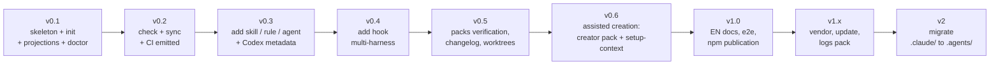

# Roadmap

Every milestone is deliverable and testable on its own. The detailed tasks live in [`.agents/tasks/`](../.agents/tasks/); the execution order and the dependencies in [`.agents/plan/v1.md`](../.agents/plan/v1.md).

## v0.1 — Installable in-house

Package skeleton (TypeScript, Node >= 22, `npx` bundle), environment detection (symlinks, stack, harnesses), `.agents.toml` manifest, working `init` (`.agents/` structure, `AGENTS.md`, Claude Code projections in symlink or copy mode), `doctor`.

**Exit criterion**: `npx agentsdir init` run on this very repo (dogfooding) and on a blank Python repo produces a correct structure, in copy mode on a Windows machine without developer mode and in symlink mode on a machine that allows it.

## v0.2 — Zero drift

`check` (invariants + drift of the projections + health of the symlinks, normalized exit codes), `sync`, GitHub Actions workflow emitted by `init`.

**Exit criterion**: hand-editing a projection, replacing a symlink with a copy, or breaking an invariant makes `check` fail with an actionable message; `sync` repairs everything.

## v0.3 — Generators

`add skill` (extended frontmatter = catalog, immediate generation of `agents/openai.yaml` + SVG icon from the built-in set), `add rule` (template + rule index in a managed block), `add agent`.

**Exit criterion**: a skill created by `add skill` is discovered by Claude Code (`/name`) and displayed by Codex with its icon and its color, without any manual editing.

## v0.4 — Multi-harness hooks

`add hook <event>`: one portable Node script, three registrations (`.claude/settings.json`, `.codex/hooks.json`, `.cursor/hooks.json`).

**Exit criterion**: a `PreToolUse` hook created once fires in all three harnesses.

## v0.5 — Packs

`verification` pack (generic `$verify` skill with a proof matrix and a standalone HTML report), `changelog`, `worktrees` (portable Node scripts + `.cursor/worktrees.json`).

**Exit criterion**: each pack can be installed and uninstalled in isolation; the worktrees pack works on native Windows (no dependency on bash, perl, lsof or trash).

## v0.6 — Assisted creation

The heart of the product ([docs/creation-assistee.md](creation-assistee.md)): `creator` pack (meta-skills `$create-skill`, `$create-hook`, `$create-rule`, `$create-agent` applying the inventory → interview → critique → `check` protocol) and `$setup-context` (a perfect AGENTS.md through repo analysis + an interview on what cannot be discovered). CLI content tracked by fingerprint (`sourceType: "agentsdir"`) for `update` protection.

**Exit criterion**: on a demonstration repo, `$create-skill` with scripted answers produces a skill that passes `check` on the first try; `$setup-context` improves an existing AGENTS.md without touching the user's sections.

## v1.0 — Publication

Public documentation and CLI messages in English, end-to-end tests on demonstration repos (TypeScript and Python) and on both modes (symlink/copy), npm publication, announcement.

**Exit criterion**: a stranger installs the architecture in their repo in less than five minutes by reading the README only.

> **Révision du 30 août 2026.** `vendor` et `migrate` sont livrés par la
> concurrence (`npx skills add`, `rulesync import`) : les poursuivre est du
> rattrapage. La direction retenue est décrite dans
> [positionnement.md](positionnement.md) — gouverner la configuration plutôt que
> l'installer : mesurer si elle sert, ce qu'elle coûte, et prouver qu'elle
> fonctionne.

## v1.x — Ecosystem

`vendor <owner/repo>` (external skills locked in `skills-lock.json`), `update` (manifest schema migrations), `logs` pack, `conductor.json`.

## v2 — Migration

`migrate`: inventory of an existing `.claude/`, `.cursor/rules` or `CLAUDE.md`, deduplication, switch to `.agents/` + projections, report. This is the main acquisition channel: the installed base of Claude Code configurations is the largest pool of users.

## Tracked risks

| Risk | Mitigation |
| --- | --- |
| The hook formats of the harnesses change (precedent: Cursor) | Compatibility matrix revalidated at every release; only 3 harnesses |
| Claude Code adopts AGENTS.md natively | The value moves to init, the generators and migrate — already at the heart of the product |
| Windows symlinks | Copy mode is a first-class citizen, tested in CI on the same footing as symlink mode |
| Competition (ruler, rulesync, npx skills) | Interoperate: agentskills.io spec followed, compatibility with `npx skills` skills |
