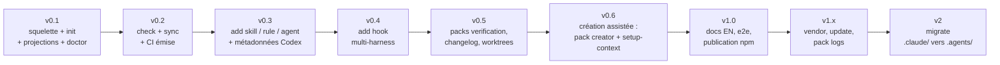

# Feuille de route

Chaque jalon est livrable et testable seul. Les tâches détaillées vivent dans [`.agents/tasks/`](../.agents/tasks/) ; l'ordre d'exécution et les dépendances dans [`.agents/plan/v1.md`](../.agents/plan/v1.md).

## v0.1 — Installable chez soi

Squelette du paquet (TypeScript, Node >= 20, bundle `npx`), détection d'environnement (symlinks, stack, harness), manifeste `.agents.toml`, `init` fonctionnel (structure `.agents/`, `AGENTS.md`, projections Claude Code en mode symlink ou copie), `doctor`.

**Critère de sortie** : `npx agentsdir init` exécuté sur ce repo même (autophagie) et sur un repo Python vierge produit une structure correcte, en mode copie sur une machine Windows sans mode développeur et en mode symlink sur une machine qui le permet.

## v0.2 — Zéro dérive

`check` (invariants + dérive des projections + santé des symlinks, codes de sortie normalisés), `sync`, workflow GitHub Actions émis par `init`.

**Critère de sortie** : modifier une projection à la main, remplacer un symlink par une copie, ou casser un invariant fait échouer `check` avec un message actionnable ; `sync` répare tout.

## v0.3 — Générateurs

`add skill` (frontmatter étendu = catalogue, génération immédiate d'`agents/openai.yaml` + icône SVG depuis le jeu embarqué), `add rule` (gabarit + index des règles en bloc géré), `add agent`.

**Critère de sortie** : un skill créé par `add skill` est découvert par Claude Code (`/nom`) et affiché par Codex avec son icône et sa couleur, sans aucune édition manuelle.

## v0.4 — Hooks multi-harness

`add hook <event>` : un script portable Node, trois enregistrements (`.claude/settings.json`, `.codex/hooks.json`, `.cursor/hooks.json`).

**Critère de sortie** : un hook `PreToolUse` créé une fois se déclenche dans les trois harness.

## v0.5 — Packs

Packs `verification` (skill `$verify` générique avec matrice de preuve et rapport HTML autonome), `changelog`, `worktrees` (scripts Node portables + `.cursor/worktrees.json`).

**Critère de sortie** : chaque pack est installable et désinstallable isolément ; le pack worktrees fonctionne sous Windows natif (aucune dépendance à bash, perl, lsof ou trash).

## v0.6 — Création assistée

Le cœur du produit ([docs/creation-assistee.md](creation-assistee.md)) : pack `creator` (méta-skills `$create-skill`, `$create-hook`, `$create-rule`, `$create-agent` appliquant le protocole inventaire → interview → critique → `check`) et `$setup-context` (AGENTS.md parfait par analyse du repo + interview du non-découvrable). Contenus CLI suivis par empreinte (`sourceType: "agentsdir"`) pour la protection `update`.

**Critère de sortie** : sur un repo de démonstration, `$create-skill` en réponses scriptées produit un skill qui passe `check` du premier coup ; `$setup-context` améliore un AGENTS.md existant sans toucher aux sections de l'utilisateur.

## v1.0 — Publication

Documentation publique et messages de la CLI en anglais, tests de bout en bout sur repos de démonstration (TypeScript et Python) et sur les deux modes (symlink/copie), publication npm, annonce.

**Critère de sortie** : un inconnu installe l'architecture dans son repo en moins de cinq minutes en lisant uniquement le README.

## v1.x — Écosystème

`vendor <owner/repo>` (skills externes verrouillés dans `skills-lock.json`), `update` (migrations de schéma du manifeste), pack `logs`, `conductor.json`.

## v2 — Migration

`migrate` : inventaire d'un `.claude/`, `.cursor/rules` ou `CLAUDE.md` existant, déduplication, bascule vers `.agents/` + projections, rapport. C'est le canal d'acquisition principal : la base installée de configurations Claude Code est le plus grand vivier d'utilisateurs.

## Risques suivis

| Risque | Mitigation |
| --- | --- |
| Les formats de hooks des harness changent (précédent : Cursor) | Matrice de compatibilité revalidée à chaque release ; 3 harness seulement |
| Claude Code adopte AGENTS.md nativement | La valeur se déplace vers init, générateurs et migrate — déjà au cœur du produit |
| Symlinks Windows | Le mode copie est un citoyen de première classe, testé en CI au même titre que le mode symlink |
| Concurrence (ruler, rulesync, npx skills) | Interopérer : spec agentskills.io respectée, compatibilité avec les skills `npx skills` |
